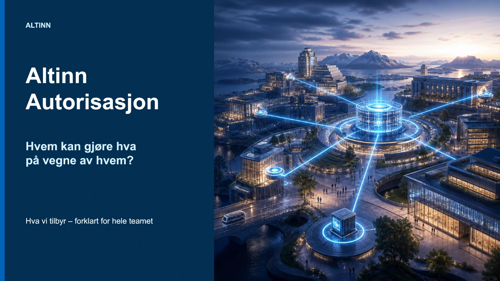

# Altinn Autorisasjon – hva tilbyr vi?

Dette er et arbeidsutkast til den første av to presentasjoner om Altinn Autorisasjon. Presentasjonen skal gi hele autorisasjonsteamet en felles forståelse av konseptene og tilbudet, uavhengig av om de arbeider med UX, utvikling, produkt eller brukerstøtte.

## Innhold og avgrensning

Presentasjonen forklarer blant annet

- forskjellen mellom autentisering og autorisasjon
- hvordan brukere handler på vegne av personer og virksomheter
- fullmakter, delegasjon, enkelttilganger og tilgangspakker
- Ressursregisteret og sammenhengen mellom tjeneste, operasjon og policy
- ansvarsdelingen mellom tjenesteeieren og Altinn Autorisasjon
- PAP, PDP og PEP på konseptnivå
- systembrukere, samtykke og vergemål
- sentrale brukerflater i Altinn og Altinn Studio

En senere presentasjon skal gå nærmere inn i systemlandskapet, komponentene, integrasjonspunktene og den tekniske flyten. Det ligger derfor utenfor dette utkastet.

## Filer

- `altinn-autorisasjon-hva-tilbyr-vi.pptx` er den redigerbare presentasjonen med 29 lysbilder.
- `preview.webp` er en samlet forhåndsvisning som gjør det mulig å vurdere flyt og visuell helhet direkte i pull requesten.

Presentasjonen inneholder de genererte illustrasjonene og skjermbildene. Hvert lysbilde har presentatørnotater, og notatene oppgir kilder for eksterne påstander og visuelle ressurser.

## Visuell retning

Illustrasjonene bruker et gjennomgående nordisk landskap i blåtimen. Lysende porter, strømmer og knutepunkter gjør abstrakte autorisasjonsbegreper synlige, mens skjermbilder viser hvordan de samme konseptene møter brukerne i produktet.

## Kontroller

- Alle 29 lysbilder er rendret og kontrollert visuelt.
- Presentasjonen består overflowtesten for innhold utenfor lysbildeflaten.
- Malfidelitetstesten rapporterer ingen avvik.
- Presentasjonen beholder temaet fra kildepresentasjonen.
- Ingen tomme PowerPoint-plassholdere står igjen.
- Sidenumrene fra 02 til 29 er kontrollert.

## Punkter for faglig gjennomgang

Teamet bør særlig kontrollere

- at produktnavn og autorisasjonsbegreper samsvarer med dagens løsning
- at skillet mellom tjenesteeierens ansvar og Altinns ansvar er presist
- at beskrivelsene av systembruker, samtykke og vergemål dekker nødvendige forutsetninger og unntak
- at skjermbildene fortsatt representerer gjeldende brukerflater
- at presentatørnotatene gir riktig nyansering av de forenklede illustrasjonene

Skjermbildene inneholder testdata. Teamet bør likevel vurdere dem særskilt før presentasjonen eventuelt publiseres utenfor den tiltenkte målgruppen.

En illustrasjon av lokale kopier fra Enhetsregisteret og Folkeregisteret er ikke lagt til ennå. Før vi lager den, bør teamet bekrefte hvilke datasett Altinn kopierer, oppdateringsmåten og -frekvensen, hvordan Altinn bruker opplysningene, og hvilken formulering som er riktig med tanke på personvern og tilgangskontroll.

Denne mappen er foreløpig ikke koblet til navigasjonen på dokumentasjonssiden.
