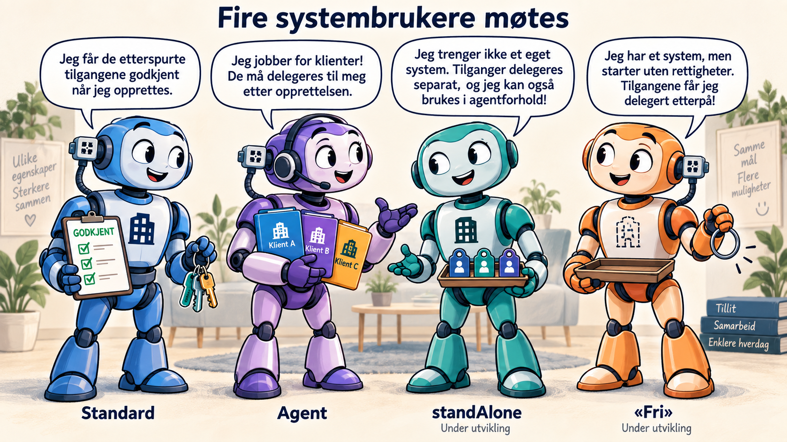

# Fire typer systembrukere

[Last ned PowerPoint-presentasjonen](./fire-typer-systembrukere.pptx)

Konseptpresentasjon med 10 lysbilder om Standard, Agent, standAlone og «fri». Standard og Agent beskriver dagens typer. standAlone og «fri» beskriver funksjonalitet under utvikling, basert på konseptavklaringer i september 2026.

## Forskjellene mellom typene

| Type | Systemtilknytning og tilganger |
| --- | --- |
| Standard | Knyttet til et registrert system for egen virksomhet. Etterspurte tilgangspakker og enkeltrettigheter godkjennes ved opprettelse. |
| Agent | Knyttet til et registrert system for klientforhold. Tilgangspakker inngår i forespørselen, og klientdelegering skjer etter opprettelse. |
| standAlone | Tilhører egen organisasjon uten at virksomheten må registrere et eget system. Tilgangspakker og enkeltrettigheter delegeres via vanlig tilgangsstyring. Kan også brukes i agentforhold. |
| «Fri» | Knyttet til et registrert system, men opprettes uten rettighetskrav og uten rettigheter, selv om systemet har definerte tilganger. Delegering skjer separat. |

«Fri» kan kombinere forskjellige klienttyper og egen virksomhet på samme systembruker. Separat delegering innebærer samtidig at brukeren kan velge feil rettigheter, slik at systemet får for lite eller for mye tilgang.

Presentasjonen foreslår visningsnavnene **Frittstående systembruker** for standAlone og **Systemtilknyttet uten rettighetskrav** for «fri». Dette er navneforslag, ikke fastsatte API-verdier.

## Lysbilder

1. Fire typer systembrukere
2. Fire systembrukere møtes – illustrasjon
3. De fire typene sammenlignet
4. Standard
5. Agent
6. standAlone
7. «Fri»
8. «Fri»: fordeler og ulemper
9. Frittstående og «fri»
10. Typene i bruk

## Filer og grunnlag

- `fire-typer-systembrukere.pptx` inneholder presentasjonen med redigerbar tekst og sammenligningstabeller. Kilder og presiseringer ligger i presentatørnotatene.
- `systembrukere-i-samtale.png` er illustrasjonen brukt på lysbilde 2, laget med imagegen.

Beskrivelsene av Standard og Agent bygger på [Altinns systembrukerveiledning](https://docs.altinn.studio/nb/authorization/guides/system-vendor/system-user/) og [veiledningen for opprettelse](https://docs.altinn.studio/nb/authorization/guides/system-vendor/system-user/systemuserrequest/). Beskrivelsene av de nye typene er et konseptgrunnlag for faglig gjennomgang.

Mappen er ikke koblet til navigasjonen på dokumentasjonssiden.
