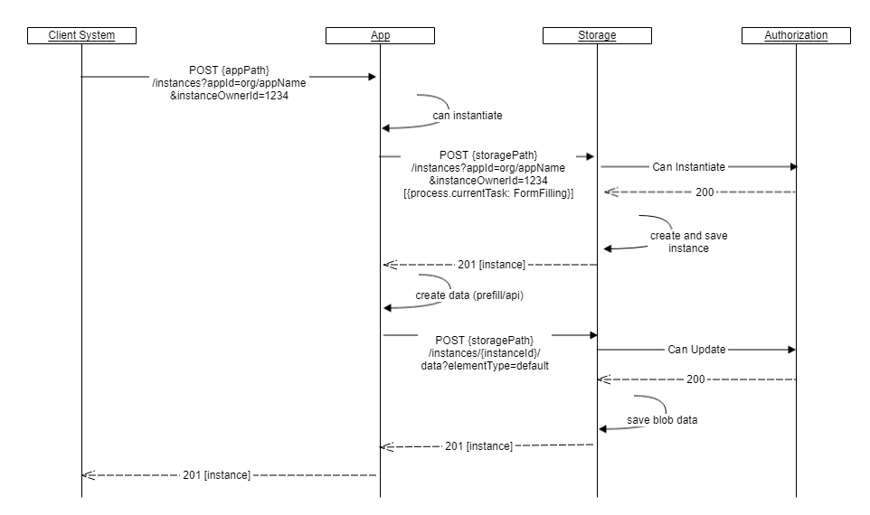
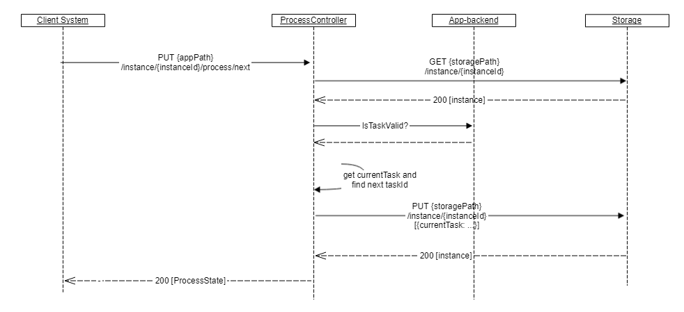

{}
This is work-in-progress. This is a proposed API which most likely is going to change. 
- HAL description is missing
- Large data elements/attachement examples are missing

{}

## Introduction
There are primarily two types of consumers of the Altinn APIs. 
The first group consists of applications and systems used by the owners of the applications hosted on the Altinn platform. The group is called *Application Owners*.
The second group consists of organizations and people using the applications through a client system, the group is called *Application Users*. 
The two groups have many similar needs, but there are also differences in what type of tasks they need to be able to perform. 
Traditionally the two groups have had access to completely separated API endpoints in Altinn. 
The new API will be available to both parties, but with some functions that will normally be used only by one of the groups. 

### Application Owner

A list of common tasks for an application owner.

- Query instances for a given application according to status
- Create an application instance
- Upload form data
- Download form data
- Confirm successful download
- Change process state (workflow)

### Application Users

A list of common tasks for an end user.

- Create an application instance
- Upload form data
- Download form data
- Change process state (workflow)
- View status of an instance

## Two different APIs

The new solution will have multiple APIs. There are two APIs available for Application Owners and Users.
There will be one API for each application cluster, called the *Application API*, and one for the Platform Storage cluster, called *Platform Storage API*. 
Both apis will provide similar operations. The Application API has business rules and must be used for validation of schema data, to change process state of the application instance. 
The Platform Storage API will provide access to information stored by the application. [More information on the Platform apis can be found here](/architecture/application/altinn-platform)

### Application API

An api that provides access to all instances of a specific app.

```http
apiPath = https://org.apps.altinn.no/org/appName
```

Identifies the organization cluster and the application. Should be used to instantiate an application, to validate data, to change process and to save/update data elements.

### Platform Storage API

An api that provides access to all instances of all apps, it should be used to access metadata about instances and to download data elements.

```http
storagePath = https://platform.altinn.no/storage
```

Should be used by application owners to download data elements. Downloads will be logged. 

## Create an application instance

Altinn assigns an unique identifier to all users that wishes to report data. We call this id *instanceOwnerId*. 
If you do not know this, you should provide the official identity number, e.g national identification number for persons or organisation number for organisations, and in some case user name. This should be provided as part of the payload to the creation request. Altinn will look up this identifier and replace it with the instanceOwnerId. The official identity number will not be stored in the instance metadata.

Data elements can be provided as part of the creation request, but can also be uploaded at a later time.

The client specify the instance owner and can set a number of the metadata fields of the instance by attaching the following form.

```json
{
    "instanceOwnerLookup": { "personNumber": "12247918309" | "organisationNumber": "123456789" | "userName": "xyz" },
    "labels" : [ "gr", "x2" ],
    "appId" : "org/appName",
    "dueDateTime": "2019-06-01T12:00:00Z",
    "visibleDateTime": "2019-05-20T00:00:00Z",
    "presentationField": { "nb": "Arbeidsmelding" }
}
```

Data elements (files) can be attached to the initial request as a *multipart/form-data*. The name of the parts must correspond to element types defined in the application metadata. 

```http
POST {appPath}/instances
```


A multipart formdata should contain the instance json document and the data element files of the instance. The first part should be the instance. The subsequent parts must have a name that correspond to the element types defined in application metadata. Hence the *default* name corresponds to the default element type (data model) of the application. If more data elements are needed they must be defined in the application metadata.

```http
Content-Type: multipart/form-data; boundary="abcdefg"

--abcdefg
Content-Type: application/json; charset=utf-8
Content-Disposition: form-data; name="instance"
{ ... }

--abcdefg
Content-Type: application/xml
Content-Disposition: form-data; name="default"
<xml> ... </xml>

--abcdefg--
```

This call will return the instance metadata record that was created. A unique identifier, which consist of the instance owner id and an guid, will be generated and should be used for later reference.

```json
{
    "id": "347829/762011d1-d341-4c0a-8641-d8a104e83d30",
    "selfLinks": {
        "apps": "{appPath}/instances/347829/41e57962-dfb7-4502-a4dd-8da28b0885fc",
        "platform": "{platformPath}/instances/347829/41e57962-dfb7-4502-a4dd-8da28b0885fc"
    },
    "appId": "org/appName",
    "labels": [ "gr", "x2" ],
    "instanceOwnerId": "347829",
    "createdDateTime": "2019-03-06T13:46:48.6882148+01:00",
    "createdBy": "org23",
    "dueDateTime": "2019-06-01T12:00:00Z",
    "visibleDateTime": "2019-05-20T00:00:00Z",
    "presentationField": "Arbeidsmelding",
    "process": {
        "currentTask": "FormFilling_1",
        "isComplete": false
    },
    "instanceOwnerStatus": {
        "isArchived": false,
        "isSoftDeleted": false,
        "isMarkedForHardDelete": false
    },
    "appOwnerStatus": {
        "message": {"nb": "felt 23 er feil"}
    },
    "data": [
    {
        "id": "692ee7df-82a9-4bba-b2f2-c8c4dac69aff",
        "elementType": "default",
        "contentType": "application/xml",
        "storageUrl": "org/appName/762011d1-d341-4c0a-8641-d8a104e83d30/data/692ee7df-82a9-4bba-b2f2-c8c4dac69aff",
        "dataLink": {
            "apps":   "{appPath}/instances/347829/762011d1-d341-4c0a-8641-d8a104e83d30/data/692ee7df-82a9-4bba-b2f2-c8c4dac69aff",
            "platform": "{storagePath}/instances/347829/762011d1-d341-4c0a-8641-d8a104e83d30/data/692ee7df-82a9-4bba-b2f2-c8c4dac69aff"
        },
        "fileName": "prefill.xml",
        "createdDateTime": "2019-03-06T15:00:23+01:00",
        "createdBy": "org23",
        "fileSize": 20001,
        "isLocked": false,
    },
    ]
}
```

### Create a data element

Post data file (xml-document) as body of request. Must specify elementType as defined in the application metadata.

```http
POST {appPath}/instances/347829/41e57962-dfb7-4502-a4dd-8da28b0885fc/data?elementType=default
```

This call updates and returns instance metadata where each data element are given a guid.

```json
{
    "id": "347829/762011d1-d341-4c0a-8641-d8a104e83d30",
    ...
    "data": [
        {
            "id": "692ee7df-82a9-4bba-b2f2-c8c4dac69aff",
            "elementType": "default",
            "contentType": "application/xml",
            "storageUrl": "org/appName/762011d1-d341-4c0a-8641-d8a104e83d30/data/692ee7df-82a9-4bba-b2f2-c8c4dac69aff",
            "dataLinks": {
                "apps":   "{appPath}/instances/347829/762011d1-d341-4c0a-8641-d8a104e83d30/data/692ee7df-82a9-4bba-b2f2-c8c4dac69aff",
                "platform": "{storagePath}/instances/347829/762011d1-d341-4c0a-8641-d8a104e83d30/data/692ee7df-82a9-4bba-b2f2-c8c4dac69aff"
            },
            "fileName": "default.xml",
            "createdDateTime": "2019-03-06T15:00:23+01:00",
            "createdBy": "org23",
            "lastChangedDateTime": "2019-03-07T15:00:23+01:00",
            "lastChangedBy": "org23",
            "fileSize": 20001,
            "isLocked": false
        }
    ]
}
```

### Update a data element

Update (replace) a data element with a new one (payload). Data as multipart or as single body. Client does a PUT request to the App. It first calculates the data and replaces the existing data element. It returns the instance metadata to the client. 


```http
PUT {appPath}/instances/347829/762011d1-d341-4c0a-8641-d8a104e83d30/data/692ee7df-82a9-4bba-b2f2-c8c4dac69aff
```

### Get a specific data element

Clients can download the data element by a get request. Notice that application owner's get of an instance owners data will update metadata for on data element.

```http
GET {storagePath}/instances/347829/762011d1-d341-4c0a-8641-d8a104e83d30/data/692ee7df-82a9-4bba-b2f2-c8c4dac69aff
```

```json
{
...
"data": [
    {
        "id": "692ee7df-82a9-4bba-b2f2-c8c4dac69aff",
        ...
        "fileName": "default.xml",
        "lastChangedDateTime": "2019-03-06T15:00:23+01:00",
        "lastChangedBy": "org24",
        "fileSize": 34059,
        "isLocked": false,
        "applicationOwner": {
            "downloaded": ["2019-05-15T08:23:01+01:00"]
        }
    }
]
}
```

### Download the PDF of a data element

Data elements with schemas will have a corresponding pdf file, this pdf file is generated when the element type's associate process task is closed.

```http
Accept=application/pdf
GET {storagePath}/instances/347829/762011d1-d341-4c0a-8641-d8a104e83d30/data/692ee7df-82a9-4bba-b2f2-c8c4dac69aff
```

### Download both data and PDF

```http
GET {storagePath}/instances/347829/762011d1-d341-4c0a-8641-d8a104e83d30/data/692ee7df-82a9-4bba-b2f2-c8c4dac69aff/download
```

Will return a multipart http response which consists of two parts:
- the data
- the generated PDF

### Confirm successful download (as application owner)

Application owner must confirm that the data element file was downloaded sucessful.

```http
PUT {storagePath}/instances/347829/762011d1-d341-4c0a-8641-d8a104e83d30/data/692ee7df-82a9-4bba-b2f2-c8c4dac69aff/confirmDownload
```

```json
{
...
"data": [
    {
        "id": "692ee7df-82a9-4bba-b2f2-c8c4dac69aff",
        ...
        "applicationOwner": {
            "downloaded": ["2019-05-15T08:23:01+01:00"],
            "downloadConfirmed": ["2019-05-16T10:23:00+01:00"]
        }
    }
]
}
```

### Download a complete instance with data elements and corresponding pdfs

```http
GET {storagePath}/instances/347829/762011d1-d341-4c0a-8641-d8a104e83d30/downloadAll
```

Will return a multipart http response with the following content:

1. instance metadata (application/json)
2. the first data element (application/xml)
3. the first data element's pdf (application/pdf)
4. second data element (e.g. attachement)
5. third data element (e.g. image)
6. ...

<!-- OLD http://altinn3.no/runtime/api/attachment/3/RtlOrg/apitracing/32dacdff-1f99-4958-9790-b0a0aeccfaa5/GetFormAttachments -->


## Query instances

Application owners can search for application instances with a simple query request.

For example: To get all instances of appId *org/appName*, that is in at task id *Submit_1* (which is Submit, see process definition), has last changed date greater than *2019-05-01* and that has label *gruppe3*.

```http
GET {storagePath}/instances?appId=org/appName&process.currentTask=Submit_1&lastChangedDateTime=gte:2019-05-01&label=gruppe3
```

Another example is get all instances of appId *org/appName* that has completed their process.

```http
GET {storagePath}/instances?appId=org/appName&process.isComplete=true
```


The query returns a paginated set of instances (JSON)

```json
{
    "_links": {
        "self": {
            "href": "{storagePath}/instances?page=0&size=100"
        },
        "next": {
            "href": "{storagePath}/instances?page=1&size=100"
        },
        "last": {
            "href": "{storagePath}/instances?page=123&size=100"
        }
    },
    "_embedded": {
        "instances": [
            {...},
            {...},
            ...
      ]
    }
}
```

## Events

### Instance events

All instance events, e.g. creation, read, save, change process state, ...

```http
GET {storagePath}/instances/347829/762011d1-d341-4c0a-8641-d8a104e83d30/events
```

Example of event data.

```json
{
    "id":"6dff32bc-0928-4ae8-937c-b362d6941c89",
    "instanceId": "60238/5c6b1a71-2e1f-447a-ae2f-d1807dcffbfb",
    "eventType": "deleted",
    "createdDateTime": "2019-05-02T13:08:21.981476Z",
    "instanceOwnerId": "60238",
    "userId": 338829,
    "authenticationLevel": 1,
    "currentTask": "Submit_1",
    "enduserSystemId": 2
}
```

### Application events (for application owners)

Selected instance events. Created, first read, change process state. Optinally specified by application developer.

Events can be queried. May be piped.

```http
GET {storagePath}/applications/org/appName/events?createdDateTime=gte:2019-03-30&process.currentTask.id=Submit_1
```

Query result:

```json
[
    {
        "id": "112453234523423344",
        "at": "2019-06-01T12:12:22+01:00",
        "appId": "org/appName",
        "instanceOwnerId": "347829",
        "instanceLink": "{storagePath}/instances/347829/41e57962-dfb7-4502-a4dd-8da28b0885fc",
        "dataLinks": [
            {
                "elementType": "default",
                "dataLink": "{storagePath}/instances/347829/762011d1-d341-4c0a-8641-d8a104e83d30/data/692ee7df-82a9-4bba-b2f2-c8c4dac69aff"
            },
            {
                "elementType": "attachement",
                "dataLink": "{storagePath}/instances/347829/762011d1-d341-4c0a-8641-d8a104e83d30/data/89fsxx7a-82a9-4bba-z2f2-c8c4dac69agf"
            },
            {
                "elementType": "prefill",
                "dataLink": "{storagePath}/instances/347829/762011d1-d341-4c0a-8641-d8a104e83d30/data/72xx238f-83b9-4bba-x2f2-c8c4dac69alj"
            }
        ],
        "eventType": "ProcessStateChange",
        "previousTask": "FormFilling_1",
        "currentTask": "Submit_1",
        "userId": "userX"
    }
]
```

## Validate data

The application will provide a method to validate the datamodel without creating a instance of the data. Data must be provided as formdata. The validate method takes a data file of an elementType and performs validation on that file. It returns a validation report.


```http
PUT {appPath}/validate?elementType=modelA
```

## Calculate / check business rules

The app will provide a method to perform calculation / perform business rules for a datamodell to an app.
The calculate method takes a data file and performs calculations and returns the possibly altered data file with updated fields.


```http
PUT {appPath}/calculate?elementType=modelB
```

## Instantiation details

### Instantiate an app

Client instantiates an app. The app create an initial data element (file) according to the app's prefill rules. Instance metadata, with links to the data element is returned which allow the Client to download the data.
Process is set to first task. The task specifies if the data can be updated or not.



### Instantiate an app and complete process

Instantiate an app with data as multipart content (stream). The app creates an instance and stores the attached data element. The app attempts to complete the process. If the process is completed successfully, the data can no longer be updated.


## Process

Application has a process definition that specifies start events, end events, tasks and the allowed flows (transitions) between these. A process is started by the application, which sets the current task to the first task in the process (selects a start event which points to a task).


A process is represented by an process modell in BPMN/XML notation. Each task has an unique id, which is used to refer to the task in the api.

```xml
 <bpmn2:process id="Process_1" isExecutable="false">
    <bpmn2:startEvent id="StartEvent_1">
      <bpmn2:outgoing>SequenceFlow_1</bpmn2:outgoing>
    </bpmn2:startEvent>
    <bpmn2:task id="FormFilling_1" name="Fyll ut" altinn:tasktype="formfilling">
      <bpmn2:incoming>SequenceFlow_1</bpmn2:incoming>
      <bpmn2:outgoing>SequenceFlow_2</bpmn2:outgoing>
    </bpmn2:task>
    <bpmn2:task id="Submit_1" name="Send inn" altinn:tasktype="submit">
      <bpmn2:incoming>SequenceFlow_2</bpmn2:incoming>
      <bpmn2:outgoing>SequenceFlow_3</bpmn2:outgoing>
    </bpmn2:task>
    <bpmn2:endEvent id="EndEvent_1">
      <bpmn2:incoming>SequenceFlow_3</bpmn2:incoming>
    </bpmn2:endEvent>
    <bpmn2:sequenceFlow id="SequenceFlow_1" sourceRef="StartEvent_1" targetRef="FormFilling_1" />
    <bpmn2:sequenceFlow id="SequenceFlow_2" sourceRef="FormFilling_1" targetRef="Submit_1" />
    <bpmn2:sequenceFlow id="SequenceFlow_3" sourceRef="Submit_1" targetRef="EndEvent_1" />
  </bpmn2:process>
```

### Get process state of a specific instance

```http
GET {appPath}/instances/347829/41e57962-dfb7-4502-a4dd-8da28b0885fc/process
```

Returns:

```json
{
    "currentTask": "FormFilling_1",
    "isComplete": false
}
```

<!-- OLD Get Current process state
Is it in signing? Is it form filling +++ Used by react to decide what to show.
http://altinn3.no/runtime/api/workflow/3/RtlOrg/apitracing/GetCurrentState?instanceId=32dacdff-1f99-4958-9790-b0a0aeccfaa5 -->

### Complete a task

Application attempts to finish the current task and moves the process forward to the next task in the flow. The application cannot always select the next task, especially when more than one tasks can be chosen. In this case the user must chose which task to select. 



```http
PUT {appPath}/instances/347829/41e57962-dfb7-4502-a4dd-8da28b0885fc/process/completeTask
```
<!--OLD  //Complete
http://altinn3.no/runtime/api/3/RtlOrg/apitracing/7f32a720-a1e9-4565-a351-b3f66f9641b0/Complete -->

Alternatively one can ask the app to go to the next task. The application will try to close the current task and attempt to start the next task. 

```http
PUT {appPath}/instances/347829/41e57962-dfb7-4502-a4dd-8da28b0885fc/process/nextTask
```

### Complete the process

The complete process method will attempt to complete the process for an instance. Hence, the app will move the process from one task to the next until it reaches an valid end state.

If a task's exit condition is not met, the process will be stopped in the last valid task. And the user must manually fix the problem and complete the process.


```http
PUT {appPath}/instances/347829/41e57962-dfb7-4502-a4dd-8da28b0885fc/process/completeProcess
```
<!-- OLD // CompleteAndSendIn
http://altinn3.no/runtime/RtlOrg/apitracing/7f32a720-a1e9-4565-a351-b3f66f9641b0/CompleteAndSendIn -->

### Get the next tasks in a process

Returns an list of the next tasks that can be reached from the current task.

```http
GET {appPath}/instances/347829/41e57962-dfb7-4502-a4dd-8da28b0885fc/process?nextTasks
```

### Start a task

Tries to close the current task and start the wanted task. Updates process state accordingly. If exit condition of current task is not met, an error will be returned. If the task is not directly reachable by the flow, an error will be returned.

```http
PUT {appPath}/instances/347829/41e57962-dfb7-4502-a4dd-8da28b0885fc/process/nextTask?id=Submit_1
```

## Application resources

The application has a number of resource files that is used by the app's frontend and which defines it's behaviour.

### Application metadata

Get application's metadata :

```http
GET {appPath}
```

```json
{
    "id": "test/sailor",
    "versionId": "v32.23-xyp",
    "org": "test",
    "app": "sailor",
    "createdDateTime": "2019-03-06T13:46:48.6882148+01:00",
    "createdBy": "XXX",
    "title": { "nb": "Testapplikasjon", "en": "Test Application" },
    "processId": "mvp1",
    "validFrom": "2019-04-01T12:14:22+01:00",
    "validTo": null,
    "maxSize": -1,
    "elementTypes": [
        {
            "id": "default",
            "description": {"nb": "Båtdata", "en": "Boat data"},
            "allowedContentType": ["application/json"],
            "schema": {
                "fileName": "boat.json-schema",
                "schemaUrl": "/applications/test/sailor/schemas/boatdata"
            },
            "maxSize": 200000,
            "maxCount": 1,
            "shouldSign": true,
            "shouldEncrypt": true
        },
        {
            "id": "crewlist",
            "allowedContentType": ["application/xml"],
            "schema": {
                "fileName": "crew.xsd",
                "schemaUrl": "/applications/test/sailor/schemas/crewlist",
            },
            "maxSize": -1,
            "maxCount": 3,
            "shouldSign": false,
            "shouldEncrypt": false
        },
        {
            "id": "certificate",
            "allowedContentType": ["application/pdf"],
            "maxSize": -1,
            "maxCount": 1,
            "shouldSign": false,
            "shouldEncrypt": false
        }
    ]
}
```

### Process model

Get the application's process model.

```http
GET {appPath}/process
```

Returns the bpmn file defining the process.

### Get text resources for the application for a specific language

```http
GET {appPath}/texts?lang=nb
```
<!-- OLD http://altinn3.no/runtime/api/Language/GetLanguageAsJSON?languageCode=nb -->

### Get text resources for a given element type

```http
GET {appPath}/elementTypes/{typeName}/texts?lang=nb
```
<!-- OLD http://altinn3.no/runtime/api/textresources/RtlOrg/apitracing -->

### Get the schema for a given element type

```http
Accept=application/schema+json
GET {appPath}/elementTypes/{typeName}/schema
```

### Get the model config for a given element type

```http
GET {appPath}/elementTypes/{typeName}/modelConfig
```
(ServiceMetadata.json)
<!-- OLD http://altinn3.no/runtime/api/metadata/RtlOrg/apitracing/ServiceMetaData -->

### Get the layout for a given element type

```http
GET {appPath}/elementTypes/{typeName}/layout
```
(FormLayout.json)
<!-- OLD http://altinn3.no/runtime/api/resource/RtlOrg/apitracing/FormLayout.json-->

### Gets the rules for a given element type

```http
GET {appPath}/elementTypes/{typeName}/rules
```

(RuleHandler.js)
<!-- OLD http://altinn3.no/runtime/api/resource/RtlOrg/apitracing/RuleHandler.js -->

### Get the API service configuration for how the app calls external APIs

```http
GET {appPath}/elementTypes/{typeName}/externalApis
```
(ServiceConfiguration.json)
<!-- OLD (Service configuration) http://altinn3.no/runtime/api/resource/RtlOrg/apitracing/ServiceConfigurations.json -->


{}
