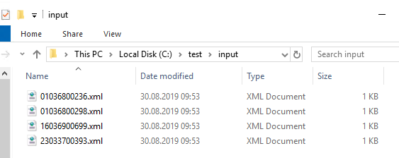
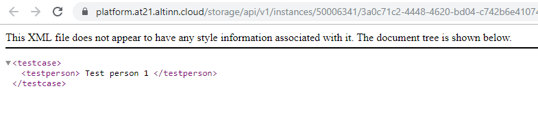

## Introduction

{}
Link to the example client application codebase:
<https://github.com/Altinn/altinn-studio/tree/master/src/Altinn.ExampleClients/PrefillClient>
{}

This is an example client appliation which demonstrate how an prganisation can use the Altinn API to instantiate applications with prefill data on a multiple set of persons (or organisations). To achieve this the Altinn API supports an HTTP technique called multipart request. This allow us to send and process an HTTP request with several content parts in **one** operation.

This example application gives you an idea on how to work with multipart prefill instantiation of applications.

## Example walkthrough

First we will walk you through a scenario of running the application from start to end.

1: To begin with we have created and placed the XML files containing the data to be prefilled on each person in a folder on our computer:



We have named each XML file with a person number. The XML content is the prefill data we wish to instantiate the applications with for each person.

*For the example purpose these files contain just a few XML lines. In a real world situation this could be large files containing schema data for a given set of persons or organisations.*

Here is the content from one of the XML files (**01036800298.xml**):

```xml
<?xml version="1.0" encoding="UTF-8" ?>
<testcase>
    <testperson>
        Test person 1
    </testperson>
</testcase>
```

*We will later showcase this XML content from an URL in browser window, after it has been saved to the storage of the application instance.*

2: Then we start the application from a command-line interface with a set of parameters:

```console
dotnet run PrefillClient -url=https://platform.at21.altinn.cloud/storage/api/v1/instances -folder=C:\test\input -appid=tdd/dog
```

3: After the application have run, the same folder now contain the additional files:


Our example application creates JSON files containing the application instance information on successful instantiations. If any failure, an error file is created per person.

Therefore we see three persons have had an application successfully instantiated with prefill data, and lastly one application instantiation for a person failed.

The next code block show the content of a newly created JSON file (**01036800298.json**):

```json
{
  "id": "50006341/3a0c71c2-4448-4620-bd04-c742b6e41074",
  "instanceOwnerId": "50006341",
  "selfLinks": {
    "platform": "http://platform.at21.altinn.cloud/storage/api/v1/instances/50006341/3a0c71c2-4448-4620-bd04-c742b6e41074"
  },
  "appId": "tdd/dog",
  "org": "tdd",
  "createdDateTime": "2019-09-03T11:52:49.9684927Z",
  "lastChangedDateTime": "2019-09-03T11:52:49.9684927Z",
  "presentationField": {
    "nb": "Testapplikasjon",
    "en": "Test Application"
  },
  "process": {
    "currentTask": "FormFilling_1",
    "isComplete": false
  },
  "instanceState": {
    "isDeleted": false,
    "isMarkedForHardDelete": false,
    "isArchived": false
  },
  "data": [
    {
      "id": "269909ea-3d1b-4a6b-85c5-021e5d63eef9",
      "elementType": "default",
      "contentType": "application/xml",
      "storageUrl": "tdd/dog/3a0c71c2-4448-4620-bd04-c742b6e41074/data/269909ea-3d1b-4a6b-85c5-021e5d63eef9",
      "dataLinks": {
        "platform": "http://platform.at21.altinn.cloud/storage/api/v1/instances/50006341/3a0c71c2-4448-4620-bd04-c742b6e41074/data/269909ea-3d1b-4a6b-85c5-021e5d63eef9"
      },
      "fileSize": 112,
      "isLocked": false,
      "createdDateTime": "2019-09-03T11:52:49.9684927Z",
      "lastChangedDateTime": "2019-09-03T11:52:49.9684927Z"
    }
  ]
}
```

If we follow the URL given under the **dataLinks** property from the JSON file, we see the content of the XML file saved as a data element to the application instance:



Lastly to be examined from the folder, is the error file on the failed instantiation (**error-01036800236.txt**) from our example:

```txt
Status code '400', error message: "Instance owner lookup failed."
```

## Behind the scenes

Now we will take a short look of what happens behind the scenes when running the example application.

Our example client application iterates over the XML files in the folder, creates an instance template containing an instanceOwnerLookup.PersonNumber value to find, and then generate the multipart content with the following blocks of C# code.

XML file iteration and instanceOwnerLookup creation:

```c#
foreach (string xmlFilePath in xmlFilePaths)
{
    xmlFileName = xmlFilePath.Split("\\").Last();

    // The person number is the XML filename
    personNumber = xmlFileName.Split(".").First();

    Instance instanceTemplate = new Instance()
    {
        InstanceOwnerLookup = new InstanceOwnerLookup()
        {
            PersonNumber = personNumber,
        }
    };
```

Multipart content creation:

```c#
MultipartFormDataContent content = new MultipartContentBuilder(instanceTemplate)
    .AddDataElement("default", new FileStream(xmlFilePath, FileMode.Open), "application/xml")
    .Build();
```

*We have made a helper class, **MultipartContentBuilder**, to easily add new data elements to the multipart in case several attachements are to be used for prefill.*

In our example we have used an element type **default** and content type **application/xml**. These two must be declared in the application metadata in order to store the files. The same goes for **instance** and **application/json** to create the instance template, which is added within the constructor of the **MultipartContentBuilder** class:

```c#
public class MultipartContentBuilder
{
    private MultipartFormDataContent builder;

    public MultipartContentBuilder(Instance instanceTemplate)
    {
        builder = new MultipartFormDataContent();
        if (instanceTemplate != null)
        {
            StringContent instanceContent = new StringContent(JsonConvert.SerializeObject(instanceTemplate), Encoding.UTF8, "application/json");

            builder.Add(instanceContent, "instance");
        }
    }
```

The C# code then generates the following multipart information to be sent with the request to the Altinn API:

```http
Content-Type: multipart/form-data; boundary="abcdefg"

--abcdefg
Content-Type: application/json; charset=utf-8
Content-Disposition: form-data; name="instance"

{
  "instanceOwnerLookup":  { "personNumber": "01036800298" }
}
--abcdefg
Content-Type: application/xml
Content-Disposition: form-data; name="default"

<?xml version="1.0" encoding="UTF-8" ?>
<testcase>
    <testperson>
        Test person 1
    </testperson>
</testcase>
--abcdefg--
```

Here we see two C# codelines to post the multipart content to the Altinn API and retrieve the response, then store it temporarily as **string result**:

```c#
HttpResponseMessage response = client.PostAsync(requestUri, content).Result;
string result = response.Content.ReadAsStringAsync().Result;
```

At last we include the deserialization of the **result** to an **Instance** object with **Json. NET** functionality.

```c#
Instance instanceResult = JsonConvert.DeserializeObject<Instance>(result);
```
