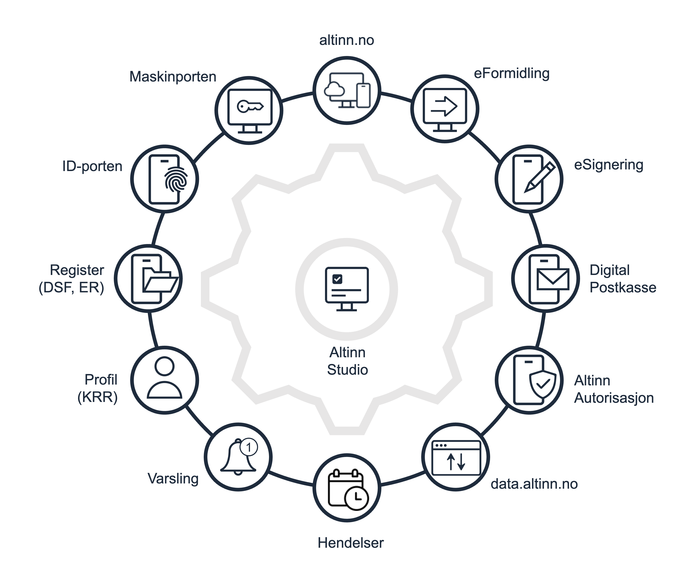

Altinn Studio is a tool for efficiently realizing digital services. We offer:
- a web-based tool for creating and testing services (apps) - Altinn Studio Designer
- a template for services with standard functionality and the ability to add custom functionality
- a dedicated Kubernetes-environment for each service owner to run the services (testing and production)
- a set of common support functions to assist services, e.g., PDF receipt generation, notifications, etc.

## What can I create with Altinn Studio?

### Form services
Traditional forms where the user fills in and submits data on behalf of themselves or others, possibly their business.

### Inspection services
Services where a form is not submitted, but only a request for insight into existing data.

### Guide
Services that guide the user through a process to provide an answer or the right starting point for the way forward.
This type of service also supports users who are not logged in.

### Coordinated services *
Services that typically consist of multiple forms, subprocesses, multiple users, and integrations with other agencies.

{}
\* Although it is possible to create this type of service today, we are working to make it easier to implement this type 
of service by moving more functionality into the web tool.
{}

## Altinn Studio is the "connector"
A form is rarely just data fields to be submitted; more is needed to create a good service – e.g., connection
to ID-porten, submission to the case processing system via eFormidling, or connection to national registers.

Altinn Studio has pre-developed integrations with several of Digdir's shared services and national registers, and will
continue to develop and add more.

## Low-code and traditional code
Altinn Studio is a hybrid between low-code and traditional coding. This means you can start with low-code in Altinn Studio
Designer and switch to dedicated development tools like Visual Studio Code if you have advanced needs that require coding.

Our goal is to do as much as possible with low-code but retain the option for traditional coding and the flexibility
it provides. This allows non-technical resources to design and publish services without the need to involve developers.
At the same time, a developer can be brought in to create more advanced functionality that requires coding.

## Principles that Altinn Studio is built on
Here are some of the principles underlying our development of Altinn Studio.
- **Free and open-source code** because we genuinely believe that openness and the opportunity for others to contribute is the way to go for developing services in the public sector.
- **Based on open standards** because closed code ties you to a supplier and often entails additional costs.
- **Cloud-based infrastructure** where loose connections are sought without binding to a specific cloud provider.
- **Built on modern and popular frameworks/products** because it makes it easier for both us and our customers to acquire technical resources and because it's something one wants to work with/learn.
- **Embedded security** where each layer in the architecture authorizes use regardless of where the calls come from.
- **Isolation** – Service owners get their own environments for testing and production.

### Open source and collaboration
Altinn Studio is not perfect, but it takes you a long way in creating good digital services - and we continuously add new functionality.

Instead of creating something on your own or buying something – why not contribute to the open-source project where there may be gaps
and thus give something back to the community?
The Altinn Studio teams handle quality assurance and ongoing code management.

Creating an environment around the development of services is important to us, and we now have a good number of contributors from
many public agencies contributing to advancing the product with us.
Contributions range from fixing typos that take seconds to fix to major components that have taken months.

An important part of creating an environment is the developer contact we have via Altinn Slack. Each service owner has their own
channel where questions can be asked.
We also see that service owners help each other and share experiences across organizations.
Backlog, user stories, plans, and roadmaps – everything is openly available on GitHub, providing both insight
and comments.
