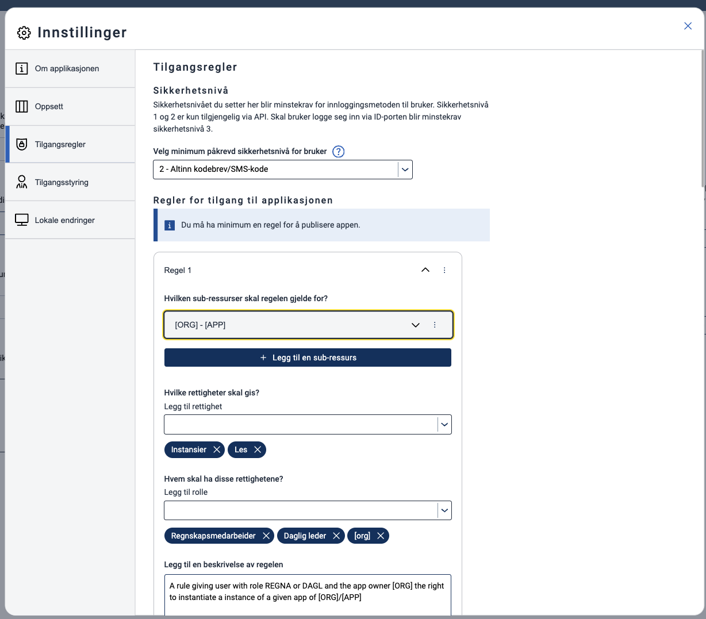

- Access control at the role, person, and organizational levels
- Access control for the entire, or parts of, the process
- Delegation of forms
- Defining trust levels on the service
- Setting actor requirements on the service

