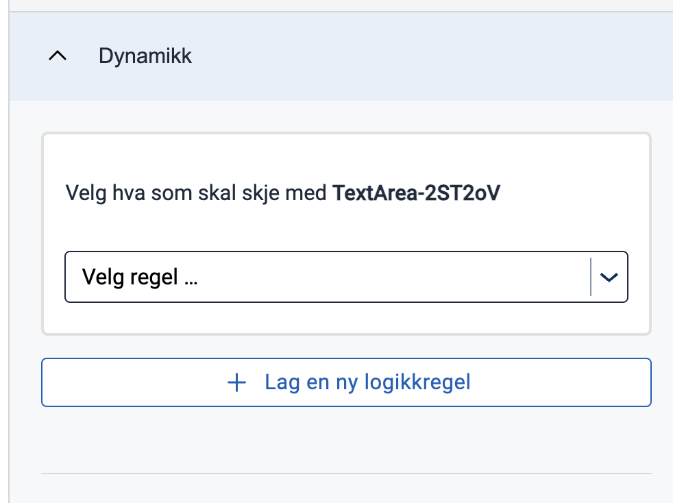
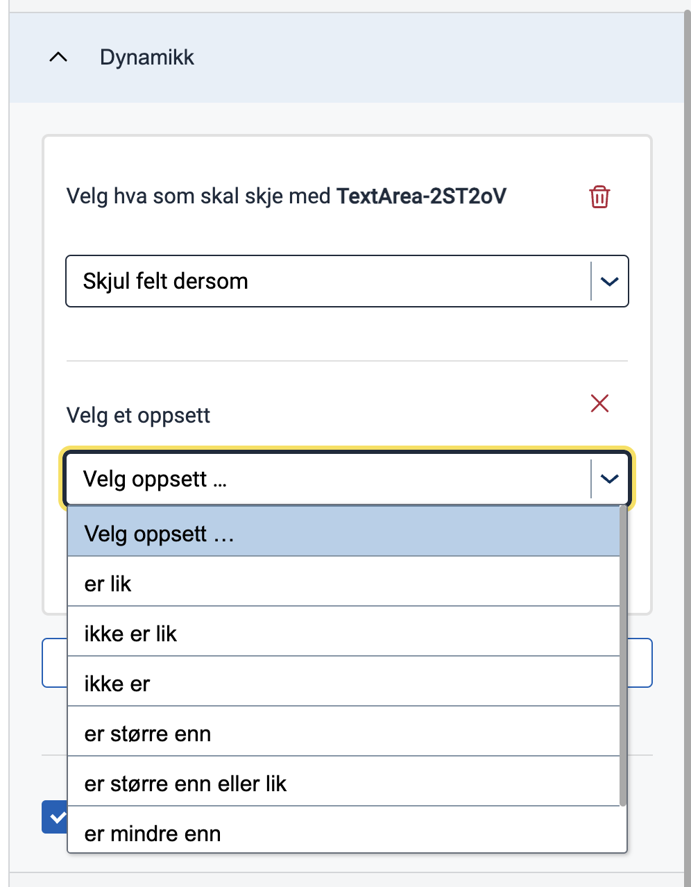
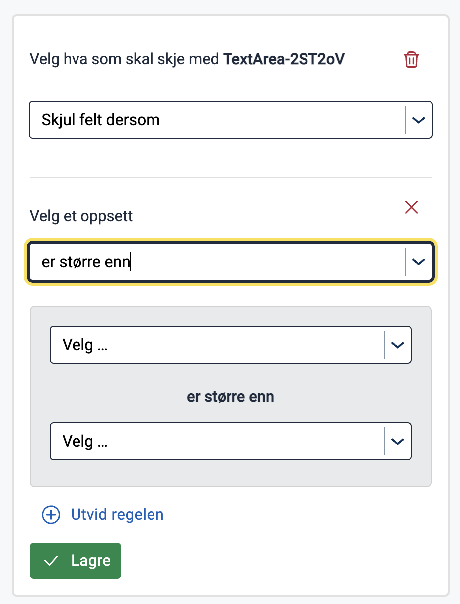
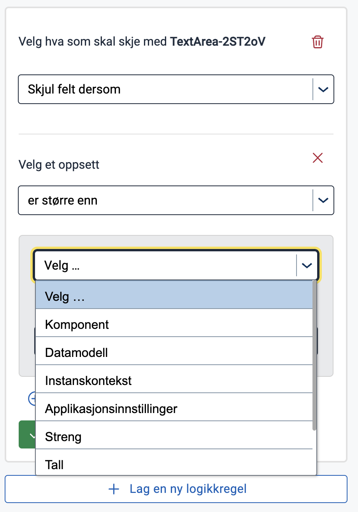
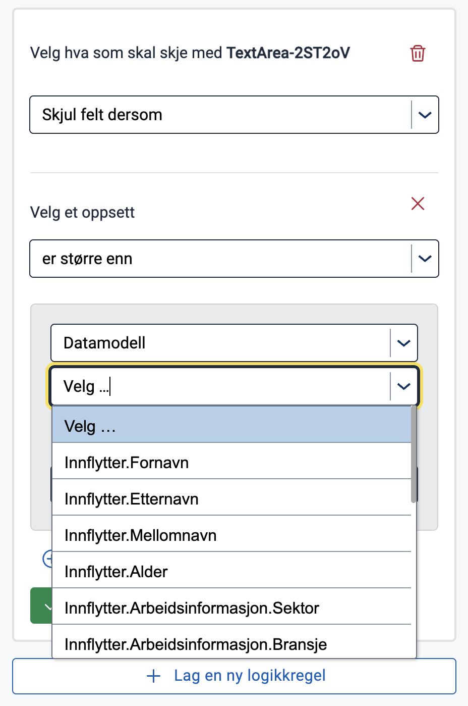
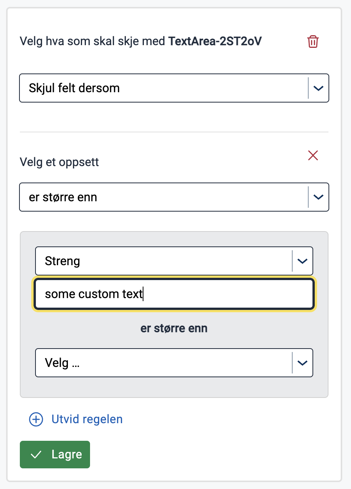
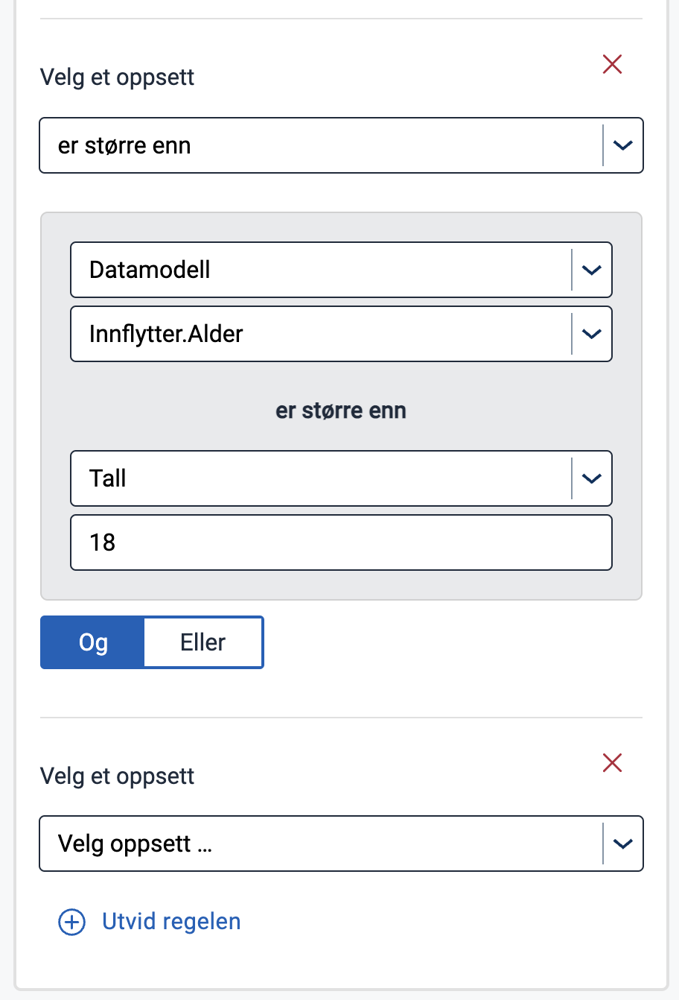
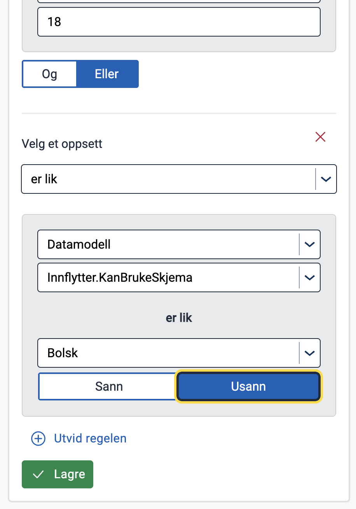
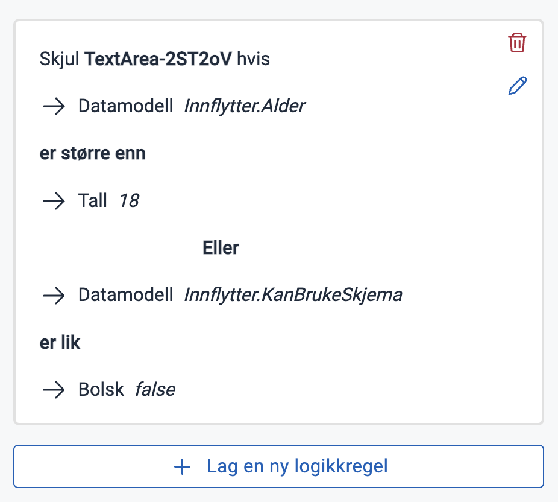
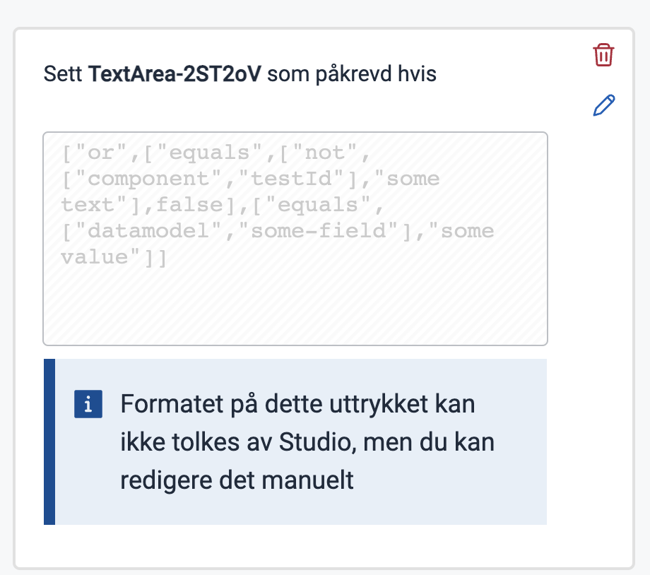

This documentation will describe _how_ to build expressions connected to component fields using the Expressions tool in
Altinn Studio.

Expressions are a concept in Altinn apps that lets app-developers dynamically assign values to different elements in an
application. Please read more in
the [Expressions section of Apps documentation](../../../../app/development/logic/expressions) of what expressions can be
used for and how the syntax works.

## Terminology

In Altinn Studio the concept is called _logic_ where an expression is addressed as a _logic rule_.

- **Expression**: A unit consisting of the boolean component field and the actual expression that will evaluate to be a
  boolean value when calculated in a running app. The most simple expression can consist of a single sub expression,
  while a more advanced expression can consist of multiple sub expressions combined with an operator.
- **Sub Expression**: A term used to address the most elementary unit of an expression that only consists of a
  function and two values, whereas a value either can be a single element or a combined element with the first part of
  the element defining a source where the following value can be found.
- **Property** or **Field**: The boolean property or field of the component that the expression should be connected to.
- **Function**: The function that should be used to compare the two values in the sub expression.
- **Data Source**: The source for the values in the sub expression. Can also be addressed as the _type_ of the value.
- **Data Source Value**: The actual value that should be used to evaluate the sub expression. However, if the value has
  a
  data source being `application settings`, `component`, `data model` or `instance context`, it acts as a reference to a
  value rather than an explicit value.
- **Operator**: The operator will only be relevant when there are more than one sub expression and will be used to
  evaluate if _all_ the sub expressions should imply (use **AND**) or if it is enough that only one of the sub
  expressions
  implies (use **OR**).

## Building expressions in Altinn Studio

When building expressions in the Expressions panel in Studio, it is always possible to add one expression for each of the following states:

- `hidden`
- `required`
- `readOnly`

For group components, also these states can have attached expressions:

- `edit.addButton`
- `edit.deleteButton`
- `edit.saveButton`
- `edit.saveAndNextButton`

If all these fields have expressions added to them you will be shown an info message saying that you have reached the limit for
expressions.

when going forward configuring an expression for your component in the Expression tool in Altinn Studio for the first
time, follow this guide:

### Basic Expressions

1. **Choose a component field to add the expression to**

   

2. **Choose a function that you want your first sub expression to use**

   
   

3. **Choose a data source that you want the first element in your sub expression to be**

   This data source can be either an actual source which will provide you with a set of available values to choose
   from, or the data source can be a type for a value. The available data sources that will provide you with a set of
   given values are:
    - Data Model: Fields from the current selected datamodel
    - Component: All component ids present in across layouts
    - Application Settings: All custom configuration values added in the `appsettings.json`
    - Instance Context: One of the following values that exist on the instance object in Altinn storage; `instanceId`
      , `InstanceOwnerPartyId` or `appId`

   While the available data sources that will act as types are:
    - String: Lets you assign any custom string as the value
    - Number: Lets you assign any custom number as the value
    - Boolean: Lets you assign the value as `true` or `false`
    - Null: Automatically assigns the value ass `null`

   

   _WARNING_: The given values provided when choosing `Application Settings` as the data source is not yet implemented.

4. **Choose a value that you want the first element in your sub expression to have**

   
   

5. **Choose a comparable data source and value for the second element in your sub expression**

   

6. **Save expression or continue adding sub expressions**

   Saving the expression will connect the expression to the component property you chose and visualize it in a preview
   mode.
   

   Or you can keep adding sub expression by expanding the rule and set the operator, that should evaluate the sub
   expressions together, to either `and` or `or`.
   

   Then you repeat these steps from point 2 - adding a function to the new sub expression and so on.
   

   Then you can save the complete expression, with the arbitrary number of sub expressions, and visualize it in preview
   mode.
   

### "Complex" expressions

There is also a possibility for adding expressions by writing them directly in the syntax expected by the configuration
of a running Altinn app. Currently, this functionality will only be visible in Studio if the expression is
manually added to the field through gitea or an editor IDE and if the expression is written in a way that can not be
interpreted by the Studio Expressions tool. See section about [nested expressions](#Nesting) to see what conditions that
must imply for Studio not to be able to interpret an expression. In addition to nested expressions, Studio will also not
be able to interpret expressions that are written in a simplified way, e.g. not including the function, since it will be
interpreted by app-frontend implicitly.



## Limitations

As mentioned there are a few limitations in the Studio tool for configuring expressions.

### Available Component Fields

Firstly, there are only some component fields that Studio are able to interpret and build connected
expressions for. In a later stage of development we will enable building and interpreting expressions connected to

- text resource bindings on components
- process

### <a name="Nesting"></a>Nesting

Second, Studio is limited to building expressions with only one level of nesting. This means that a value in a sub
expression only can be either an implicit or explicit value and not a sub expression. If the value is a sub expression
you will end up with a "complex" expression as in the example above.

### Existing Boolean properties are lost when adding expressions

If you have defined any of the boolean properties/fields on the component to have a boolean value, `true` or `false`,
and you connect an expression to it, Studio will not remember this value. This means that if you add an expression to a
field that originally had a boolean value and you delete the expression, the field will disappear from the component and
be evaluated to its default value.

## What is a Valid Expression from a Studio Point of View

To be allowed to save an expression to the layout file Studio will only visualize the **Save** button when some
conditions
imply:

1. You have selected a component property/field that the expression should be connected to
2. You have selected a function for the first sub expression of your expression

When these conditions imply you can save the expression without filling in any of the values. This will add an
expression looking like this to the given component field:

```json
"[COMPONENT_PROPERTY]": [
"[FUNCTION]",
null,
null
]
```

Be aware that the expression will be valid and calculate a boolean value that will have effect on the behaviour of your
component. Depending on the chosen function the expression can be calculated to `true` or `false`. If the `null` values
would not make sense with the given function the default calculated expression value will be `false`.
