Denne dokumentasjonen vil beskrive _hvordan_ du kan bygge uttrykk knyttet til komponentfelt ved hjelp av
Expressions-verktøyet i Altinn Studio.

Uttrykk er et begrep i Altinn-apper som lar apputviklere dynamisk tildele verdier til ulike elementer i en
applikasjon. Les mer i [Uttrykk-seksjonen av App-dokumentasjonen](../../../../app/development/logic/expressions) om hva
uttrykk kan brukes til og hvordan syntaksen fungerer.

## Terminologi

I Altinn Studio kalles konseptet for _logikk_, der et uttrykk omtales som en _logikkregel_.

- **Uttrykk**: En enhet som består av et boolsk komponentfelt og det faktiske uttrykket som vil bli evaluert til å være
  en
  boolsk verdi når det beregnes i en kjørende app. Det enkleste uttrykket kan bestå av en enkelt underenhet,
  mens et mer avansert uttrykk kan bestå av flere underuttrykk kombinert med en operator.
- **Underuttrykk**: Et begrep som brukes for å omtale den mest elementære enheten i et uttrykk som bare består av en
  funksjon og to verdier, der en verdi kan være et enkelt element eller et sammensatt element der den første delen av
  elementet definerer en kilde der den etterfulgte verdien kan bli funnet.
- **Egenskap** eller **Felt**: Det boolske egenskapen eller feltet til komponenten som uttrykket skal kobles til.
- **Funksjon**: Funksjonen som skal brukes til å sammenligne de to verdiene i underuttrykket.
- **Datakilde**: Kilden for verdiene i underuttrykket. Kan også omtales som _typen_ til verdien.
- **Verdi for datakilde**: Den faktiske verdien som skal brukes til å evaluere underuttrykket. Hvis verdien har
  en
  datakilde som er `applikasjonsinnstillinger`, `komponent`, `datamodell` eller `instanskontekst`, fungerer den som en
  referanse til en verdi i stedet for en eksplisitt verdi.
- **Operator**: Operatoren er bare relevant når det er mer enn ett underuttrykk, og den vil bli brukt til å
  evaluere om _alle_ underuttrykkene skal gjelde (bruk **OG**) eller om det er nok at bare ett av underuttrykkene
  gjelder (bruk **ELLER**).

## Bygging av uttrykk i Altinn Studio

Når du bygger uttrykk i uttrykks-panelet i Studio, kan du legge til så mange uttrykk som komponenten du redigerer har
felt som kan konfigureres til en boolsk verdi. Dette betyr at følgende felt kan ha uttrykk som er felles for **alle**
komponenter:

- `hidden`
- `required`
- `readOnly`

Mens følgende også vil være mulig å legge til når du legger til uttrykk for en gruppe:

- `edit.addButton`
- `edit.deleteButton`
- `edit.saveButton`
- `edit.saveAndNextButton`

Hvis alle disse feltene har uttrykk lagt til dem, vil du bli vist en informasjonsmelding om at du har nådd grensen for
uttrykk.

Når du går videre med å konfigurere et uttrykk for komponenten din i uttrykks-verktøyet i Altinn Studio for første
gang, følg denne veiledningen:

### Grunnleggende uttrykk

1. **Velg et komponentfelt å legge uttrykket til**

   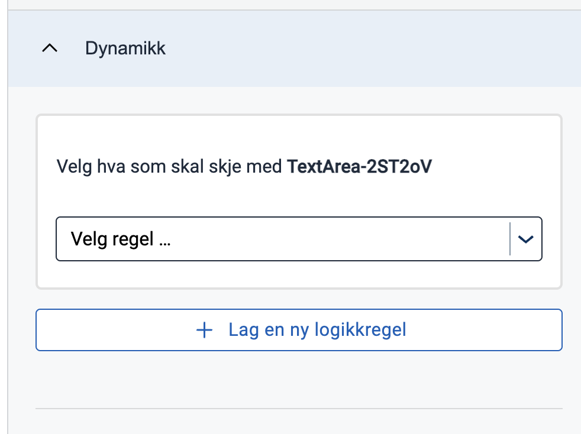

2. **Velg en funksjon som du vil at ditt første underuttrykk skal bruke**

   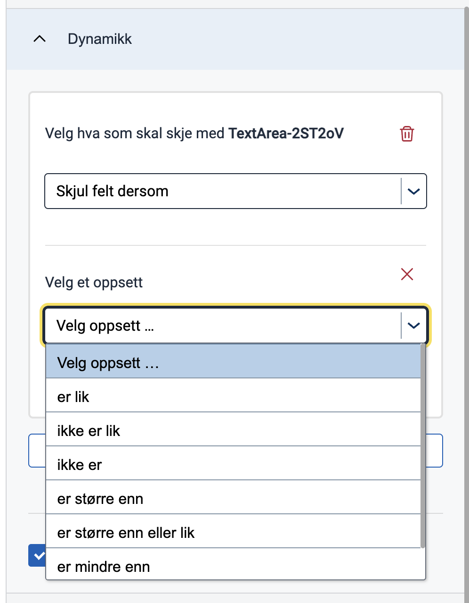
   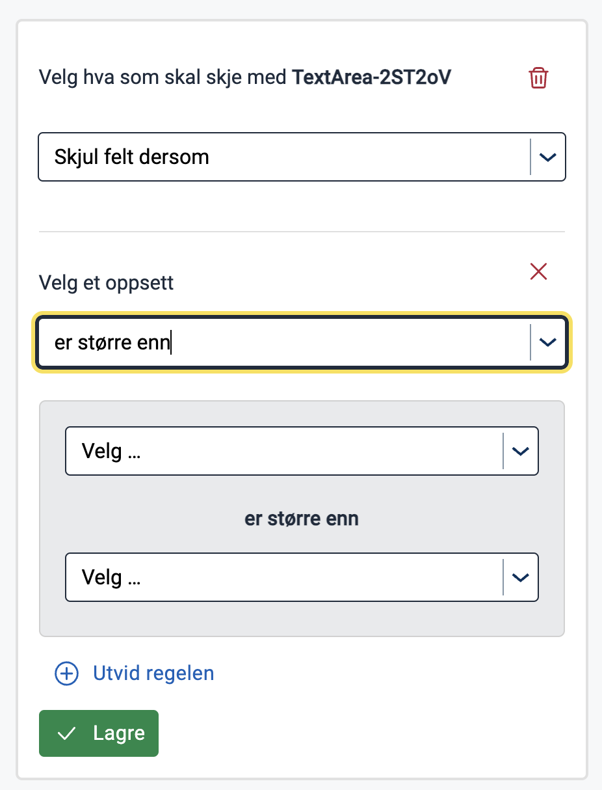

3. **Velg en datakilde som du vil at den første delen av underuttrykket ditt skal være**

   Denne datakilden kan være enten en faktisk kilde som gir deg tilgang til et sett med tilgjengelige verdier å velge
   fra etterpå, eller den kan være en type for en verdi. De tilgjengelige datakildene som vil gi deg et sett med
   gitte verdier er:

    - Datamodell: Felt fra den nåværende valgte datamodellen
    - Komponent: Alle komponent-IDer som er tilstede på tvers av layouter
    - Applikasjonsinnstillinger: Alle tilpassede konfigurasjonsverdier lagt til i `appsettings.json`
    - Instanskontekst: En av de følgende verdiene som finnes på instansobjektet i Altinn-lagring; `instanceId`
      , `InstanceOwnerPartyId` eller `appId`

   Mens de tilgjengelige datakildene som vil opptre som typer er:

    - Streng: Lar deg tilordne en hvilken som helst tilpasset streng som verdien
    - Tall: Lar deg tilordne et hvilket som helst tilpasset tall som verdien
    - Boolesk: Lar deg tilordne verdien som `true` eller `false`
    - Null: Tildeler automatisk verdien som `null`

   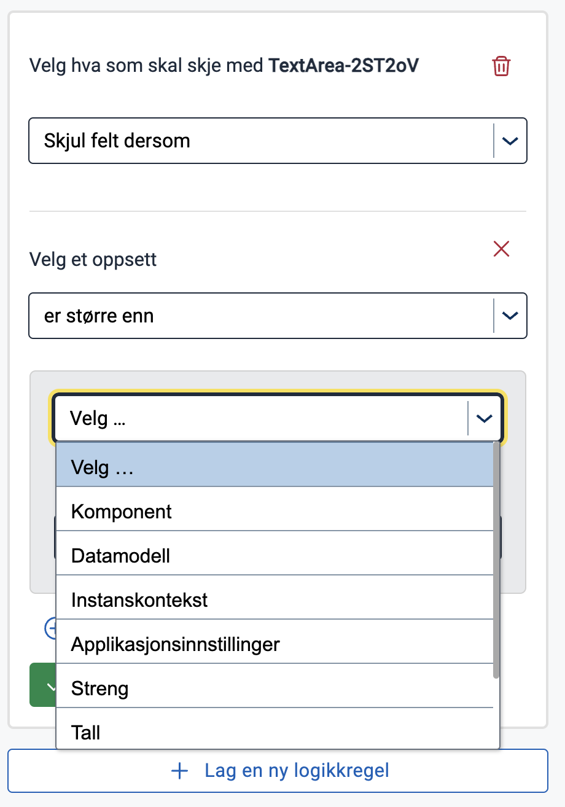

   **ADVARSEL**: De angitte verdiene som tilbys når du velger `Application Settings` som datakilde er ennå ikke
   implementert.

4. **Velg en verdi som du ønsker at det første elementet underuttrykket ditt skal ha**

   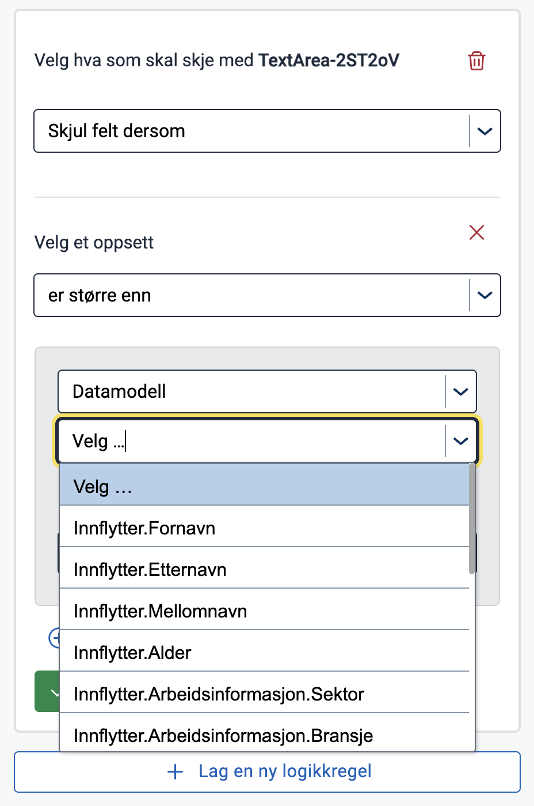
   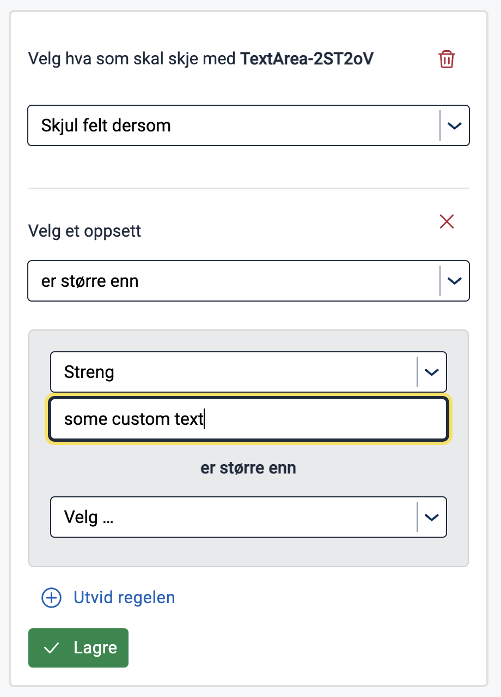

5. **Velg en sammenlignbar datakilde og verdi for det andre elementet i underuttrykket ditt**

   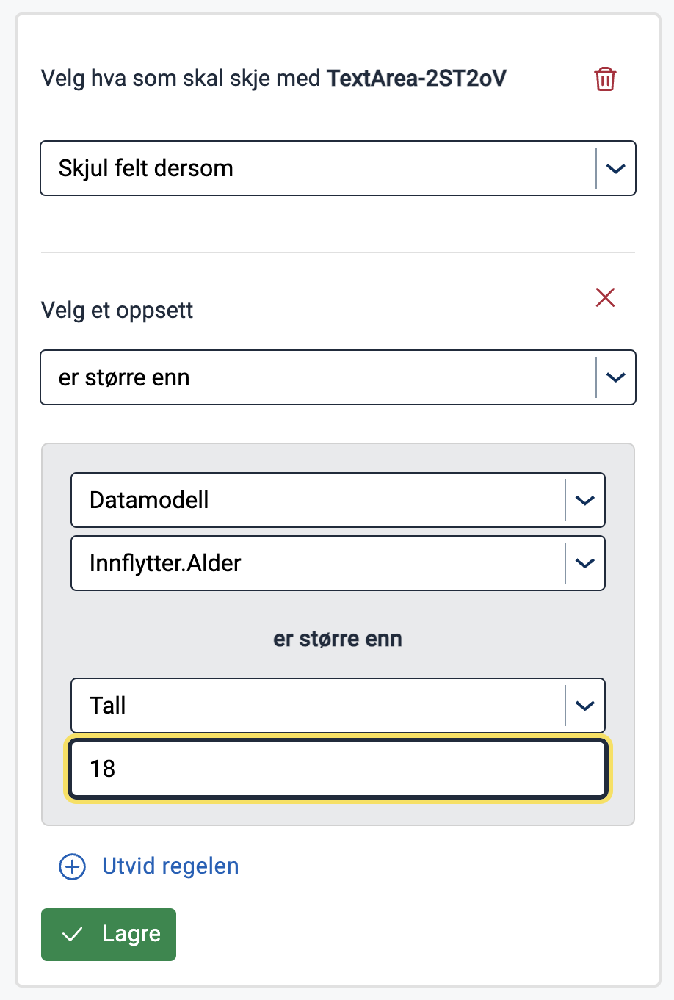

6. **Lagre uttrykket eller fortsett å legge til underuttrykk**

   Lagring av uttrykket vil koble uttrykket til komponentegenskapen du valgte og visualisere det i et
   forhåndsvisningsmodus.
   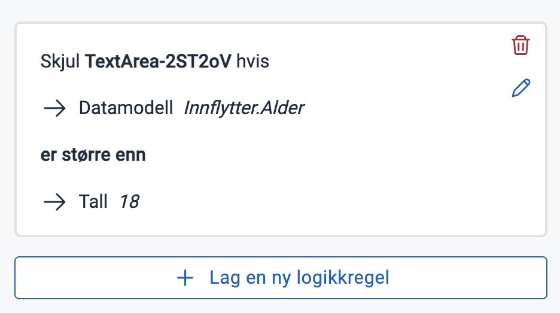

   Eller du kan fortsette å legge til underuttrykk ved å utvide regelen og sette operatøren, som skal evaluere
   deluttrykkene sammen, til enten `and` eller `or`.
   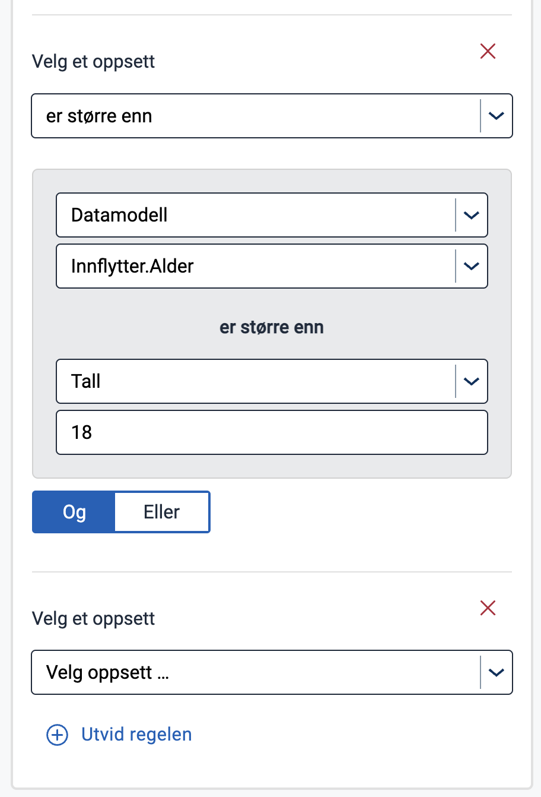

   Deretter gjentar du disse trinnene fra punkt 2 - legg til en funksjon i det nye underuttrykket og så videre.
   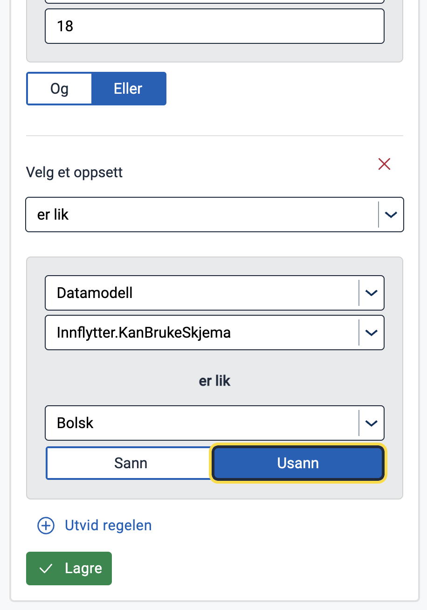

   Deretter kan du lagre det komplette uttrykket, med et vilkårlig antall underuttrykk, og visualisere det i
   forhåndsvisningsmodus.
   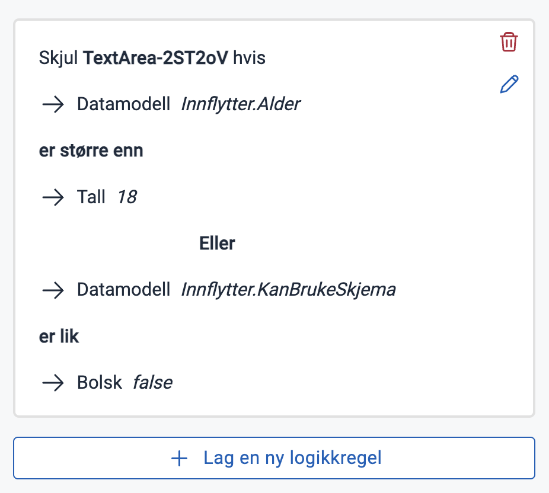

### "Komplekse" uttrykk

Det er også mulighet for å legge til uttrykk ved å skrive dem direkte i syntaksen som forventes av konfigurasjonen
i en kjørende Altinn-applikasjon. For øyeblikket vil denne funksjonaliteten bare være synlig i Studio UI hvis uttrykket
manuelt legges til feltet gjennom gitea eller en redigerings-IDE, og hvis uttrykket er skrevet på en måte som ikke kan
tolkes
av Studio uttrykks-verktøyet. Se avsnittet om [nøstede uttrykk](#Nøsting) for hvilke tilfeller som kan intreffe hvor
Studio ikke kan tolke et uttrykk. I tillegg til nøstede uttrykk, vil Studio heller ikke
kunne tolke uttrykk som er skrevet på en forenklet måte, for eksempel uten å inkludere funksjonen, der det vil bli
tolket av app-frontenden implisitt.

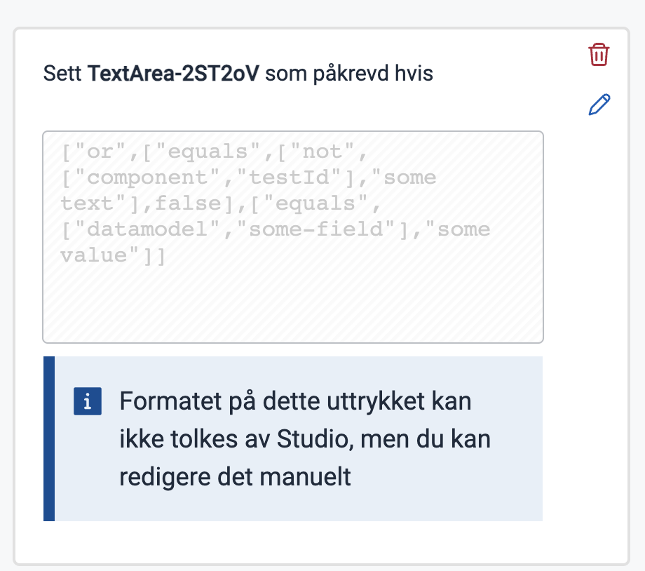

## Begrensninger

Som nevnt er det noen begrensninger i Studio-verktøyet for konfigurering av uttrykk.

### Tilgjengelige komponentfelter

For det første er det bare noen komponentfelter som Studio kan tolke og bygge tilknyttede
uttrykk for. På et senere utviklingsstadium vil vi gjøre det mulig å bygge og tolke uttrykk knyttet til

- tekstreseursbindinger på komponenter
- prosess

### <a name="Nøsting"></a>Nøsting

For det andre er Studio begrenset til å bygge uttrykk med bare ett nivå av nøsting. Dette betyr at en verdi i et
underuttrykk kun kan være enten en implisitt eller eksplisitt verdi, og ikke et underuttrykk. Hvis verdien er et
underuttrykk, vil du ende opp med et "komplekst" uttrykk som i eksempelet ovenfor.

### Eksisterende boolske egenskaper går tapt når uttrykk legges til

Hvis du har definert noen av de booleanske egenskapene/feltene på komponenten til å ha en boolsk verdi, `true`
eller `false`,
og du kobler et uttrykk til det, vil ikke Studio huske denne verdien. Dette betyr at hvis du legger til et uttrykk på et
felt som opprinnelig hadde en boolsk verdi, og deretter sletter uttrykket, vil feltet forsvinne fra komponenten og bli
vurdert til sin
standardverdi.

## Hva er et gyldig uttrykk sett fra Studios synspunkt

For å tillate lagring av et uttrykk i layoutfilen, vil Studio bare visualisere **Lagre**-knappen når noen gitte
betingelser gjelder:

1. Du har valgt en komponentegenskap/felt som uttrykket skal være tilknyttet til
2. Du har valgt en funksjon for det første deluttrykket i uttrykket ditt

Når disse betingelsene er oppfylt, kan du lagre uttrykket uten å fylle inn noen av verdiene. Dette vil legge til et
uttrykk som ser slik ut i den gitte komponentfeltet:

```json
"[KOMPONENTEGENSKAP]": [
"[FUNKSJON]",
null,
null
]
