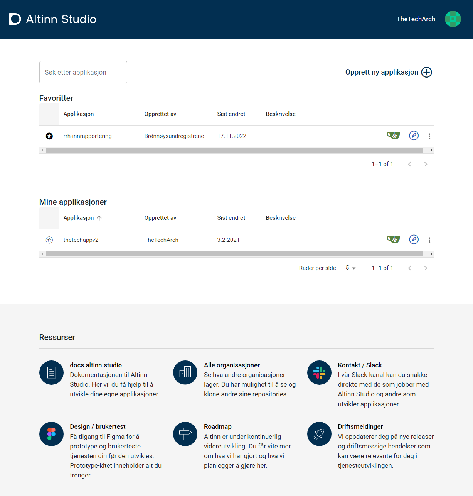

The dashboard lets the developer search for apps, create new apps, list all orgs and apps that developer have access to.

[See Getting started for more info on how to use dashboard](../../../../../../app/getting-started/create-app/).