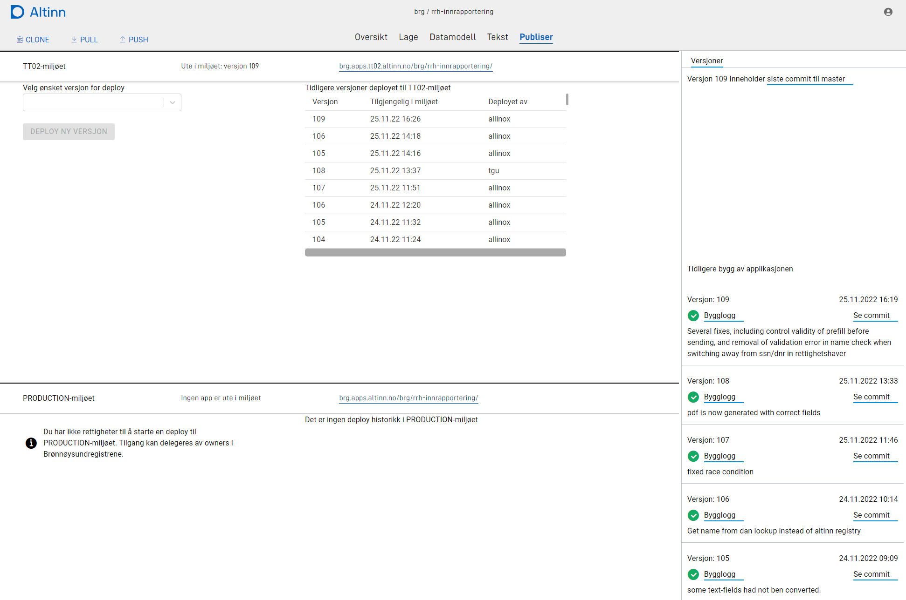

An app developer can build and deploy apps to all test and production environments available for that org.

Builds is based on the latest source code checked in to master branc for a given app. Each build can have a description.
When build is complete the build can be deployed to a given environment.

Read more about deployment in the [Application development handbook.](../../../../../app/deployment/)
