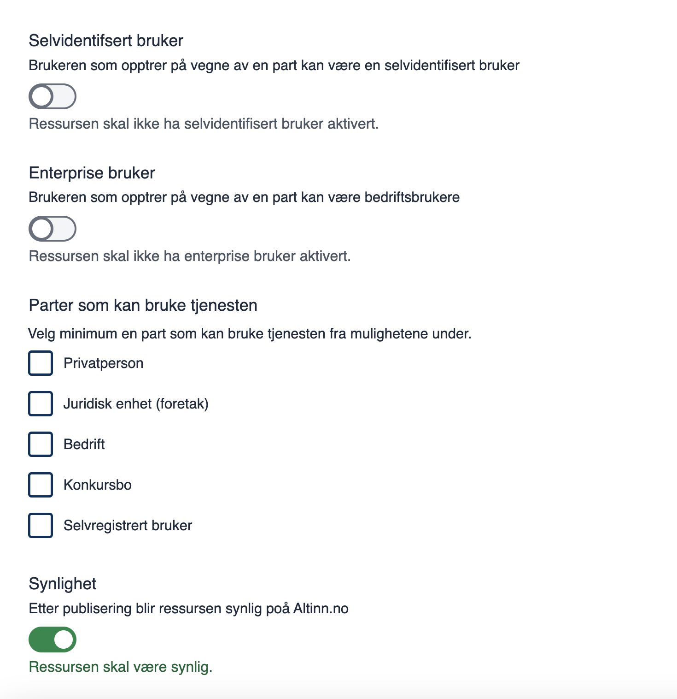
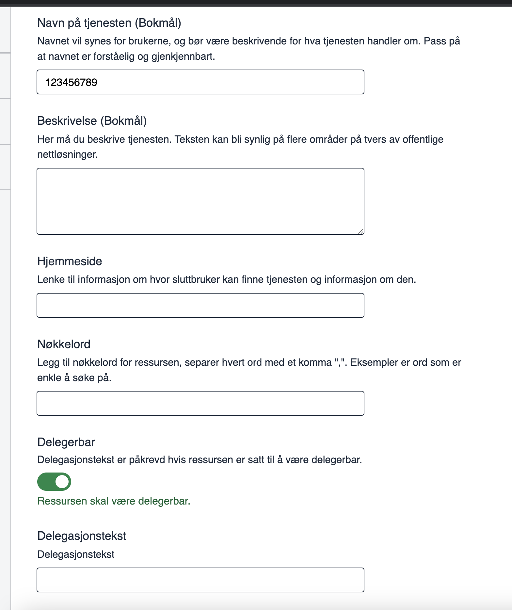
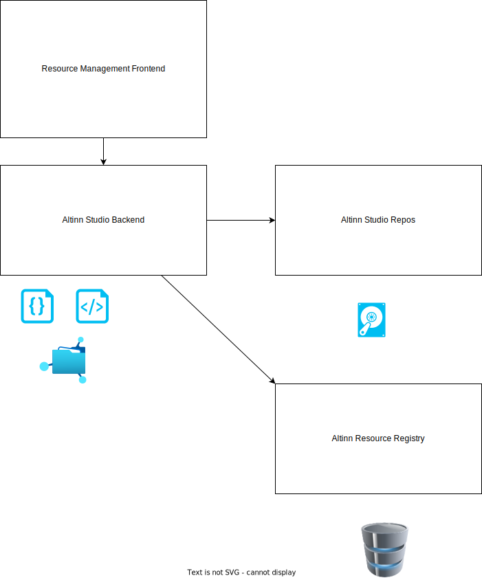

{}
Dette er et pågående arbeid
{}

## Hva er en ressurs i denne sammenhengen?

En ressurs i denne sammenhengen er et JSON-dokument som beskriver en typisk tjeneste eller hendelse som er gjort tilgjengelig for borgere eller bedrifter. Ressursdokumentet inneholder tittelen, beskrivelsen og annen relevant metadata om den tjenesten.

## Funksjonalitet i Altinn Studio Designer Standalone Resource

I Altinn Studio kan tjenesteeiere gjøre følgende for selvstendige ressurser:

- Liste opp ressursene sine.
- Opprette nye og oppdatere eksisterende ressurser og registrere alle relevante [attributter](/authorization/what-do-you-get/resourceregistry/#resource-attributes) for den ressursen.
- Sette og oppdatere autorisasjonspolicyen med de ulike nødvendige reglene for hver ressurs.
- Validere metadata for ressurser og autorisasjonspolicy for å sikre at de følger de nødvendige standardene.
- Publisere nye ressurser til TT02 eller produksjonsmiljøet.
- Oppdatere eksisterende ressurser i TT02 eller produksjonsmiljøet.

## Funksjonalitet i Altinn Studio Designer for metadata for app-ressurser opprettet i Altinn Studio

- Opprette nye og oppdatere eksisterende alle relevante [attributter](/authorization/what-do-you-get/resourceregistry/#resource-attributes) for den ressursen.
- Sette og oppdatere autorisasjonspolicyen med de ulike nødvendige reglene for hver ressurs.
- Validere metadata for ressurser og autorisasjonspolicy for å sikre at de følger de nødvendige standardene.
- Publisere nye ressurser til TT02 eller produksjonsmiljøet.
- Oppdatere eksisterende ressurser i TT02 eller produksjonsmiljøet.

## Migrere ressurser fra Altinn 2

- Man kan velge å opprette ressurs basert på lenketjenester i Altinn 2. 
- Man får da opprettet ressurs med eksisterende metadata og policy

## Gruppe styrt tilgang

- Tilgang til funksjonalitet er styrt via grupper i Altinn Studio

## Skjermbilder

## Konsept

