I denne modulen skal du videreutvikle applikasjonen du laget i [Modul 1](../modul1) med blant annet en ny side, dynamisk skjuling av sider og forhåndsutfylling.

Deler av Modul 2 kan gjøres i [Altinn Studio Designer](/nb/altinn-studio/getting-started/) (Designer), men noe må utføres med [lokal utvikling](/nb/altinn-studio/guides/local-dev).

**Temaer som dekkes i denne modulen:**

- Flere sider
- Bildekomponent
- Dynamisk skjuling av sider
- Sporvalg
- Forhåndsutfylling

## Oppgaver

{}

For skjemaer der det samles inn eller gis mye informasjon
kan det forbedre brukeropplevelsen dersom man deler applikasjonen opp i flere sider.

La oss se nærmere på hvordan man kan opprette en ny side i applikasjonen
som vises _før_ brukeren kommer til første datainnsamlingsside som ble laget i Modul 1.

Opprettelse og administrasjon av flere sider kan gjøres i [Altinn Studio Designer](/nb/altinn-studio/getting-started/) (venstre panel).
 For manuelt oppsett av sider, se 'Nyttig dokumentasjon' lenger ned på siden.

### Krav fra kommunen

Siden Sogndal kommune vil samle inn en betydelig mengde data i denne tjenesten, må de klargjøre hvem skjemaet er ment for og hvordan de vil bruke dataene. Noen i kommunen har laget et [utkast til en informasjonsside](infoside_tilflyttere.pdf) for dette formålet.

Informasjonssiden bør gjenspeile følgende elementer:
 - plassering av bilder
 - tekststørrelser
 - formatering av tekst

Du kan bruke følgende bilde av Sogndals kommunevåpen i applikasjonen:


### Oppgaver

1. Legg til en ny side. Gi den et passende navn og plasser den foran skjemasiden du opprettet i Modul 1.
2. [Legg til bilde](/nb/altinn-studio/reference/ux/components/image/#legg-til-komponent) av Sogndals kommunevåpen.
3. Legg til tekst i henhold til [skisse](infoside_tilflyttere.pdf).

### Nyttig dokumentasjon

- [Formatering av tekst](/nb/altinn-studio/reference/ux/texts/#formatering-av-tekster)
- [Hvordan legge til bilder i en applikasjon](/nb/altinn-studio/reference/ux/components/images/)
- [Sidestilte komponenter](/nb/altinn-studio/reference/ux/styling/#sidestilte-komponenter-grid)
- [Filoppsett ved flere sider](/nb/altinn-studio/reference/ux/pages/)
- [Administrere rekkefølge på flere sider](/nb/altinn-studio/reference/ux/pages/navigation/#rekkefølge)

### Forståelsessjekk

{}
Du kan konfigurere siderekkefølgen i `App/ui/Settings.json` ved å endre listen beskrevet under `pages.order`.
Se [Administrere rekkefølge på flere sider](/nb/altinn-studio/reference/ux/pages/navigation/#rekkefølge).
{}

{}
- `App/ui/layouts/<page>.json`: Endre filnavnet (`<page>`) på siden som skal bytte navn.
- `App/ui/Settings.json`: Endre navnet på siden under `pages.order`.
{}

{}
Alle tekstressurser støtter Markdown og dermed HTML-notasjon. Du kan derfor benytte `<br>` for å tvinge tekstbrytning.
{}

{}

{}

I mange tilfeller er det ønskelig å kontrollere hvilke deler av applikasjonen som er synlige basert på brukerens respons.
For eksempel kan det være relevant å hoppe over noen av spørsmålene i et skjema hvis svaret er åpenbart eller irrelevant basert på tidligere svar.

I denne oppgaven vil du sette opp dynamiske uttrykk i applikasjonen for å dirigere brukere til ulike sider basert på deres respons.

### Krav fra kommunen

En bruker som ikke oppfyller kravene for tjenesten, bør stoppes så tidlig som mulig i arbeidsflyten.
 Brukeren skal indikere om tjenesten gjelder dem på informasjonssiden.

Måten svaret samles inn på er valgfri, men et tips er å bruke en valg-komponent som [avkrysningsbokser](/nb/altinn-studio/reference/ux/components/checkboxes/), [radioknapper](/nb/altinn-studio/reference/ux/components/radiobuttons/) eller [nedtrekksliste](/nb/altinn-studio/reference/ux/components/dropdown/).
Merk at en komponent må være knyttet til et felt i datamodellen for å lagre verdier (du kan bruke feltet `Innflytter.KanBrukeSkjema` i datamodellen).

Brukeren skal sendes til ett av følgende spor basert på svaret deres:

*Spor 1*

- Brukeren indikerer at tjenesten ikke gjelder deres situasjon.
- Brukeren skal rettes til en side med følgende tekst:

    > Dette skjemaet er ikke for deg.  
    > [Se en oversikt over andre tilbud i kommunen her](https://www.sogndal.kommune.no/).
    
    Linje 2 i teksten er en hyperlenke som peker på https://www.sogndal.kommune.no/

*Spor 2*

- Brukeren har svart bekreftende på at tjenesten gjelder deres situasjon.
- Brukeren sendes videre til datainnsamlingssidene.

### Oppgaver

1. Legg til en komponent hvor brukeren kan oppgi om skjemaet gjelder dem eller ikke.
2. Legg til en side du kan sende brukeren til i _spor 1_.
3. Legg til logikk som aktiverer _spor 1_ eller _spor 2_ basert på brukerens svar.

### Nyttig dokumentasjon
- [Dynamiske uttrykk](/nb/altinn-studio/reference/logic/expressions)
- [Hvordan skjule hele sider](/nb/altinn-studio/reference/logic/expressions/#viseskjule-hele-sider)
- [Formatering av tekst](/nb/altinn-studio/reference/ux/texts/#formatering-av-tekster)

### Forståelsessjekk

{}
Dersom du har logikk i en applikasjon der man kan fortsette til innsending for flere spor, bør dataen på siden(e) som nå blir skjult for bruker nullstilles.
{}

{}

{}

Altinn gir fordelen av å ha lett tilgjengelig [metadata](/nb/api/models/instance/#instance) for enkeltpersoner og bedrifter.
 Ved hjelp av forhåndsutfylling kan vi hente brukerdata og fylle ut felt sømløst.
 Dette reduserer behovet for manuell inntasting av data, spesielt for standardopplysninger som navn, adresser og e-postadresser.

Du kan integrere data fra Altinns [forhåndsutfyllingskilder](/nb/altinn-studio/reference/data/prefill) direkte i appen ved å tilordne dataene til spesifikke felt i datamodellen. Dette automatiserer utfylling av felt under opprettelse av skjema. Du kan også integrere egendefinerte løsninger for forhåndsutfylling.

Denne oppgaven fokuserer på den første siden for datainnsamling og har som mål å effektivisere brukeropplevelsen ved å forhåndsutfylle brukerens personalia.

### Krav fra kommunen

- Følgende verdier skal forhåndsutfylles for brukeren:
  - Fornavn: `Innflytter.Fornavn`
  - Mellomnavn: `Innflytter.Mellomnavn`
  - Etternavn: `Innflytter.Etternavn`
  - E-post: `Innflytter.Kontaktinformasjon.Epost`
  - Telefonnummer: `Innflytter.Kontaktinformasjon.Telefonnummer`
  - Alder: `Innflytter.Alder`

- Det skal **ikke** være mulig å endre forhåndsutfylt navn og alder
- Det skal være mulig å endre forhåndsutfylt e-post og telefonnummer

### Oppgaver

1. Opprett en [fil for forhåndsutfylling](/nb/altinn-studio/guides/prefill/config/#oppsett-av-prefill-i-applikasjons-repository).
2. Konfigurer forhåndsutfylling for verdier tilgjengelig i Altinns [forhåndsutfyllingskilder](/nb/altinn-studio/reference/data/prefill) (alle unntatt alder).
3. Opprett [egendefinert forhåndsutfylling](/nb/altinn-studio/guides/prefill/custom) for alder basert på personnummer (se Kodehjelp og Nyttig dokumentasjon under).
4. Konfigurer innstillinger for felter som ikke skal kunne endres av brukeren.

{}

Du kan bruke den følgende funksjonen til å beregne en persons alder fra personnummeret deres:

```cs
private static int CalculateAge(string sosialSecNumber)
    {
        int MAX_D_NUMBER = 71;
        int MIN_D_NUMBER = 41;
        int MAX_TEST_NUMBER = 92;
        int MIN_TEST_NUMBER = 81;
        int START_D_NUMBER = 40;
        int START_TEST_NUMBER = 80;

        string stringDay = sosialSecNumber.Substring(0, 2);
        string stringMonth = sosialSecNumber.Substring(2, 2);
        string stringYear = sosialSecNumber.Substring(4, 2);
        string stringIndivid = sosialSecNumber.Substring(6, 3);

        int day = int.Parse(stringDay);
        int month = int.Parse(stringMonth);
        int year = int.Parse(stringYear);
        int individ = int.Parse(stringIndivid);

        // Get day if D-number
        if (MAX_D_NUMBER >= day && MIN_D_NUMBER <= day)
        {
            day -= START_D_NUMBER;
        }

        // Get month if TestUser-number
        if (MAX_TEST_NUMBER >= month && MIN_TEST_NUMBER <= month)
        {
            month -= START_TEST_NUMBER;
        }

        // find century
        if (year > 54 && (individ >= 500 && individ < 750))
        {
            // 1855-1899
            year += 1800;
        }
        else if (year > 39 && (individ >= 900 && individ < 1000))
        {
            // 1940-1999
            year += 1900;
        }
        else if (year < 40 && (individ >= 500 && individ < 1000))
        {
            // 2000-2039
            year += 2000;
        }
        else
        {
            year += 1900;
        }

        // calculate age
        int age = DateTime.Now.Year - year;

        if (DateTime.Now.Month < month)
        {
            age -= 1;
        }
        else if (DateTime.Now.Month == month)
        {
            if (DateTime.Now.Day < day)
            {
                age -= 1;
            }
        }

        return age;
    }
```
{}

{}
**Merk:** Applikasjonen må kjøres lokalt for at forhåndsutfyllinger skal vises.
{}

*Husk å pushe de lokale endringene dine så de blir tilgjengelige i Altinn Studio.*

### Nyttig dokumentasjon
- [Forhåndsutfylling fra nasjonale registre og brukerprofil](/nb/altinn-studio/guides/prefill/config/#prefill-fra-nasjonale-register-og-brukerprofil)
- [Tilgjengelige kilder og verdier for forhåndsutfylling](/nb/altinn-studio/reference/data/prefill)
- [Egendefinert forhåndsutfylling](/nb/altinn-studio/guides/prefill/custom)
- [Instance](/nb/api/models/instance/#instance) - Metadata for applikasjonen.
- [Beskrivelse av InstanceOwner-objektet](/nb/api/models/instance/#instanceowner) - Her finner du personnummeret.
  Vær oppmerksom på at egenskapene refereres til med store forbokstaver i koden, ikke med små, som i denne oversikten.

### Forståelsessjekk

{}
Ja, en standardkomponent med forhåndsutfylt data vil i utgangspunktet være redigerbar.
{}

{}

Komponenten kan settes til `readOnly` på én av to måter:

**1\.** I Altinn Studio Designer ved å huke av ved "Det skal ikke være mulig å svare (read only)" for den aktuelle komponenten:


**2\.** Sette egenskapen `readOnly` til `true` for komponenten i json-filen til siden:


App/ui/layouts/{page}.json


```json {linenos=false,hl_lines=["12"]}
{
  "$schema": "https://altinncdn.no/toolkits/altinn-app-frontend/4/schemas/json/layout/layout.schema.v1.json",
  "data": {
    "layout": [
      {
        "id": "firstName",
        "type": "Input",
        "dataModelBindings": {
          "simpleBinding": "Innflytter.Fornavn"
        },
        "required": false,
        "readOnly": true,
        "textResourceBindings": {
          "title": "firstName"
        }
      }
    ]
  }
}
```

Alternativt kan man kjøre valideringer av dataen på serversiden for å verifisere at dataen i feltet matcher dataen fra forhåndsutfyllingskilden. Dette kan gjøres i prosesserings- eller valideringslogikken til applikasjonen.
{}

{}

{}
Et [D-nummer](https://jusleksikon.no/wiki/F%C3%B8dselsnummer#D-nummer) er ellevesifret, som et ordinært personnummer, og består av en modifisert sekssifret fødselsdato og et femsifret personnummer. Fødselsdatoen modifiseres ved at _det legges til 4 på det første sifferet_. For eksempel vil den modifiserte fødselsdatoen være 410180 for en person født 1. januar 1980, og 710180 for noen født 31. januar 1980.
{}

Den følgende funksjonen konverterer et vilkårlig fødsels- eller D-nummer til en streng for fødselsdato på formatet `dd-MM-yy`:

```cs
public static string GetDOB(string fOrDNumber){
  List<string> firstCharsInDNumber = new(){"4", "5", "6", "7" };

  var fOrDNumberArray = fOrDNumber.ToCharArray();

  char[] dobArray = new char[6];
  Array.Copy(fOrDNumberArray, dobArray, 6);

  char firstChar = dobArray[0];
  int firstInt = 0;

  if(firstCharsInDNumber.Contains(firstChar.ToString()))
  {
    firstInt = firstChar - 4;
    dobArray[0] = (char)firstInt;
  }

  string dobString = $"{dobArray[0]}{dobArray[1]}.{dobArray[2]}{dobArray[3]}.{dobArray[4]}{dobArray[5]}";
  // verify that it is a valid date
  DateTime.ParseExact(dobString, "dd.MM.yy", CultureInfo.InvariantCulture);
  return dobString;
}
```
{}
{}

## Oppsummering

I denne modulen har du utvidet applikasjonen din med mer funksjonalitet ved å
legge til flere sider, sette opp sporvalg for å styre brukerflyten og sette opp forhåndsutfylling av skjemafelter
med tilgjengelige datakilder i Altinn og egendefinert kode.

Tjenesten skal kunne kjøres på din lokale maskin for lokal testing og du skal kunne teste begge brukerflytene og
bekrefte at riktige felter blir forhåndsutfylt.

## Løsningsforslag

[Kildekode Modul 2](https://altinn.studio/repos/testdep/flyttemelding-sogndal/src/branch/modul2)



{}
I dette steget har vi lagt til en enkel infoside med bilde og tekst.

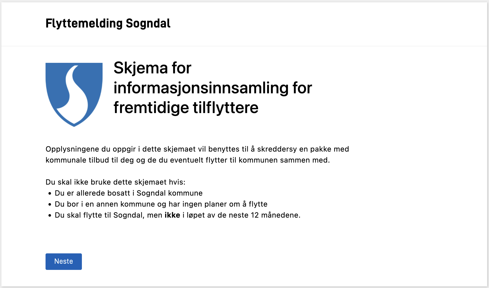
{}




### Komponenter

{}
Se *Kode* for sidestilling av komponenter.
{}

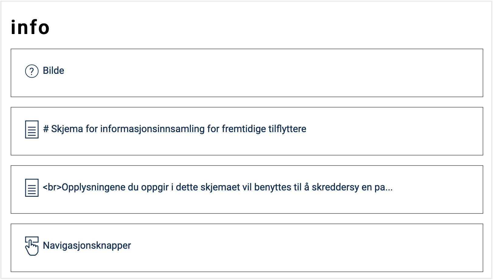

### Bilde

I denne løsningen har vi lagret bildet i appen og brukt `wwwroot/kommune-logo.png` som kilde.
 Et alternativ er å bruke en ekstern URL for bildet som kilde.

{}

Naviger til repository (klikk logo øverst i høyre hjørne eller tre prikker til høyre på menylinjen) og velg "Last opp fil" fra menyen "Add file".

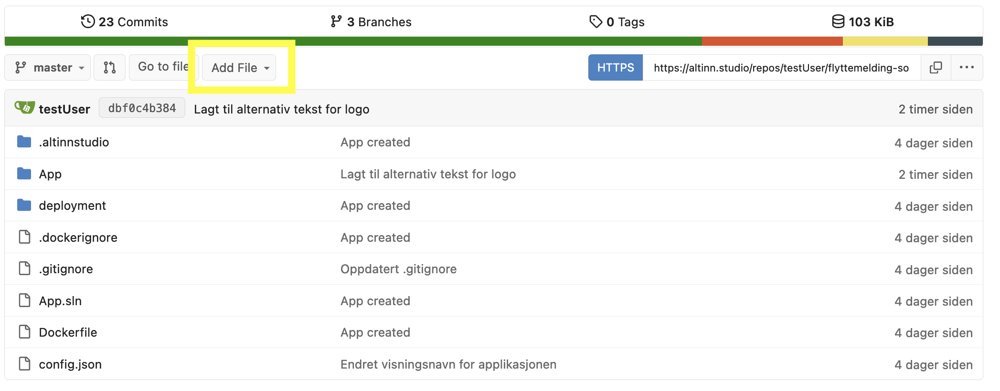

I feltet "Legg til mappe" fyller du inn `/App/wwwroot`.
 Last opp bildet og legg til en beskrivende commit-melding.
  Klikk "Commit endringer" for å lagre.


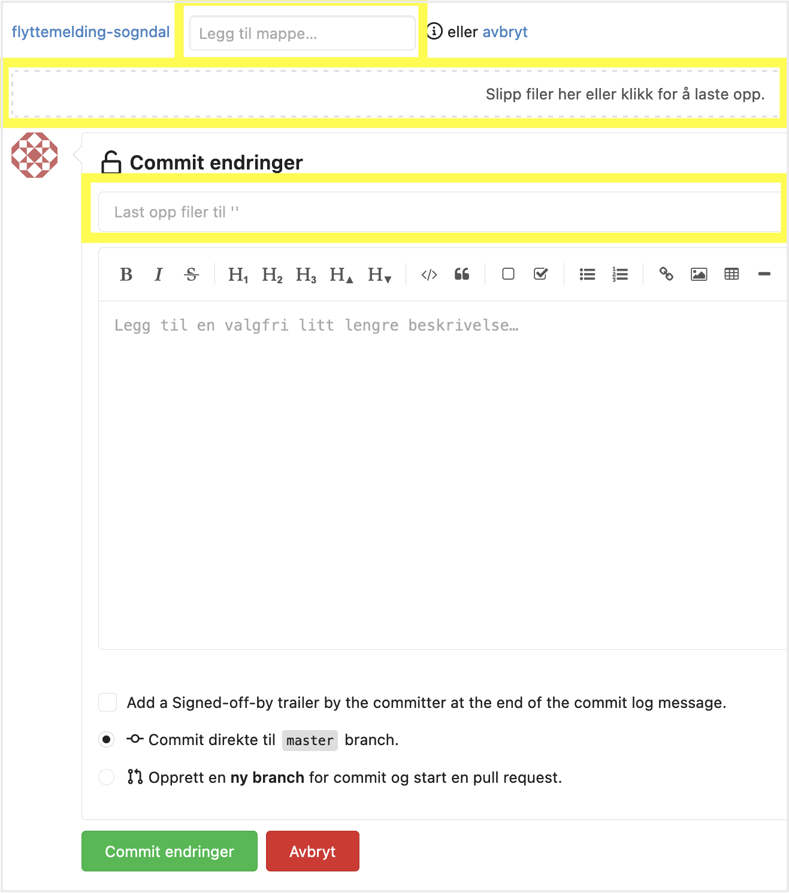

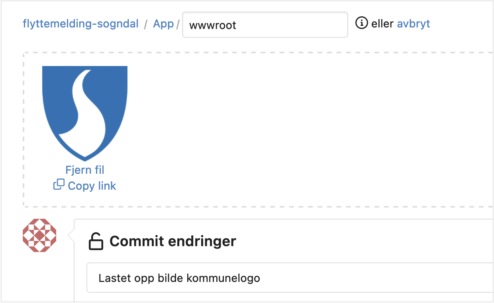

{}

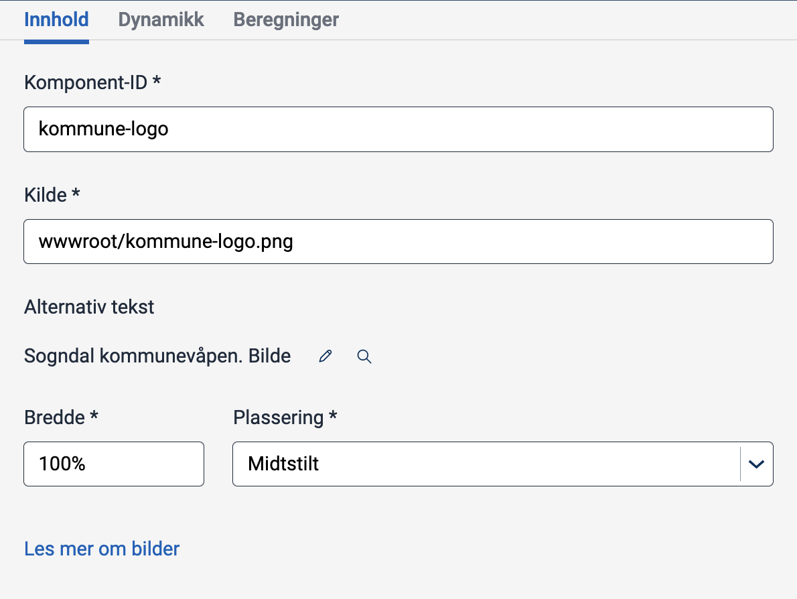


### Tekst

Både overskrift og beskrivelse er lagt til som "Paragraf" (underkategori av "Tekst") og formatert med markdown.

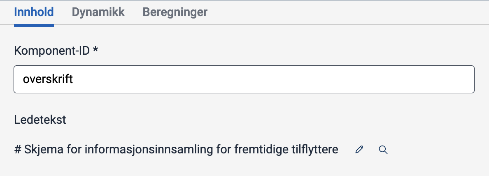

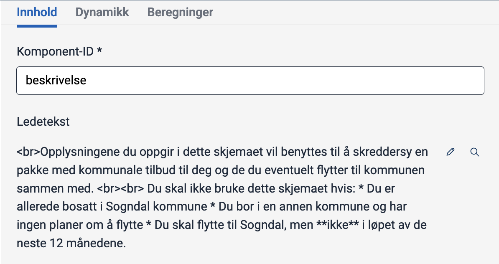




### Infoside - komponenter og innstillinger

Vi har plassert bildet og overskriften ved siden av hverandre ved hjelp av `grid`-egenskapen (markert) og tildelt ulike grid-fraksjoner til komponentene.


App/ui/layouts/info.json


```json {linenos=false,hl_lines=["15-17", "28-30"]}
{
  "$schema": "https://altinncdn.no/toolkits/altinn-app-frontend/4/schemas/json/layout/layout.schema.v1.json",
  "data": {
    "layout": [
      {
        "id": "kommune-logo",
        "type": "Image",
        "image": {
          "src": {
            "nb": "wwwroot/kommune-logo.png"
          },
          "width": "100%",
          "align": "center"
        },
        "grid": {
          "xs": 2
        },
        "textResourceBindings": {
          "altTextImg": "kommune-logo.altTextImg"
        }
      },
      {
        "id": "overskrift",
        "type": "Paragraph",
        "textResourceBindings": {
          "title": "info.overskrift.title"
        },
        "grid": {
          "xs": 7
        }
      },
      {
        "id": "beskrivelse",
        "type": "Paragraph",
        "textResourceBindings": {
          "title": "info.beskrivelse.title"
        }
      },
      {
        "id": "NavigationButtons-hateTR",
        "type": "NavigationButtons",
        "showBackButton": true,
        "textResourceBindings": {
          "next": "navigation.next",
          "back": "navigation.back"
        }
      }
    ]
  }
}
```

### Tekstressurser (nb)


App/config/texts/resource.nb.json


```json
{
  "$schema": "https://altinncdn.no/toolkits/altinn-app-frontend/4/schemas/json/text-resources/text-resources.schema.v1.json",
  "language": "nb",
  "resources": [
    ...
    {
      "id": "info.overskrift.title",
      "value": "# Skjema for informasjonsinnsamling for fremtidige tilflyttere"
    },
    {
      "id": "info.beskrivelse.title",
      "value": "<br>Opplysningene du oppgir i dette skjemaet vil benyttes til å skreddersy en pakke med kommunale tilbud til deg og de du eventuelt flytter til kommunen sammen med.\n<br><br>\nDu skal ikke bruke dette skjemaet hvis:\n* Du er allerede bosatt i Sogndal kommune\n* Du bor i en annen kommune og har ingen planer om å flytte\n* Du skal flytte til Sogndal, men **ikke** i løpet av de neste 12 månedene."
    },
    {
      "id": "kommune-logo.altTextImg",
      "value": "Sogndal kommunevåpen. Bilde"
    }
  ]
}
```






{}
I denne løsningen har vi valgt å legge til en komponent for radioknapper på info-siden hvor brukeren skal angi om de oppfyller kravene for å bruke skjemaet.
Det er valgt å forhåndsmarkere alternativet 'Nei' så brukeren må gjøre et aktivt valg for å bruke skjemaet.

Du kan bruke avkrysningsbokser eller nedtrekksliste som alternativ til radioknapper.


Vi har lagt til en ny side vi kan sende brukere til dersom de ikke oppfyller kravene (spor 1).

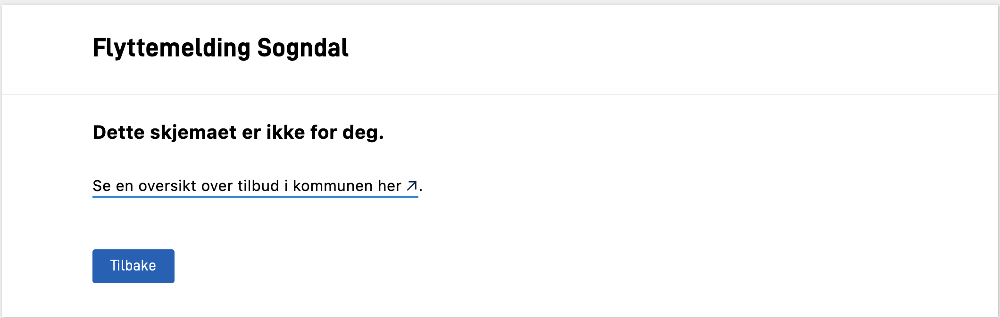
{}




{}
Se *Kode* for logikk ved veivalg.
{}

### Radioknapper


### Ny side

Ny side for *Spor 1*.


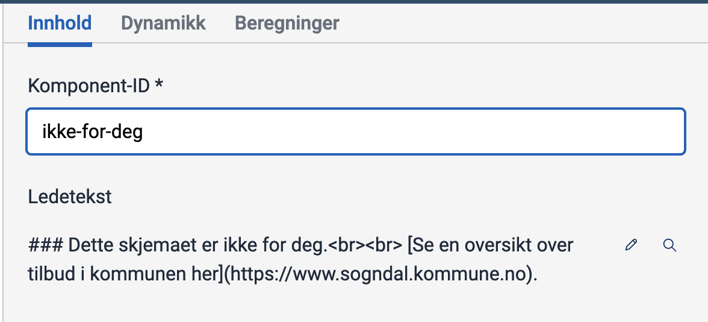





### Radioknapper


App/ui/layouts/info.json


```json {linenos=false,hl_lines=["6-27"]}
{
  "$schema": "https://altinncdn.no/toolkits/altinn-app-frontend/4/schemas/json/layout/layout.schema.v1.json",
  "data": {
    "layout": [
      ...
      {
        "id": "bekreftelse",
        "type": "RadioButtons",
        "required": true,
        "textResourceBindings": {
          "title": "info.bekreft"
        },
        "dataModelBindings": {
          "simpleBinding": "Innflytter.KanBrukeSkjema"
        },
        "options": [
          {
            "label": "info.ja",
            "value": "true"
          },
          {
            "label": "info.nei",
            "value": "false"
          }
        ],
        "preselectedOptionIndex": 1
      },
      ...
    ]
  }
}
```

### Ny side 'Ikke for deg' og logikk ved veivalg

Vi har lagt til en ny side som kun skal vises dersom brukeren ikke oppfyller kravene for å bruke tjenesten.
 En måte å oppnå dette på er ved å skjule siden hvis brukeren bekrefter at de *kan* bruke tjenesten.

Logikk for å skjule siden er implementert ved hjelp av egenskapen `hidden` (se markert del av koden).
Verdien fra valgt radioknapp lagres i feltet `Innflytter.KanBrukeSkjema` og kan nås gjennom komponenten (`["component", "bekreftelse"]`).
Som et alternativ kan du teste verdien til feltet direkte (`["dataModel", "Innflytter.KanBrukeSkjema"]`).


App/ui/layouts/ikke-for-deg.json


```json {linenos=false,hl_lines="4-11"}
{
  "$schema": "https://altinncdn.no/toolkits/altinn-app-frontend/4/schemas/json/layout/layout.schema.v1.json",
  "data": {
    "hidden": [
      "equals",
      [
        "component",
        "bekreftelse"
      ],
      true
    ],
    "layout": [
      {
        "id": "ikke-for-deg",
        "type": "Paragraph",
        "textResourceBindings": {
          "title": "ikke-for-deg.info"
        }
      },
      {
        "id": "NavigationButtons-azt7sj",
        "type": "NavigationButtons",
        "showBackButton": true,
        "textResourceBindings": {
          "back": "navigation.back"
        }
      }
    ]
  }
}
```

Tilsvarende logikk er lagt til for skjemasiden.
 Denne siden vil bli skjult når alternativet for *ikke* å oppfylle tjenestekravene blir valgt (verdien av komponenten `bekreftelse` er `false`).


App/ui/layouts/innflytterPersonalia.json


```json {linenos=false,hl_lines=["4-11"]}
{
  "$schema": "https://altinncdn.no/toolkits/altinn-app-frontend/4/schemas/json/layout/layout.schema.v1.json",
  "data": {
    "hidden": [
      "equals",
      [
        "component",
        "bekreftelse"
      ],
      false
    ],
    "layout": [
      ...
    ]
  }
}
```

### Ekskludere side fra pdf

Vi ønsker ikke å inkludere siden 'Ikke for deg' dersom det skal genereres en pdf-fil.
 Konfigurer egenskapen `excludeFromPdf` i `Settings.json` for å ekskludere sider fra pdf.


App/Settings.json


```json {linenos=false,hl_lines="9"}
{
  "$schema": "https://altinncdn.no/toolkits/altinn-app-frontend/4/schemas/json/layout/layoutSettings.schema.v1.json",
  "pages": {
    "order": [
      "info",
      "innflytterPersonalia",
      "ikke-for-deg"
    ],
    "excludeFromPdf": ["ikke-for-deg"]
  }
}
```

### Tekstressurser (nb)

Nye tekstressurser:


App/config/texts/resource.nb.json


```json {linenos=false,hl_lines=["6-21"]}
{
  "$schema": "https://altinncdn.no/toolkits/altinn-app-frontend/4/schemas/json/text-resources/text-resources.schema.v1.json",
  "language": "nb",
  "resources": [
    ...
    {
      "id": "info.bekreft",
      "value": "**Jeg møter kriteriene for å bruke appen.**"
    },
    {
      "id": "info.ja",
      "value": "Ja"
    },
    {
      "id": "info.nei",
      "value": "Nei"
    },
    {
      "id": "ikke-for-deg.info",
      "value": "### Dette skjemaet er ikke for deg.<br><br>\n[Se en oversikt over tilbud i kommunen her](https://www.sogndal.kommune.no)."
    }
  ]
}
```








{}

Under er et eksempel på hvordan datasiden kan se ut med forhåndsutfylt informasjon.
 Vi har også sidestilt flere av komponentene og lagt til en 'Send inn'-knapp.

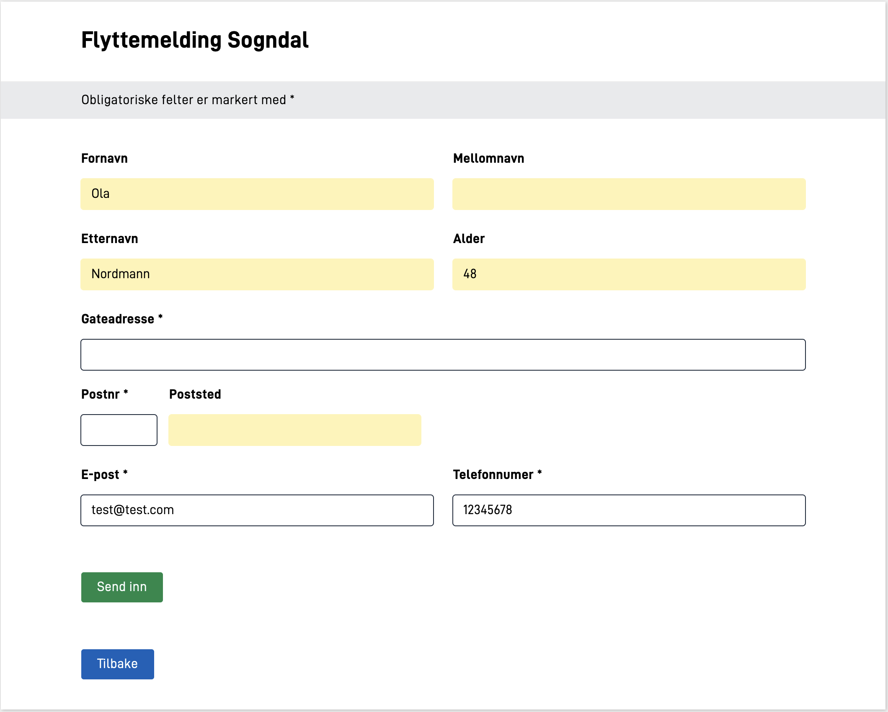

{}




{}
Se *Kode* for forhåndsutfylling og sidestilling av komponenter.
{}

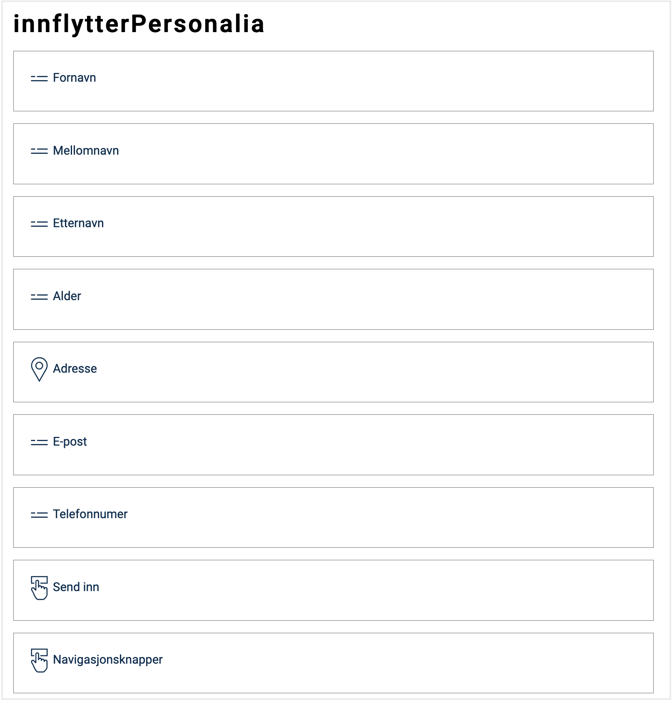

Huk av for 'Det skal ikke være mulig å svare (read only)' for felt som det ikke skal være mulig å endre (navn og alder):


Ny knapp:

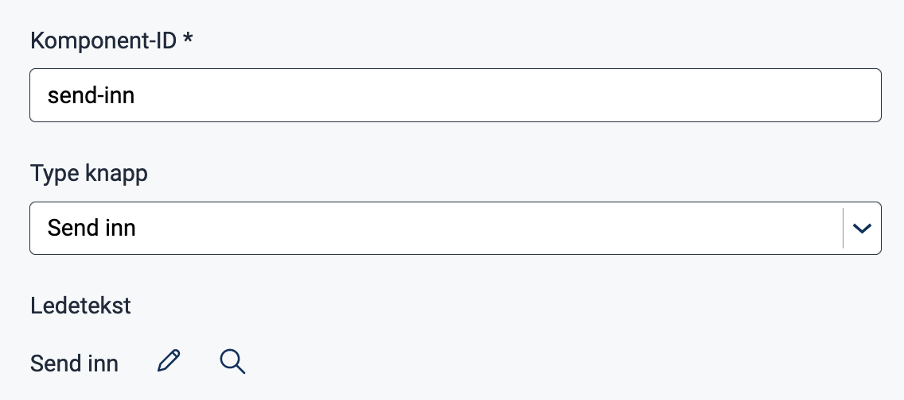




### Oppdatert dataside

* Komponentene for navn og alder er satt til `readOnly`.
* Noen komponenter er sidestilt.
* Det er lagt til en ny knapp.

Koden under viser et eksempel med noen av de endrede komponentene.
 For en fullstendig løsning, se [kildekode for Modul 2](https://altinn.studio/repos/testdep/flyttemelding-sogndal/src/branch/modul2).


App/ui/layouts/innflytterPersonalia.json


```json {linenos=false,hl_lines=["20", "24-26", "35", "39-41", "45-52"]}
{
  "$schema": "https://altinncdn.no/toolkits/altinn-app-frontend/4/schemas/json/layout/layout.schema.v1.json",
  "data": {
    "hidden": [
      "equals",
      [
        "component",
        "bekreftelse"
      ],
      false
    ],
    "layout": [
      {
        "id": "firstName",
        "type": "Input",
        "dataModelBindings": {
          "simpleBinding": "Innflytter.Fornavn"
        },
        "required": false,
        "readOnly": true,
        "textResourceBindings": {
          "title": "firstName"
        },
        "grid": {
          "xs": 6
        }
      },
      {
        "id": "middleName",
        "type": "Input",
        "dataModelBindings": {
          "simpleBinding": "Innflytter.Mellomnavn"
        },
        "required": false,
        "readOnly": true,
        "textResourceBindings": {
          "title": "middleName"
        },
        "grid": {
          "xs": 6
        }
      },

      ...

      {
        "id": "send-inn",
        "type": "Button",
        "textResourceBindings": {
          "title": "button.send-inn"
        }
      },
      ...
    ]
  }
}
```

### Forhåndsutfylling

Vi har opprettet filen `datamodel.prefill.json` og konfigurert forhåndsutfylling av personlig informasjon (unntatt alder):


App/models/datamodel.prefill.json


```json {linenos=false,hl_lines=[""]}
{
  "$schema": "https://altinncdn.no/toolkits/altinn-app-frontend/4/schemas/json/prefill/prefill.schema.v1.json",
  "allowOverwrite": true,
  "ER": {},
  "DSF": {
    "FirstName": "Innflytter.Fornavn",
    "MiddleName": "Innflytter.Mellomnavn",
    "LastName": "Innflytter.Etternavn",
    "TelephoneNumber": "Innflytter.Kontaktinformasjon.Telefonnummer"
  },
  "UserProfile": {
    "Email": "Innflytter.Kontaktinformasjon.Epost",
  }
}
```

### Beregning og forhåndsutfylling av alder

For egendefinert forhåndsutfylling av alder har vi opprettet en fil `InstantiationProcessor.cs` i mappen `logic/Instantiation` (vi har også opprettet den valgfrie mappen `Instantiation`).
 Metoden `DataCreation` henter personnummeret fra instansen som blir sendt til den. Deretter bruker den nummeret til å beregne alderen ved hjelp av metoden `CalculateAge` (utelatt, se kodehjelp under [Forhåndsutfylling](#prefill) i oppgavebeskrivelsen).
Den beregnede alderen blir så tilordnet datafeltet `skjema.Innflytter.Alder`.


App/logic/Instantiation/InstantiationProcessor.cs


```csharp{linenos=false,hl_lines=[""]}
using System;
using System.Collections.Generic;
using System.Threading.Tasks;
using Altinn.App.Core.Features;
using Altinn.App.Models;
using Altinn.Platform.Storage.Interface.Models;

namespace Altinn.App.AppLogic.Instantiation;

public class InstantiationProcessor : IInstantiationProcessor
{
    public async Task DataCreation(Instance instance, object data, Dictionary<string, string> prefill)
    {
        Skjema skjema = (Skjema)data;
        string personNumber = instance.InstanceOwner.PersonNumber;
        skjema.Innflytter.Alder = CalculateAge(personNumber);
        await Task.CompletedTask;
    }

  // Kode for hjelpemetoden CalculateAge()
}
```

Datatypen for `skjema` er gitt av datamodellen `datamodel.xsd`:


App/models/datamodel.xsd


```xml{linenos=false,hl_lines="2"}
 <xsd:schema xmlns:xsd="http://www.w3.org/2001/XMLSchema" elementFormDefault="qualified" attributeFormDefault="unqualified">
  <xsd:element name="InnflytterSkjema" type="Skjema" />
  <xsd:complexType name="Skjema">
    <xsd:sequence>
    ...
```

Til slutt har vi registrert implementeringen i `Program.cs`:


App/Program.cs


```csharp{linenos=false,hl_lines="6"}
...

void RegisterCustomAppServices(IServiceCollection services, IConfiguration config, IWebHostEnvironment env)
{
    // Register your apps custom service implementations here.
    services.AddTransient<IInstantiationProcessor, InstantiationProcessor>();
}

...
```





<br><br>

{}
[<< Forrige modul](../modul1/)      [Neste modul >>](../modul3/)
{}
