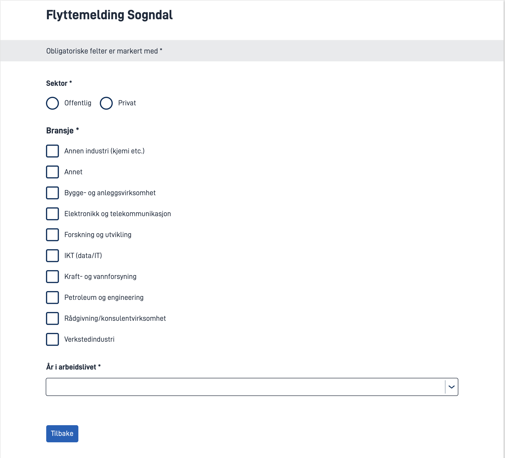
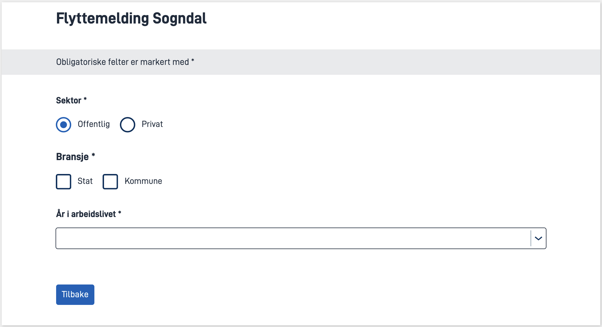
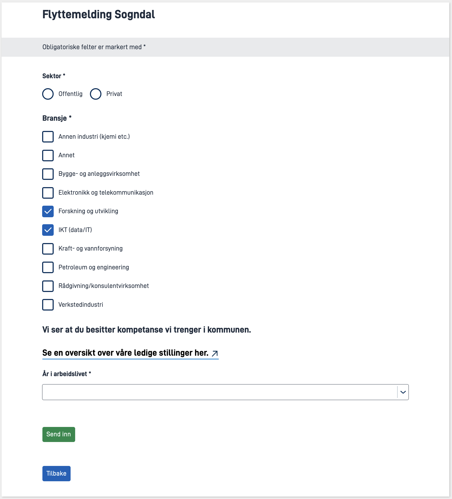

I denne modulen skal du utvide applikasjonen du har laget i foregående moduler for å støtte enda fler av [kravene til Sogndal kommune](../case/#krav-fra-kommunen).

**Temaer som dekkes i denne modulen:**

- Kodelister/Options
- Dynamiske uttrykk

## Oppgaver

{}

I mange applikasjoner er det behov for å gi brukeren et sett med svaralternativer for et datafelt.
Svaralternativene refereres til som _kodelister_ eller _options_.

I Altinn Studio er alternativer støttet av komponentene [radioknapper](/nb/altinn-studio/reference/ux/components/radiobuttons/), [avkrysningsbokser](/nb/altinn-studio/reference/ux/components/checkboxes/), [nedtrekkslister](/nb/altinn-studio/reference/ux/components/dropdown/) og [flervalg](/nb/altinn-studio/reference/ux/components/multipleselect/).

{}
Det er tre måter å sette opp kodelister (legge til alternativer) i Altinn:
 1. Ved å legg til alternativer manuelt for komponenten via Altinn Studio eller i filen `{page}.json`
 2. Ved å la komponenten hente alternativer fra en statisk json-fil.
 3. Ved å generere alternativer dynamisk med applikasjonslogikk.
{}

I denne oppgaven skal du få prøve deg på alle tre måtene å sette opp en kodeliste.

Sogndal kommune ønsker å samle inn opplysninger om tilflytterens arbeidsituasjon.
 Blant dataen de ønsker å samle inn er hvilken **sektor** og **bransje** tilflytter jobber i og hvor mange **år** tilflytter har vært yrkesaktiv.

### I Altinn Studio

1. Opprett en ny skjemaside for å samle inn data om arbeidsforhold.
2. Legg til en **radioknapp**-komponent for _Sektor_ og opprett svaralternativene `Offentlig` og `Privat` manuelt.
3. Legg til en **avkrysningsboks** for _Bransje_.
   Velg _Kodeliste_ som metode for å legge til avkrysningsboker og legg inn _Kodeliste ID_ `industry`. Resten av oppsettet for denne komponenten gjøres lokalt.
4. Legg til en **nedrekksliste** (dropdown) for _År i arbeidslivet_.
   Legg inn _Kodeliste ID_ `years-in-work-force`. Resten av oppsettet for denne komponenten gjøres lokalt.
5. Last opp endringene dine i Designer og last de deretter ned (_pull_) i ditt lokale utviklingsmiljø.

### I lokalt utviklingsmiljø

1. Opprett mappen `App/options` hvis den ikke eksisterer.
2. Sogndal kommune har opprettet en [statisk kodeliste](/nb/altinn-studio/guides/development/options/static-codelists) for **bransjer**: [industry.json](../industry.json). Last ned filen og plasser den i `App/options`.
3. Sett opp alternativene for **År i arbeidslivet** som en [åpen dynamisk kodeliste](/nb/altinn-studio/guides/development/options/dynamic-codelists#åpne-dynamiske-kodelister) i mappen `App/options` (følg anvisning i dokumentasjonen).  
   Svaralternativer:
   Label      | Dataverdi
   -----------|----------
   0 - 5 år   | `0-5`
   5 - 10 år  | `5-10`
   10 - 20 år | `10-20`
   20+ år     | `20+`
4. Verifiser at alle kodelister fungerer som forventet.

### Nyttig dokumentasjon

- [Statiske kodelister](/nb/altinn-studio/guides/development/options/static-codelists)
- [Dynamiske kodelister](/nb/altinn-studio/guides/development/options/dynamic-codelists)

### Forståelsessjekk
{}
Statiske svaralternativer er definert ved **build time**, og vil, som navnet tilsier, være statiske under hele sin levetid.
Dynamiske svaralternativer hentes ut ved **runtime** og kan dermed hente verdier basert på tiden på døgnet eller andre dynamiske verdier.
{}

{}
Svaralternativer er som standard åpent tilgjengelige og API'et vil være mulig å nå for personer som ikke er logget inn i appen. Det er heller ingen restriksjoner på roller.
I enkelte tilfeller så kan det tenkes at man ønsker å eksponere svaralternativer som er sensitive. Her kommer sikrede dynamiske svaralternativer til sin rett ved at man får automatisk verifisering på at den som gjør kallet har leserettigheter (`Instance.Read`-rettigheter).
{}

{}


{}

I noen tilfeller kan verdiene som skal vises fram i en kodeliste være avhengig av et annet skjemafelt.

Sogndal kommune ønsker at listen av bransjer skal tilpasses hvilken sektor man jobber i.

Les gjennom kravene til kommunen for å se om du kan hjelpe dem.

### Krav fra kommunen

Vi ønsker at brukerne skal ha et ulikt sett med svaralternativer for bransjevalget
basert på hvilken sektor de har krysset av for.

- Privat sektor: [Standardlisten med bransjer](../industry.json)
- Offentlig sektor: `Stat` og `Kommune`

### Oppgaver

1. [Send en dynamisk query-parameter](/nb/altinn-studio/guides/development/options/#sende-med-spørringsparametere-ved-henting-av-en-kodeliste) med Bransje-komponenten basert på Sektor.
2. Lag en dynamisk kodeliste for _Bransje_ med logikk basert på verdien til query-parameteren (hint: du kan lese inn bransjelisten fra json-filen).

### Nyttig dokumentasjon
- [Hvordan sende med spørringsparametre ved henting av kodelister](/nb/altinn-studio/guides/development/options/#sende-med-spørringsparametere-ved-henting-av-en-kodeliste)
- [Hvordan sette opp dynamiske kodelister](/nb/altinn-studio/guides/development/options/dynamic-codelists)

### Forståelsessjekk
{}
Om et felt i mappingen oppdateres, så vil app-frontend gjøre et nytt kall for å hente ut kodelisten.
Dette muliggjør å dynamisk vise valg som er skreddersydd til brukerens tidligere utfylte data.
{}

{}
Om brukeren f.eks. har valgt kommune fra en nedtrekksliste over kommuner som er satt opp med en mapping på `Fylke`, går tilbake og endrer feltet `Fylke`, så vil det valgte svaret i kommunelisten bli fjernet.
{}

{}

{}

### Krav fra kommunen

Dersom brukeren velger `IKT (data/it)` under bransje skal det vises en tekst og en lenke til en av våre stillingsutlysninger.

Under bransje-valget skal følgende tekst presenteres:

   
   > Vi ser at du besitter kompetanse vi trenger i kommunen.
   > Se en oversikt over våre ledige stillinger her.
    

Linje 2 i teksten skal være en hyperlenke som peker på https://sogndal.easycruit.com/index.html.

Tekst og lenke skal **kun** vises om man har valgt `IKT (data/it)`. I alle andre tilfeller skal dette være skjult.

### Oppgaver

1. Legg til en komponent som kan vise den aktuelle teksten.
2. Legg til [dynamikk for komponenten](/nb/altinn-studio/reference/logic/expressions/) som gjør at den kun vises dersom `IKT (data/it)` er valgt (**MERK**: Teksten skal vises også når flere alternativer er valgt, så lenge ett av dem er `IKT (data/it)`).
3. Flytt knappen 'Send inn' til siden for arbeidsforhold.


### Nyttig dokumentasjon
- [Dynamiske uttrykk](/nb/altinn-studio/reference/logic/expressions/)


{}

## Oppsummering

I denne modulen har du lagt til nedtrekksliste, radioknapp og avkrysningsbokser og lagt inn alternativer for disse komponentene manuelt og med dynamiske og statiske kodelister.
 I tillegg har du lagt til dynamikk som viser ulike alternativer basert på tidligere valg.

Tjenesten skal kunne kjøres opp på din lokale maskin med localtest
og du skal kunne validere at komponentene presenterer forventede dataverdier.

*Husk å pushe de lokale endringene dine så de blir tilgjengelig i Altinn Studio.*

## Løsningsforslag
[Kildekode Modul 4](https://altinn.studio/repos/testdep/flyttemelding-sogndal/src/branch/modul4)

{}



* Legg til komponenter i Altinn Studio Designer, legg til en passende ledetekst og knytt komponenten til riktig felt i datamodellen.

* **Legge til alternativer manuelt:** Fyll in felter i Altinn Studio Designer. I koden ser det ut som følger:


App/ui/layouts/Arbeidsforhold.json


```json {linenos=false,hl_lines="5-23"}
{
  "$schema": "https://altinncdn.no/toolkits/altinn-app-frontend/4/schemas/json/layout/layout.schema.v1.json",
  "data": {
    "layout": [
      {
        "id": "RadioButtons-sektor",
        "type": "RadioButtons",
        "dataModelBindings": {
          "simpleBinding": "Innflytter.Arbeidsinformasjon.Sektor"
        },
        "required": true,
        "options": [
          {
            "label": "arbeidsforhold.sektor.offentlig",
            "value": "offentlig"
          },
          {
            "label": "arbeidsforhold.sektor.privat",
            "value": "privat"
          }
        ],
        "textResourceBindings": {
          "title": "arbeidsforhold-sektor.title"
        }
      },
      ...
    ]
  }
}
```

* **Legge til statisk kodeliste for bransje:** Legg filen `industry.json` i `App/options`.

* **Legge til dynamisk kodeliste for år i arbeidslivet:**


App/options/YearsInWorkForceOptionsProvider.cs


```csharp
using Altinn.App.Core.Features;
using Altinn.App.Core.Models;
using System.Collections.Generic;
using System.Threading.Tasks;

namespace Altinn.App.AppLogic.Options
{
    public class YearsInWorkForceOptionsProvider : IAppOptionsProvider
    {
        public string Id { get; set; } = "years-in-work-force";

        public Task<AppOptions> GetAppOptionsAsync(string language, Dictionary<string, string> keyValuePairs)
        {
            var options = new AppOptions
            {
                Options = new List<AppOption>
                    {
                        new() {
                            Label = "0 - 5 år",
                            Value = "0-5"
                        },
                        new() {
                            Label = "5 - 10 år",
                            Value = "5-10"
                        },
                        new() {
                            Label = "10 - 20 år",
                            Value = "10-20"
                        },
                        new() {
                            Label = "20+ år",
                            Value = "20+"
                        }
                    }
            };

            return Task.FromResult(options);
        }
    }
}
```

* **Registrere dynamisk kodeliste:**


App/Program.cs


```csharp{linenos=false,hl_lines="5"}
...
{
    // Register your apps custom service implementations here.
    services.AddTransient<IInstantiationProcessor, InstantiationProcessor>();
    services.AddTransient<IAppOptionsProvider, YearsInWorkForceOptionsProvider>();
   ...
}

{}

{}



* For å sende en spørreparameter med Bransje-komponenten legger vi til en mapping på komponenten knyttet til feltet `Sektor` i datamodellen:


App/ui/layouts/arbeidsforhold.json


```json {linenos=false,hl_lines="13-15"}
...
      {
        "id": "Checkboxes-bransje",
        "type": "Checkboxes",
        "dataModelBindings": {
          "simpleBinding": "Innflytter.Arbeidsinformasjon.Bransje"
        },
        "required": true,
        "textResourceBindings": {
          "title": "arbeidsforhold-bransje.title"
        },
        "optionsId": "industry",
        "mapping": {
          "Innflytter.Arbeidsinformasjon.Sektor": "sektor"
        }
      },
...
```

* Dynamisk kodeliste for _Bransje_ med svaralternativer som avhenger av verdien for `sektor`:


App/options/IndustryOptions.cs


```csharp
using Altinn.App.Core.Features;
using Altinn.App.Core.Models;
using Newtonsoft.Json;
using System.Collections.Generic;
using System.IO;
using System.Threading.Tasks;

namespace Altinn.App.AppLogic.Options
{
    public class IndustryOptions : IAppOptionsProvider
    {
        public string Id { get; set; } = "industry";
        private List<AppOption> _privateOptions = null;

        public Task<AppOptions> GetAppOptionsAsync(string language, Dictionary<string, string> keyValuePairs)
        {
            string sektor = keyValuePairs.GetValueOrDefault("sektor");

            if (sektor == "offentlig")
            {
                var offentligeOptions = new AppOptions
                {
                    Options = new List<AppOption>
                    {
                        new() {
                            Label = "Stat",
                            Value = "stat"
                        },
                        new() {
                            Label = "Kommune",
                            Value = "kommune"
                        },
                    }
                };
                return Task.FromResult(offentligeOptions);
            }
            else
            {
                if (_privateOptions == null)
                {
                    using (StreamReader r = new("./options/industry.json"))
                    {
                        string json = r.ReadToEnd();
                        _privateOptions = JsonConvert.DeserializeObject<List<AppOption>>(json);
                    }

                }
                return Task.FromResult(new AppOptions { Options = _privateOptions });
            }
        }
    }
}
```

* Kodelisten registreres i `Program.cs`:


App/Program.cs


```csharp{hl_lines="6"}
{
   ...
    // Register your apps custom service implementations here.
    services.AddTransient<IInstantiationProcessor, InstantiationProcessor>();
    services.AddTransient<IAppOptionsProvider, YearsInWorkForceOptionsProvider>();
    services.AddTransient<IAppOptionsProvider, IndustryOptions>();
    ...
}
```

{}

{}



* **Legg til komponent for visning av tekst**. Det er lagt til logikk på komponenten som skjuler den dersom "IKT (data/IT)" ikke er valgt. Verdien `491` for feltet er hentet fra filen `industry.json`.  
'Send inn'-knappen er også flyttet til denne siden.


App/ui/layouts/arbeidsforhold.json


```json {hl_lines="8"}
...
{
   "id": "info-it-kompteanse",
   "type": "Paragraph",
   "textResourceBindings": {
      "title": "arbeid.it-kompetanse"
   },
   "hidden": ["notContains", ["component", "Checkboxes-bransje"], "491"],
   "dataModelBindings": {}
},
{
   "id": "send-inn",
   "type": "Button",
   "textResourceBindings": {
      "title": "button.send-inn"
   }
},
...
```

* **Legg til tekstressurs:**


App/config/texts/resource.nb.json


```json
...
{
"id": "arbeid.it-kompetanse",
"value": "#### Vi ser at du besitter kompetanse vi trenger i kommunen. <br><br> [Se en oversikt over våre ledige stillinger her.](https://sogndal.easycruit.com/index.html)"
},
...
```

{}


<br><br>

{}
[<< Forrige modul](../modul3/)      [Neste modul >>](../modul5/)
{}