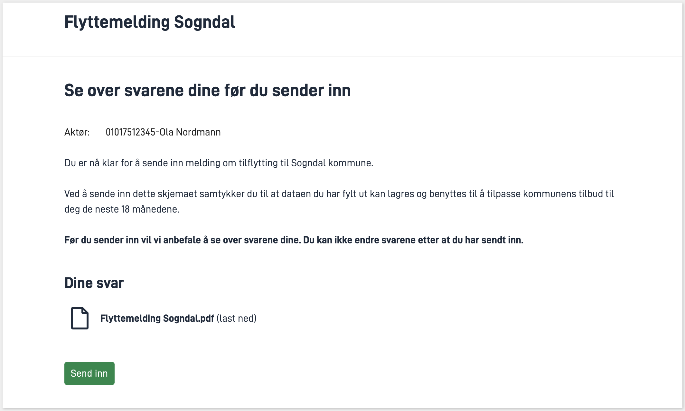

In this module you are adding a process step in the application.

**Topics covered in this module:**
- Process
- Confirmation step
- Authorization rules
- Validation
- Replace standard texts

## Tasks

{}

An Altinn App has a process flow that describes the different steps in the flow.
The standard flow for a newly created application consists of one task; the fill out step.


Your task is to expand the standard process flow with a confirmation step as illustrated below.
The confirmation page is added automatically when the step is added to the BPMN file.


### Requirements from the municipality

At this point in the workflow, the user should be able to:
1. View an overview of the data entered before submitting the form

### Tasks

1. Update `App/config/process/process.bpmn` to include the confirmation step
    (you can replace the entire content with the content in the template below).

[Template process flow with data and confirmation step](/altinn-studio/reference/configuration/process/Data_Confirmation_Process.bpmn)

{}
If you're up for an extra challenge, you can manually edit the process flow or use a BPMN editing tool.
 You can then use the template as the answer key.
{} 

### Useful documentation

- [Available process steps in an Altinn app](/altinn-studio/reference/configuration/process/#supported-process-task-types)
- [How to change the process flow of an application](/altinn-studio/reference/configuration/process/#change-the-process)
- [Online BPMN editor](https://demo.bpmn.io/)
- [BPMN standard](https://en.wikipedia.org/wiki/Business_Process_Model_and_Notation)

### Knowledge check
{}
`altinn:tasktype` is defined for each task.
{}

{}
Altinn-specific properties are unlikely to be imported or exported when working with the model.
{}

{}
The _SequenceFlow_ in the bpmn file only describes the flow going one way, from filling out to confirmation. Therefore, the flow cannot go both ways.
{}

{}

{}

The policy file for your application is tailored to the standard process flow and needs to be updated to include the confirmation step.

### Requirements from the municipality
- The role requirements for filling out and confirming an instance should be the same.
- Users should be able to submit the form.

### Tasks

1. Familiarize yourself with the policy file `App/config/authorization/policy.xml`: Identify the various rules and the pattern for `RuleId`.
2. Find the relevant rule in the [rule library](/altinn-studio/reference/configuration/authorization/rules/). The rule should cover that a user with the role REGNA or DAGL should be able to confirm the submission of the form (Task2).
3. Add the rule to the policy file. Remember to replace `[RULE_ID]` with the correct ID (follow the pattern of the other rules).

### Useful documentation
- [Rule library](/altinn-studio/reference/configuration/authorization/rules/)
- [All roles in Altinn](https://www.altinn.no/en/help/forms/all-altinn-roles/)

### Knowledge check
{}
The application will display an "Unknown error" when the user presses the "submit" button.
{}

{}
In that case, all users, both with and without roles, will have permission to perform the _confirm_ operation for the application.
{}

{}

{}

### Requirements from the municipality
- Only the user who owns the instance should be able to submit the form, even if others may have the required roles.

To ensure that only the user who owns the instance can submit the form, we can add validation that checks if
 the `partyId` of the current user matches the `partyId` (see [InstanceOwner](/api/models/instance/#instanceowner)) of the owner of the instance for the task with the ID "Task_2"
  (which is the confirmation step). If they do not match, it adds an error message to the validation results.
   The error message will be displayed on the screen, and the process flow will be halted.

1. Create the file `App/logic/Validation/InstanceValidation.cs` (follow the procedure for [custom validation](/altinn-studio/reference/logic/validation/#how-to-add-custom-validation)).
2. Add the validation logic for user ID in the `ValidateTask` class.

### Useful documentation
- [Custom validation](/altinn-studio/reference/logic/validation/#how-to-add-custom-validation)
- [Instance](/api/models/instance/#instance)
- [InstanceOwner](/api/models/instance/#instanceowner)

### Knowledge check
{}
You can suggest modifying the policy so that only the "PRIV" role - which can only be delegated to an individual on their own behalf - has permission to perform the "confirm" action. This would automatically include the check that is currently implemented as custom validation in the authorization rules.
{}

{}


{}

### Requirements from the municipality

We want the user to be presented with the following text before submission:

```rich
Du er nå klar for å sende inn melding om tilflytting til Sogndal kommune.

Ved å sende inn dette skjemaet samtykker du til at dataen du har fylt ut kan lagres og benyttes til å tilpasse kommunens tilbud til deg de neste 18 månedene.

Før du sender inn vil vi anbefale å se over svarene dine. Du kan ikke endre svarene etter at du har sendt inn.
```

**Tasks**

1. Create a text resource that [overrides the default text for the confirmation page](/altinn-studio/reference/configuration/process/customize/#confirmation).

### Useful documentation
- [Customization of the confirmation page](/altinn-studio/reference/configuration/process/customize/#confirmation)

{}


## Summary

In this module, you have expanded your application with a confirmation step, customized the view, and added validation and authorization rules associated with the process step.

The service should be able to run on your local machine with localtest, and you should be able to test the new process step and confirm that the view appears as desired.

*Remember to push your local changes so that they become available in Altinn Studio.*


## Solution
[Source Code Module 5](https://altinn.studio/repos/testdep/flyttemelding-sogndal/src/branch/modul5)

{}

* **Copy the content from the [template](/altinn-studio/reference/configuration/process/Data_Confirmation_Process.bpmn) and paste it into the file `App/config/process/process.bpmn`** (replace the entire original content).

 You should now see the following page when you click "Submit":


Please note that clicking "Send inn" (submit) on the confirmation page will result in an error message. This will be resolved in the next step with authorization.

{}

{}

* **Find the relevant rule in the [rule library](/altinn-studio/reference/configuration/authorization/rules/):**
[User with role REGNA or DAGL can confirm instances of [ORG]/[APP] when it is in Task_2](/altinn-studio/reference/configuration/authorization/rules/#user-with-role-regna-or-dagl-can-confirm-instances-of-orgapp-when-it-is-in-task_2).

* **Copy the code for the rule and paste it into `policy.xml`** (right after the last rule (between the last `</xacml:Rule>` tag and `<xacml:ObligationExpressions>`)).

* **Replace `[RULE_ID]` with `7`** (since the preceding rule has id `6`).

For the complete solution, see [source code](https://altinn.studio/repos/testdep/flyttemelding-sogndal/src/branch/modul5/App/config/authorization/policy.xml).

With authorization in place, you should be able to submit the form, and you will see the confirmation page:


{}

{}

* **Follow the procedure for [custom validation](/altinn-studio/reference/logic/validation/#how-to-add-custom-validation) to create the file.**
* **Add validation logic for user ID in the `ValidateTask` class:**


App/logic/Validation/InstanceValidation.cs


```csharp
...

namespace Altinn.App.AppLogic.Validation;

public class InstanceValidator : IInstanceValidator
{
    // Field used to store the http context for the current request
    private readonly HttpContext _httpContext;

    public InstanceValidator(IHttpContextAccessor httpContextAccessor)
    {
        // Get the http context from the accessor
        _httpContext = httpContextAccessor.HttpContext;
    }
    public Task ValidateData(object data, ModelStateDictionary validationResults)
    {
        throw new System.NotImplementedException();
    }

     public async Task ValidateTask(Instance instance, string taskId, ModelStateDictionary validationResults)
    {
        // Get the user from the http context
        var user = _httpContext.User;
        if (taskId == "Task_2")
        {
            // Get the party id claim from the user
            Claim partyIdClaim = user.FindFirst(c => c.Type == AltinnCoreClaimTypes.PartyID);
            // Check if the party id claim matches the instance owner party id
            if (partyIdClaim.Value != instance.InstanceOwner.PartyId)
            {
                // Add a model error to the validation results (this will be displayed in the UI and prevent the user from continuing)
                validationResults.AddModelError(taskId, "confirm.validation_message");
            }
        }

        // Return a completed task
        await Task.CompletedTask;
    }
}
```

* **Register the implementation in `Program.cs`**


App/Program.cs


```csharp{hl_lines="6"}
{
    // Register your apps custom service implementations here.
    services.AddTransient<IInstantiationProcessor, InstantiationProcessor>();
    services.AddTransient<IAppOptionsProvider, YearsInWorkForceOptionsProvider>();
    services.AddTransient<IAppOptionsProvider, IndustryOptions>();
    services.AddTransient<IInstanceValidator, InstanceValidator>();
}
```

* **Add a text resource with a message to display in case of validation failure:**


App/config/texts/resources.nb.json


```json
{
  "$schema": "https://altinncdn.no/toolkits/altinn-app-frontend/4/schemas/json/text-resources/text-resources.schema.v1.json",
  "language": "nb",
  "resources": [
    ...
    {
      "id": "confirm.validation_message",
      "value": "Kun brukeren som eier instansen kan sende inn dette skjema."
    }
  ]
}
```

{}

{}



* **To add custom text to the confirmation page as shown in the example above, add the following text resource:**


App/config/texts/resources.nb.json


```json
{
  "$schema": "https://altinncdn.no/toolkits/altinn-app-frontend/4/schemas/json/text-resources/text-resources.schema.v1.json",
  "language": "nb",
  "resources": [
    ...
    {
      "id": "confirm.body",
      "value": "Du er nå klar for å sende inn melding om tilflytting til Sogndal kommune. </br></br> Ved å sende inn dette skjemaet samtykker du til at dataen du har fylt ut kan lagres og benyttes til å tilpasse kommunens tilbud til deg de neste 18 månedene. </br></br> **Før du sender inn vil vi anbefale å se over svarene dine. Du kan ikke endre svarene etter at du har sendt inn.**"
    }
  ]
}
```

{}

<br><br>

{}
[<< Previous Module](../modul4/)      [Next Module >>](../modul6/)
{}