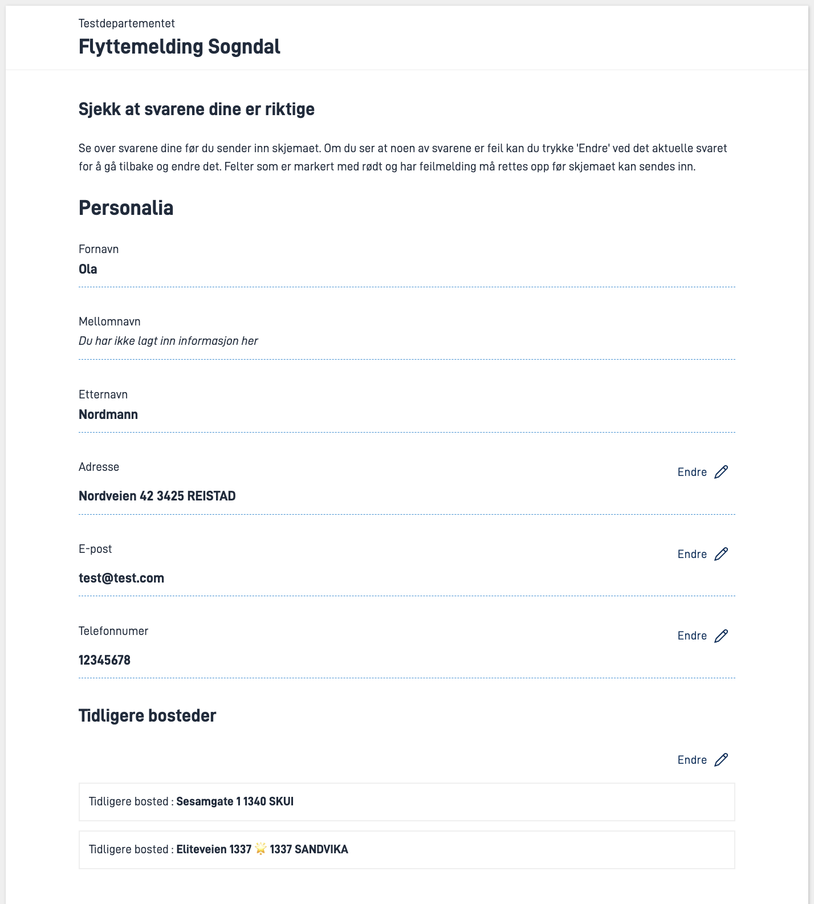
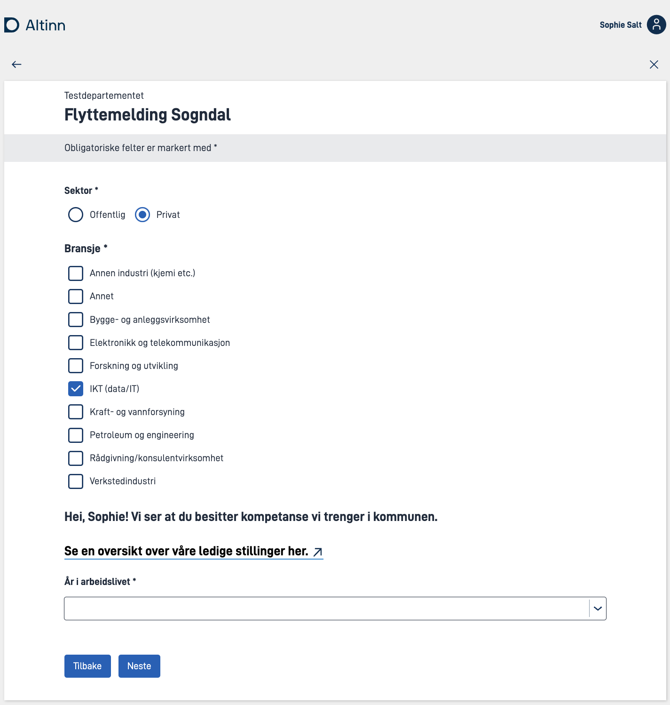

I denne modulen er det en samling med frittstående utvidelser av applikasjonen. De trenger ikke å løses i gitt rekkefølge.

**Temaer som dekkes i denne modulen:**
- Oppsummmeringsside
- Stateless applikasjon
- Variabler i tekst
- Bruk av eksternt API
<!-- - Konfigurasjon av meldingsboks
- Presentasjonstekster
- Events -->

## Oppgaver

<!-- Oppsummeringsside -->

{}
### Krav fra kommunen

Sogndal kommune opplever at enkelte innsendinger inneholder feilopplysninger og skrivefeil som skaper unødig arbeid for saksbehandlere.
For å unngå at personer sender inn feil informasjon, ønsker kommunen at brukeren presenteres for en oppsummmeringsside hvor det er mulig å gå tilbake og redigere informasjonen brukeren har oppgitt.

Sogndal kommune ønsker at man benytter kategoriene **Personalia** om brukerens personinformasjon, og **Arbeid** om svarene gitt på brukerens arbeidshistorikk.

### Oppgaver

1. Opprett en oppsummeringsside og ekskluder den fra pdf-genereringen.
2. Legg til to gruppe-komponenter, "Personalia" og "Arbeid", og `Summary`-komponenter for skjema-komponentene. Inkluder `Summary`-komponentene i sine respektive grupper.
3. Legg til en beskrivende tekst øverst i dokumentet.
4. Gjør eventuelt andre nødvendige tilpasninger (f.eks. av tekster og knapper).

### Nyttig dokumentasjon
- [Hvordan sette opp visning av oppsummering av utfylt skjema](/nb/altinn-studio/reference/ux/pages/summary/)
- [Kategorier i oppsummering](/nb/altinn-studio/reference/ux/pages/summary/#kategorier)

### Forståelsessjekk

{}
PDF-genereringen har per nå ikke støtte for oppsummerings-komponenten.
 For at PDF-generering skal fungere må enten alle oppsummerings-komponentene, eller hele oppsummerings-siden(e) ekskluderes fra PDF.
{}

{}

<!-- Stateless -->

{}
### Krav fra kommunen
Sogndal kommune har oppdaget at det er en del trafikk fra personer som ikke møter kriteriene i applikasjonen.
For hver av disse brukerne blir det lagret en instans i databasen. Dette skaper unødige utgifter.

Sogndal kommune ønsker derfor at informasjonssiden vises som en "stateless"-del av applikasjonen og at man derfra kan velge å starte en instans om man
møter kriteriene.  
Om man ikke møter kriteriene skal man tas videre til "Ikke for deg"-siden som også er en del av "stateless"-settet.

### Oppgaver

1. Opprett [layout-sets](/nb/altinn-studio/reference/ux/pages/layout-sets/) i appen. Flytt førstesiden og "Ikke for deg"-siden til "stateless"-settet (Husk å oppdatere `Settings.json`-filene).
2. Konfigurer appen til å starte opp som en "stateless" applikasjon.
3. Legg til en `InstantiationButton`-komponent på førstesiden.
4. Legg til logikk der brukeren enten kan starte en instans eller sendes videre til "Ikke for deg"-siden basert på om [de møter kriteriene](/nb/altinn-studio/getting-started/app-dev-course-old/case/#alternativ-arbeidsflyt-sporvalg).

### Nyttig dokumentasjon
- [Introduksjon til stateless applikasjoner](/nb/altinn-studio/reference/configuration/stateless)
- [Konfigurasjon av stateless applikasjoner](/nb/altinn-studio/reference/configuration/stateless/#konfigurasjon)
- [Starte instans fra stateless skjema](/nb/altinn-studio/reference/configuration/stateless/#starte-instans-fra-et-stateless-skjema)

### Forståelsessjekk

{}
En stateless, eller tilstandsløs, applikasjon lagrer ikke noe data, verken skjemadata eller metadata om instanser av applikasjonen. 
{}

{}

<!-- Variabler i tekst -->

{}
### Krav fra kommunen
IT-kompetanse er svært ettertraktet. I **Modul 4** satte vi opp et skreddersydd tilbud til de med IT-kompetanse.

Sogndal kommune har sett på tallene og ser at det genererer for lite trafikk til stillingsutlysningene.
For å prøve å forbedre dette ønsker vi at tilbudet blir enda litt mer skreddersydd.

Vi ønsker at den originale teksten:

```rich
Vi ser at du besitter kompetanse vi trenger i kommunen.
Se en oversikt over våre ledige stillinger her.
```

nå skal bli mer personlig med brukerens navn. Teksten vi nå ønsker oss er:

```rich
Hei, {innsenders navn}! Vi ser at du besitter kompetanse vi trenger i kommunen.
Se en oversikt over våre ledige stillinger her.
```

Siste linje i teksten skal fortsatt være en lenke til stillingsutlysningene.

### Oppgaver
1. Endre teksten slik som det er beskrevet over og erstatt "{innsenders navn}" med en variabel som er knyttet til `Fornavn`-feltet i datamodellen.

### Nyttig dokumentasjon
- [Variabler i tekster](/nb/altinn-studio/reference/ux/texts/#variabler-i-tekster)

### Forståelsessjekk
{}
Hvis en variabel ikke har noen verdi vil stien til feltet i datakilden vises.
{}

{}

<!-- Eksternt API -->

{}
I noen tilfeller vil man måtte ta i bruk eksterne APIer for å dekke alle behovene til en applikasjon. 
Dette kan være for å berike nedtrekkslister eller å presentere data til brukeren basert på oppgitt informasjon.

I denne oppgaven skal du implementere en klient som integrerer seg mot Bring sine APIer for å berike adressen som 
sluttbruker oppgir med et poststed basert på postnummer. 

APIet som skal benyttes er et postnummeroppslag tilgjengeliggjort av Bring. 
Test det gjerne i en nettleser med ulike postnumre.

```
GET
https://fraktguide.bring.no/fraktguide/api/postalCode.json?country=no&pnr={postnummer}
```

### Krav fra kommunen
 - Adresseinformasjonen skal samles inn via standard inndatakomponenter og ikke Altinns adressekomponent
 - Poststed skal automatisk fylles ut for sluttbruker når postnummer er oppgitt
 - Poststed skal det ikke være mulig å redigere
 - Antall kall til Bring sitt API skal begrenses til maksimalt én gang om dagen per postnummer

### Nyttig dokumentasjon
[Konsumering av eksterne API](/nb/altinn-studio/reference/api/consume)

### Forståelsessjekk
- Med en _memorycache_, hvor mange ganger vil man maksimalt gjøre et API-kall i løpet av et døgn dersom applikasjonen kjører med tre replikas?
{}

<!-- {}
### Krav fra kommunen


### Nyttig dokumentasjon

### Forståelsessjekk
{}

{}
### Krav fra kommunen


### Nyttig dokumentasjon

### Forståelsessjekk
{}

{}
### Krav fra kommunen


### Nyttig dokumentasjon

### Forståelsessjekk
{} -->

## Løsningsforslag
[Kildekode Modul 7](https://altinn.studio/repos/tss/flyttemelding-sogndal/src/branch/modul7)

{}

**Skjermbilde av oppsummeringsside:**




* **Opprett siden `oppsummering.json` under `App/ui/layouts` eller i Studio Designer**
  * Legg til et avsnitt med forklarende tekst (se tekstressurser under).
  * Legg til to gruppekomponenter, `Personalia` og `Arbeid`.
  * Legg til `Summary`-komponenter tilsvarende skjemakomponentene og inkluder dem i den aktuelle gruppen.

Gruppekomponent og `Summary`-komponenter for "Arbeid":


App/ui/layouts/oppsummering.json


```json
{
  "$schema": "https://altinncdn.no/toolkits/altinn-app-frontend/4/schemas/json/layout/layout.schema.v1.json",
  "data": {
    "layout": [
      {
        "id": "arbeidsforhold-group",
        "type": "Group",
        "textResourceBindings": {
          "title": "Arbeid"
        },
        "children": [
          "summary9",
          "summary10",
          "summary11"
        ]
      },
      {
        "id": "summary9",
        "type": "Summary",
        "componentRef": "RadioButtons-sektor"
      },
      {
        "id": "summary10",
        "type": "Summary",
        "componentRef": "Checkboxes-bransje"
      },
      {
        "id": "summary11",
        "type": "Summary",
        "componentRef": "Dropdown-years-in-workforce"
      }
    ]
  }
}
```

* Legg til en innsendingsknapp med teksten 'Bekreft' og fjern innsendingsknappen fra siden `Arbeidsforhold.json`.
* Bonus: Legg til en `Panel`-komponent over 'Bekreft'-knappen med advarsel om at brukeren ikke kan gå tilbake etter å ha klikket 'Bekreft'.


App/ui/layouts/oppsummering.json


```json
{
  "$schema": "https://altinncdn.no/toolkits/altinn-app-frontend/4/schemas/json/layout/layout.schema.v1.json",
  "data": {
    "layout": [
      {
        "id": "panelinfo",
        "type": "Panel",
        "textResourceBindings": {
          "title": "MERK",
          "body": "preview.warning"
        },
        "variant": "warning",
        "showIcon": true
      },
      {
        "id": "preview-confirm",
        "type": "Button",
        "textResourceBindings": {
          "title": "button.confirm"
        }
      }
    ]
  }
}
```

Fullstendig løsning: [oppsummering.json](https://altinn.studio/repos/tss/flyttemelding-sogndal/src/branch/modul7/App/ui/layouts/oppsummering.json)

* **Legg til tekstressurs `summaryTitle` på Adresse-komponenter:**


App/ui/layouts/innflytterPersonalia.json


```json

// address
"textResourceBindings": {
    "summaryTitle": "Adresse"
}

// Address-tidligere-bosted
"textResourceBindings": {
    "summaryTitle": "innflytterPersonalia.Address-tidligere-bosted.title"
}
```

* **Legg til siden `oppsummering` under `pages` og `excludeFromPdf`:**

Merk at hvis siden er lagt til i Studio Designer vil den dukke opp under `pages` automatisk
 (husk å lagre endringer i Designer og hente de ned lokalt).


App/ui/Settings.json


```json {hl_lines=[9,13]}
{
  "$schema": "https://altinncdn.no/toolkits/altinn-app-frontend/4/schemas/json/layout/layoutSettings.schema.v1.json",
  "pages": {
    "order": [
      "info",
      "innflytterPersonalia",
      "ikke-for-deg",
      "Arbeidsforhold",
      "oppsummering"
    ],
    "excludeFromPdf": [
      "ikke-for-deg",
      "oppsummering"
    ]
  }
}
```
* **Følgende tekstressurser er lagt til/endret:**


App/config/texts/resources.nb.json


```json
{
  "$schema": "https://altinncdn.no/toolkits/altinn-app-frontend/4/schemas/json/text-resources/text-resources.schema.v1.json",
  "language": "nb",
  "resources": [
    ...
    {
      "id": "innflytterPersonalia.tidligere-bosteder-overskrift.title",
      "value": "Tidligere bosteder"
    },
    {
      "id": "confirm.title",
      "value": "Du er nå klar for å sende inn skjemaet"
    },
    {
      "id": "confirm.body",
      "value": "Ved å sende inn dette skjemaet samtykker du til at dataen du har fylt ut kan lagres og benyttes til å tilpasse kommunens tilbud til deg de neste 18 månedene. </br></br> For å avbryte innsendingen kan du klikke på krysset oppe i høyre hjørne."
    },
    {
      "id": "preview.body",
      "value": "<h3>Sjekk at svarene dine er riktige</h3><br>Se over svarene dine før du sender inn skjemaet. Om du ser at noen av svarene er feil kan du trykke 'Endre' ved det aktuelle svaret for å gå tilbake og endre det. Felter som er markert med rødt og har feilmelding må rettes opp før skjemaet kan sendes inn."
    },
    {
      "id": "preview.warning",
      "value": "**Når du klikker 'Bekreft' vil du gå videre til innsending. Derfra kan du se og laste ned oppsummerings-pdf og avbryte innsendingen, men ikke endre svarene.**"
    }
  ]
}
```

{}

<!-- Stateless Løsning -->

{}

### Opprett layout-sets
Nedenfor ser du strukturen på `App/ui`-mappen vår etter at vi har opprettet layout-sets:
```
|- App/
  |- ui/
    | - layout-sets.json
    | - footer.json
    |- statefull/
      |- Settings.json
      |- RuleHandler.js
      |- layouts/
        |- innflytterPersonalia.json
        |- arbeidsforhold.json
        |- oppsummering.json
    |- stateless/
      |- Settings.json
      |- RuleHandler.js
      |- layouts/
        |- info.json
        |- ikkeForDeg.json
```

* **Opprett `layout-sets.json`** og legg til to sett ("stateless" og "statefull"):


App/ui/layout-sets.json


```json
{
  "$schema": "https://altinncdn.no/toolkits/altinn-app-frontend/4/schemas/json/layout/layout-sets.schema.v1.json",
  "sets": [
    {
      "id": "stateless",
      "dataType": "datamodel"
    },
    {
      "id": "statefull",
      "dataType": "datamodel",
      "tasks": ["Task_1"]
    }
  ]
}
```

* **Oppdater `Settings.json`-filene** under hvert layout-set for å få riktige sider/rekkefølge i appen:


App/ui/stateless/Settings.json


```json
{
  "$schema": "https://altinncdn.no/toolkits/altinn-app-frontend/4/schemas/json/layout/layoutSettings.schema.v1.json",
  "pages": {
    "order": [
      "info",
      "ikkeForDeg"
    ]
  }
}
```


App/ui/statefull/Settings.json


```json
{
  "$schema": "https://altinncdn.no/toolkits/altinn-app-frontend/4/schemas/json/layout/layoutSettings.schema.v1.json",
  "pages": {
    "order": [
      "innflytterPersonalia",
      "arbeidsforhold",
      "oppsummering"
    ],
    "excludeFromPdf": [
      "oppsummering"
    ]
  }
}
```

### Oppdater `applicationmetadata.json`
Legg til `"onEntry": { "show": "stateless" }`.  
`"stateless"` refererer til layout-settet som vi definerte tidligere.


App/config/applicationmetadata.json


```json {hl_lines=10}
{
  "id": "ttd/flyttemelding-sogndal",
  "org": "ttd",
  "title": {
    "nb": "Flyttemelding Sogndal"
  },
  "dataTypes": [
    ...
  ],
  "onEntry": { "show": "stateless" },
  ...
}
```

### Starte instans fra førstesiden

* **Legg til `InstantiationButton`** på førstesiden:  
Legg til en instansieringsknapp på førstesiden i tillegg til navigasjonsknappen som vi hadde lagt til tidligere.  
Vi har brukt uttrykk på knappene for å bestemme hvilken knapp som skal vises/skjules basert på brukerens valg.


App/ui/stateless/layouts/info.json


```json {hl_lines=[9,17]}
[
  ...
  {
    "id": "Instantiation-button",
    "type": "InstantiationButton",
    "textResourceBindings": {
      "title": "navigation.next"
    },
    "hidden": ["equals", ["dataModel", "Innflytter.KanBrukeSkjema"], false]
  },
  {
    "id": "NavigationButtons-hateTR",
    "type": "NavigationButtons",
    "textResourceBindings": {
      "next": "navigation.next"
    },
    "hidden": ["equals", ["dataModel", "Innflytter.KanBrukeSkjema"], true]
  }
]
```
{}

<!-- Variabler i tekst - Løsning -->

{}

Nedenfor kan du se den "skreddersydde" teksten i skjemaet og hvordan vi satte dette opp i tekstressursfilen.



* **Endre teksten i tekstressursfilen:**  
I koden under kan du se hvordan vi har lagt til fornavnet til brukeren i `resource.nb.json` som en variabel:


App/config/texts/resource.nb.json


```json
{
  "$schema": "https://altinncdn.no/toolkits/altinn-app-frontend/4/schemas/json/text-resources/text-resources.schema.v1.json",
  "language": "nb",
  "resources": [
    ...
    {
      "id": "arbeid.it-kompetanse",
      "value": "#### Hei, {0}! Vi ser at du besitter kompetanse vi trenger i kommunen. <br><br> [Se en oversikt over våre ledige stillinger her.](https://sogndal.easycruit.com/index.html)",
      "variables": [
        {
          "key": "Innflytter.Fornavn",
          "dataSource": "dataModel.Skjema"
        }
      ]
    },
    ...
  ]
}
```
{}

<br><br>

{}
[<< Forrige modul](../modul6/)
{}