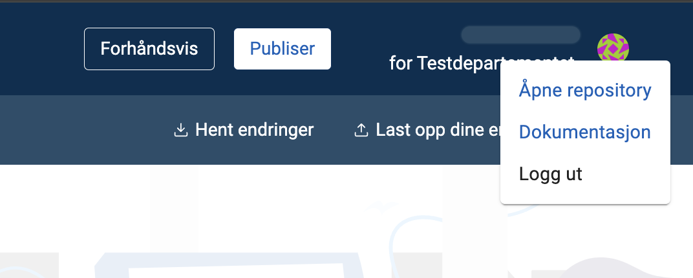
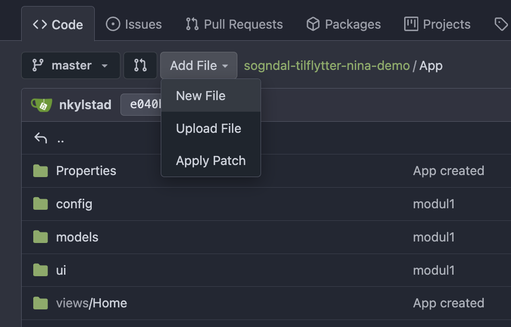
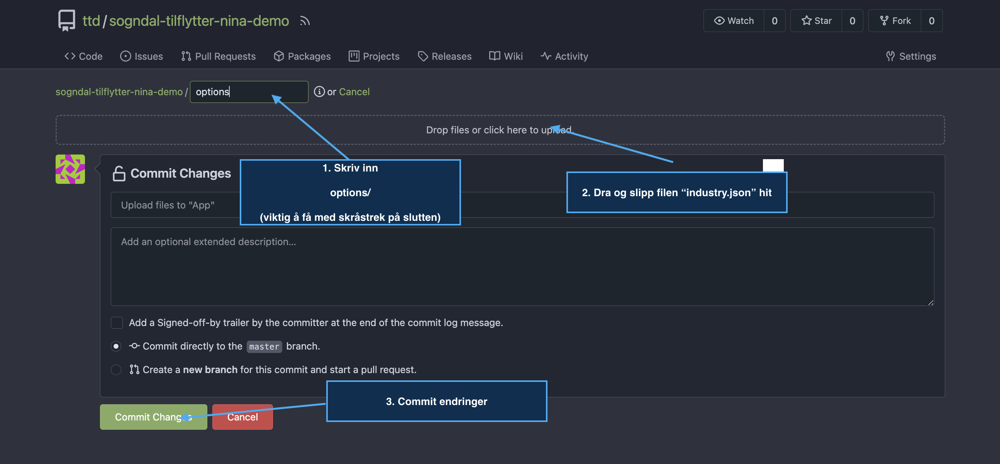

I denne modulen skal du utvide applikasjonen du har laget i foregående moduler for å støtte enda fler av [kravene til Sogndal kommune](../case/#requirements-from-the-municipality).

**Temaer som dekkes i denne modulen:**

- Kodelister/Options
- Dynamiske uttrykk

## Oppgaver

{}

I mange applikasjoner er det behov for å gi brukeren et sett med svaralternativer for et datafelt.
Svaralternativene refereres til som _kodelister_ eller _options_.

I Altinn Studio er alternativer støttet av komponentene [radioknapper](/nb/app/development/ux/components/radiobuttons/), 
[avkrysningsbokser](/nb/app/development/ux/components/checkboxes/), 
[nedtrekkslister](/nb/app/development/ux/components/dropdown/) og 
[flervalg](/nb/app/development/ux/components/multipleselect/).

{}
Det er tre måter å sette opp kodelister (legge til alternativer) i Altinn:
 1. Ved å legg til alternativer manuelt for komponenten via Altinn Studio.
 2. Ved å la komponenten hente alternativer fra en statisk json-fil.
 3. Ved å generere alternativer dynamisk med applikasjonslogikk.
{}

I denne oppgaven skal du få prøve deg de første to metodene.

Sogndal kommune ønsker å samle inn opplysninger om tilflytterens arbeidsituasjon.
Blant dataen de ønsker å samle inn er hvilken **sektor** og **bransje** tilflytter jobber i og hvor mange **år** tilflytter har vært yrkesaktiv.

  
### I Altinn Studio

1. Legg til de nye feltene i datamodellen. Husk å trykke "Generer modeller" etter at du er ferdig.
2. Opprett en ny skjemaside for å samle inn data om arbeidsforhold.
3. Legg til en **radioknapp**-komponent for _Sektor_ og opprett svaralternativene `Offentlig` og `Privat` manuelt.
4. Last ned den statiske kodelisten for bransjer [industry.json](../industry.json)
5. Last opp filen `industry.json` i applikasjonens filområde. Detaljer for hvordan dette gjøres ligger i neste avsnitt.
6. Legg til en **avkrysningsboks** for _Bransje_. Velg "Bruk kodeliste" i konfigurasjonen, og velg `industry` fra nedtrekkslisten.
7. Legg til en ny statisk kodeliste _manuelt_. Dette gjøres på veldig lik måte som opplasting av kodeliste-fil, se detaljer under.
    - Bruk svaralternativene:
        Label      | Dataverdi
        -----------|----------
        0 - 5 år   | `0-5`
        5 - 10 år  | `5-10`
        10 - 20 år | `10-20`
        20+ år     | `20+`
8. Legg til en **nedrekksliste** (dropdown) for _År i arbeidslivet_.
   Legg inn _Kodeliste ID_ `years-in-work-force`. Resten av oppsettet for denne komponenten gjøres lokalt.
9.  Last opp endringene dine i Designer og last de deretter ned (_pull_) i ditt lokale utviklingsmiljø.

### Nyttig info
{}
Alternativene legges direkte på skjemakomponenten. Nyttig for å få på plass komponenten, og fungerer godt for 
komponenter der det ikke er mange alternativer, og alternativene ikke skal gjenbrukes i andre komponenter.
- Skru av "Bruk kodeliste"-valget nederst på Tekst-seksjonen.
- Legg til hvert alternativt manuelt. Du kan legge inn både verdi og visningstekst.
{}

{}
Kodelister er nyttige der man ønsker å hente alternativer utenfor applikasjonen (f.eks. via api) eller har:
- mange alternativer
- et felles sett med alternativer som skal brukes av flere komponenter

En kodeliste kan defineres i kode (beskrives ikke her), eller kan legges inn som en statisk fil.

For å legge til en statisk kodeliste, må man inn i applikasjonens sentrale filområde og laste opp filen som 
inneholder kodelisten.
{}
Pass på at du har _lastet opp dine endringer_ fra Studio GUI før du gjør dette!
{}
Øverst til høyre i toppmenyen ser du ditt navn/brukernavn og et sirkel-ikon. Klikk på navnet ditt for å åpne profilmenyen.

I profilmenyen, velg "Åpne repository" for å åpne filområdet for applikasjonen i en ny fane.
Naviger inn i mappen som heter `App`, og trykk på "Legg til fil/Add file" --> "Last opp fil/Upload file".

Kodelister skal ligge i en mappe som heter `options`. Du må derfor legge til dette i fil-stien øverst. Når du skriver 
`options` og så `/` blir options opprettet som mappe, og filene som lastes opp legges i den mappen.

Dra og slipp filen du har lastet ned for stadardlisten med bransjer inn i opplastingsområdet.

Til slutt må du lagre alle endringer ved å trykke på "Commit endringer".

Til slutt navigerer du tilbake til fanen med skjemaet, og trykker på "Hent endringer" til høyre i topp-menyen. 
Du vil da få lastet inn endringene du gjorde på filområdet, og kodelisten er nå tilgjengelig for flervalgskomponentene.

{}
Om du allerede har en `options`-mappe i applikasjonen din, navigerer du inn i den. Så følger du de samme stegene som over,
men du skriver ikke inn `options` i filstien da du allerede har mappen på plass.

Om du ønsker å kopiere inn/skrive inn en kodeliste direkte kan du gjøre dette på samme måte. Du velger bare da "Ny fil"
i stedet for "Last opp fil", og du vil da komme til et redigeringsverktøy hvor du kan skrive/lime inn. Du må legge inn 
navnet på filen (må ende med `.json`) i filstien.
{}

{}

### Nyttig dokumentasjon

- [Statiske kodelister](/nb/altinn-studio/guides/options/static-codelists)

{}

{}

### Krav fra kommunen

Dersom brukeren velger `IKT (data/it)` under bransje skal det vises en tekst og en lenke til en av våre stillingsutlysninger.

Under bransje-valget skal følgende tekst presenteres:

   
   > Vi ser at du besitter kompetanse vi trenger i kommunen.
   > Se en oversikt over våre ledige stillinger her.
    

Linje 2 i teksten skal være en hyperlenke som peker på https://sogndal.easycruit.com/index.html.

Tekst og lenke skal **kun** vises om man har valgt `IKT (data/it)`. I alle andre tilfeller skal dette være skjult.

### Oppgaver

1. Legg til en komponent som kan vise den aktuelle teksten.
2. Legg til [dynamikk for komponenten](/nb/app/development/logic/expressions/) som gjør at den kun vises dersom `IKT (data/it)` er valgt (**MERK**: Teksten skal vises også når flere alternativer er valgt, så lenge ett av dem er `IKT (data/it)`).
3. Flytt knappen 'Send inn' til siden for arbeidsforhold.

### Nyttig dokumentasjon
- [Dynamiske uttrykk](/nb/app/development/logic/expressions/)

{}

## Oppsummering

I denne modulen har du lagt til nedtrekksliste, radioknapp og avkrysningsbokser og lagt inn alternativer for disse komponentene manuelt og med statiske kodelister.
I tillegg har du lagt til dynamikk som viser ulike alternativer basert på tidligere valg.

*Husk å laste opp dine endringer så de lagres på applikasjonens sentrale filområde.*

{}
[<< Forrige modul](../modul3/)    [Neste modul >>](../modul5/)
{}