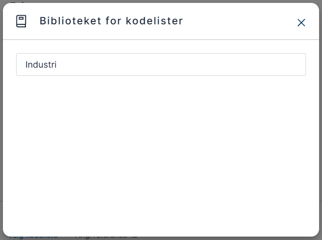
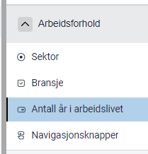

I denne modulen skal vi bygge videre på appen vår for å støtte enda flere av [kravene til Sogndal kommune](../case/#krav-fra-kommunen).

## Temaer i denne modulen
- Radioknapper
- Avkrysningsbokser
- Nedtrekkslister
- Kodelister
- Gitea

## Krav fra Sogndal kommune
I denne modulen skal vi jobbe med disse kravene fra kommunen:
> Kommunen ønsker å samle inn følgende data om innflyttere:
> - Arbeids- og bransjeerfaring
> - Sektor (privat/offentlig)
> - Bransje ([standardliste med bransjer](../industry.json))

## Oppgaver

I mange tjenester trenger vi å gi brukerne et sett med svaralternativer for et datafelt.
Slike sett med svaralternativer kalles _kodelister_ eller _alternativer_.

Du kan sette opp kodelister på tre måter i Altinn:
- Ved å legge til alternativer manuelt for komponenten i Altinn Studio.
- Ved å la komponenten hente alternativer JSON-fil med ferdige alternativer.
- Ved å generere alternativer dynamisk ved hjelp av kode.

I denne oppgaven skal vi se på de første to metodene.

### Legg til de nye feltene i datamodellen

1. Gå til "Datamodell".
2. Velg "Legg til".
3. Velg "Objekt".
4. Gi objektet navnet "arbeidsforhold".
5. Gå til "Felter"-fanen.
6. Legg til tre tekstfelter med navnene "sektor", "bransje" og "ar_i_arbeidslivet".


### Opprett en ny skjemaside for arbeidsforhold

1. Gå til "Lage".
2. Opprett en ny side og kall den "Arbeidsforhold".

Skjemaet du har laget skal nå ha tre sider.


### Legg til radioknapper for sektor
Brukeren skal kunne velge mellom offentlig og privat sektor. Til det er det naturlig å bruke [radioknapper](/nb/altinn-studio/reference/ux/components/radiobuttons/).

1. Dra inn en komponent av typen "Radioknapper" øverst på den nye siden.
2. Under "Tekst" i egenskapene til komponenten du har lagt til, legg til ledeteksten "Sektor". Nå bør skjemaet se slik ut:
   
3. Nederst i tekstseksjonen kan man sette opp alternativer. Bryteren "Bruk kodeliste" er slått på som standard. Slå den av, så du kan legge til alternativene selv.
4. Velg "Legg til alternativ". Du får nå et alternativ under overskriften "Radioknapp 1" med en tilfeldig generert verdi.
   
5. Klikk på "Radioknapp 1".
6. Skriv `offentlig` i feltet med verdien. Dette er verdien som vil bli sendt til systemet når brukeren besvarer skjemaet.
7. Velg "Ledetekst".
8. Fyll inn teksten "Offentlig". Dette er teksten som brukeren vil se ved siden av radioknappen.
9. Gjenta stegene fra trinn 4 til trinn 8, men klikk på "Radioknapp 2" i stedet for "Radioknapp 1", og gi knappen verdien `privat` og ledeteksten "Privat".
   
10. Nå mangler vi bare å koble komponenten til riktig felt i datamodellen. Åpne "Datamodellknytninger", klikk på "Radioknapper" og velg `arbeidsforhold.sektor`.

### Legg til avmerkingsbokser for bransje
Brukeren skal også kunne velge én eller flere bransjer. Siden det skal være mulig å velge mer enn ett alternativ, er det naturlig å bruke [avmerkingsbokser](/nb/altinn-studio/reference/ux/components/checkboxes/). I stedet for å legge til alternativene manuelt, skal vi bruke [en fil med en _kodeliste_](industri.json). En kodelistefil er nyttig hvis vi for eksempel trenger å bruke de samme alternativene flere steder.

Slik bruker du en kodeliste til å lage en liste med avmerkingsbokser:

#### Legg til komponenten
1. Dra en komponent av typen "Avmerkingsbokser" inn på siden, etter radioknappkomponenten for sektor.
2. Under "Tekst" i egenskapene til komponenten du har lagt til, legg til ledeteksten "Bransje". Nå bør skjemabyggeren se slik ut:
   
3. Gå til "Datamodellknytninger", velg "Avmerkingsbokser" og koble komponenten til feltet `arbeidsforhold.bransje`.

#### Del endringene
1. Klikk på "Last opp dine endringer" for å dele arbeidet du har gjort. Den røde prikken viser at du har gjort endringer som ikke er delt.
   
2. Skriv en kort tekst om hva du har oppdatert. Hvis det er flere som jobber på samme app, blir det lettere for dem å vite hva du har jobbet med. Dette er frivillig.
3. Velg "Del endringer" for å lagre teksten og laste opp endringene dine. Du får beskjed om at appen er oppdatert, og den røde prikken forsvinner.

#### Åpne repositoriet og lagre kodelisten
1. Klikk på profilikonet øverst til høyre i Studio og velg "Åpne repositoriet".
2. Det åpnes en ny fane med en oversikt med mapper og filer. Denne oversikten kalles Gitea. Her ligger de filene Altinn Studio har generert ut fra innstillinger du har satt for appen du lager.
   I Gitea kan du redigere filene manuelt og holde oversikt over versjoner ved hjelp av [Git](https://git-scm.com/). Hvis du ikke kjenner til Git fra før, kan det være lurt å sette deg litt inn i det, for å forstå hva som skjer i bakgrunnen når du gjør endringer.
3. Last ned [kodelisten](industri.json).
4. Klikk på "Add File", deretter "Last opp fil" og last opp kodelisten.
5. Filen må ligge i mappen `App/options`. Lag en ny mappe som heter `options` i mappen `App` ved å skrive "App/options" i feltet over opplastingsfeltet. Til slutt ser feltet slik ut:
   
6. Velg "Commit endringer".
7. Du er nå ferdig i Gitea for denne gang. Gå tilbake til Altinn Studio-fanen, eller klikk på Altinn-logoen øverst til venstre i Gitea for å komme tilbake til Altinn Studio.

#### Koble kodelisten til komponenten
1. I Altinn Studio ser du nå en rød prikk ved knappen "Hent endringer". Det betyr at det er gjort endringer i filsystemet (mappen du har lagt til i Gitea), som du må synkronisere med Studio.
   
   Klikk på knappen. Du vil få en bekreftelse på at du har fått siste versjon og prikken forsvinner.
2. Åpne siden der du la til "Bransje" og klikk på "Bransje".
3. Under "Tekst" i egenskapene for "Bransje", sjekk at valget "Bruk kodeliste" er slått på.
3. Velg "industri" fra nedtrekkslisten under.
   

Nå skal avmerkingsboksene være klare.

### Legg til en nedtrekksliste for antall år i arbeidslivet
Det siste vi skal gjøre i denne modulen er å legge til en nedtrekksliste hvor brukerne kan si noe om hvor lenge de har vært i arbeid. Listen skal ha følgende alternativer:

| Visningsverdi   | Dataverdi |
|-----------------|-----------|
| 0 – 5 år        | `0-5`     |
| 5 – 10 år       | `5-10`    |
| 10 – 20 år      | `10-20`   |
| 20 år eller mer | `20+`     |

Til denne komponenten skal vi også bruke en kodelistefil, men denne gangen skal vi kode alternativene selv.

#### Legg til komponenten og del endringene
1. Fra "Komponenter"-panelet, dra inn komponenten som heter "Nedtrekksliste" og legg den til rett etter avmerkingsboksene.
2. Gi komponenten ledeteksten "Antall år i arbeidslivet". Skjemaet skal nå se slik ut:
   
3. Legg til en datamodellknytning til feltet `arbeidsforhold.ar_i_arbeidslivet`.
4. Velg "Last opp dine endringer" og deretter "Del endringer". Se at den røde prikken ved knappen forsvinner.

#### Legg til kodelisten i repositoriet
1. Klikk på profilikonet og gå til repositoriet i Gitea.
2. Gå til mappen `App/options`. Her ser du at filen `industri.json` fra forrige steg er listet opp.
3. Velg "Add file" og deretter "Ny fil".
4. Skriv inn filnavnet `ar_i_arbeidslivet.json`. Husk filtypen `.json`. Uten den vil ikke Studio finne filen når vi skal koble kodelisten til komponenten etterpå.
5. Kopier koden under og lim den inn i tekstområdet der det står "Ny fil".
   ```
   [
       {
           "label": "0 – 5 år",
           "value": "0-5"
       },
       {
           "label": "5 – 10 år",
           "value": "5-10"
       },
       {
           "label": "10 – 20 år",
           "value": "10-20"
       },
       {
           "label": "20 år eller mer",
           "value": "20+"
       }
   ]
   ```
6. Velg "Commit endringer" nederst på siden. Det kan hende du får en melding fra Gitea om at filen inneholder tvetydige tegn, men den kan du trygt ignorere.

#### Koble kodelisten til komponenten
1. Gå tilbake til fanen med Altinn Studio og velg "Hent endringer".
2. Klikk på komponenten "Antall år i arbeidslivet" og legg til den nye kodelisten på samme måte som du gjorde da du la til kodeliste for bransje.

Nå skal appen din ha fått en nedtrekksliste med alternativene som er spesifisert i kodelisten.

## Nyttig dokumentasjon
Se [kodelisteguiden](../../../guides/options/) for å se hvordan kodelister settes opp i appkoden.

## Oppsummering
I denne modulen har du lagt til en gruppe med radioknapper, en gruppe med avkrysningsbokser og en nedtrekksliste. Du har også satt opp svaralternativer manuelt i Studio og ved hjelp av JSON-filer i Gitea.


