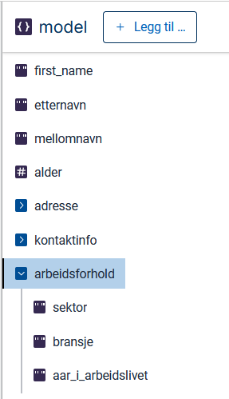

I denne modulen skal vi utvide tjenesten vi har laget i foregående moduler for å støtte enda flere av [kravene til Sogndal kommune](../case/#krav-fra-kommunen).

## Temaer som dekkes i denne modulen
- Radioknapper
- Avkrysningsbokser
- Nedtrekkslister
- Kodelister
- Gitea

## Krav fra Sogndal kommune
I denne modulen skal vi dekke følgende krav fra kommunen:
> Kommunen ønsker å samle inn følgende data om innflyttere:
> - Arbeids-/bransjeerfaring
>   - Sektor (privat/offentlig)
>   - Bransje ([standardliste med bransjer](../industry.json))

## Oppgaver

I mange tjenester er det behov for å gi brukeren et sett med svaralternativer for et datafelt.
Svaralternativene refereres til som _kodelister_ eller _alternativer_.

Det er tre måter å sette opp kodelister (legge til alternativer) på i Altinn:
- Ved å legge til alternativer manuelt for komponenten via Altinn Studio.
- Ved å la komponenten hente alternativer fra en statisk JSON-fil.
- Ved å generere alternativer dynamisk.

I denne oppgaven skal vi se på de første to metodene.

### 1. Legg til de nye feltene i datamodellen
Gå til datamodellsiden og opprett et nytt objekt med navnet "arbeidsforhold". Legg til to tekstfelter i objektet med navnene "sektor", "bransje" og "ar_i_arbeidslivet".


### 2. Opprett en ny skjemaside for arbeidsforhold
Gå til skjemabyggeren og opprett en ny side med navnet "Arbeidsforhold". Skjemaet skal nå ha tre sider.


### 3. Legg til radioknapper for sektor
Brukeren skal kunne velge mellom offentlig og privat sektor. Til det er det naturlig å bruke [radioknapper](/nb/altinn-studio/reference/ux/components/radiobuttons/).

1. Legg til en radioknappkomponent øverst på den nye siden ved å dra den inn fra panelet til venstre.
2. I tekstseksjonen i menyen til høyre, legg til ledeteksten "Sektor" på den nye komponenten. Skjemabyggeren skal nå se mer eller mindre slik ut:
   
3. Nederst i tekstseksjonen kan man sette opp alternativer. Sørg for at valget "bruk kodeliste" er deaktivert – da får vi muligheten til å legge til alternativer manuelt.
4. Legg til radioknapper ved å klikke på knappen "Legg til alternativ". Knappene for automatisk genererte verdier; bytt ut disse med for eksempel "offentlig" og "privat". Verdiene brukes internt i systemet og vil ikke være synlige for brukerne. Ledetekstene er derimot synlige - sett disse til å være "Offentlig" og "Privat".
   
5. Nå mangler vi bare å koble komponenten til riktig felt i datamodellen. Åpne seksjonen "datamodellknytninger", klikk på "Radioknapper" og velg `arbeidsforhold.sektor`.

### 4. Legg til avkrysningsbokser for bransje
Brukeren skal også kunne velge én eller flere bransjer. Siden det skal være mulig å velge mer enn ett alternativ, er det naturlig å bruke [avkrysningsbokser](/nb/altinn-studio/reference/ux/components/checkboxes/). I dette tilfellet har vi også [en fil med en _kodeliste_](industri.json) som vi ønsker å benytte i stedet for å legge til hvert alternativ manuelt. Slike filer kan være nyttige hvis man for eksempel ønsker å benytte de samme alternativene flere steder.

Nå skal vi se på hvordan vi kan bruke kodelisten til å lage en liste med avkrysningsbokser.

1. Dra en komponent av typen "Avkrysningsbokser" inn på siden, etter radioknappkomponenten for sektor.
2. Under seksjonen "Tekst" i panelet til høyre, legg til ledeteksten "Bransje". Nå skal skjemabyggeren se slik ut:
   
3. Under seksjonen "Datamodellknytninger", klikk på "Avkrysningsbokser" og koble komponenten til riktig felt i datamodellen ved å velge `arbeidsforhold.bransje`.
4. Last ned [kodelisten](industri.json).
5. For å laste kodelisten opp i appen, må vi gå ut av Studio og inn i appens filrepositorium. Men aller først må vi oppdatere repositoriet med endringene vi har gjort i Studio. Ved siden av knappen "last opp dine endringer" skal det være en rød prikk som indikerer at det er gjort endringer:
   
   Klikk på denne.
6. Du skal nå få mulighet til å skrive en kort oppsummering av endringene du har gjort. Dette kan være spesielt nyttig når man er flere personer som jobber på samme app. Skriv en tekst og klikk på "Valider endringer". Etter en liten stund skal du få en beskjed om at appen er oppdatert, og den røde prikken skal forsvinne.
7. Nå kan du gå til repositoriet; klikk på profilikonet øverst til høyre og deretter på "åpne repositorium".
   
   Du skal nå komme til et grensesnitt som heter Gitea, med en oversikt over filer. Dette er filene som Altinn Studio har generert på grunnlag av dine innstillinger. Gitea gir deg muligheten til å redigere filene manuelt og til å drive versjonskontroll ved hjelp av [Git](https://git-scm.com/). Hvis du ikke allerede kjenner til Git, kan det være en fordel at du setter deg inn i de grunnleggende prinsippene for å forstå prosessene som skjer i bakgrunnen når du gjør endringer.
8. Klikk på "Add File", deretter "Last opp fil" og last opp kodelisten.
9. Filen må ligge i mappen `App/options`. Sørg for at den blir plassert der ved å oppgi denne stien i feltet over opplastingsfeltet.
   
10. Klikk på "Commit endringer".
11. Klikk på Altinn-logoen øverst til venstre for å komme tilbake til Altinn Studio.
12. Søk opp appen du har laget og klikk på blyanten for å komme tilbake til redigeringssiden. Naviger deretter til skjemabyggeren ved å klikke på "Lage".
13. Nå er det en rød prikk ved siden av knappen "Hent endringer". Dette indikerer at det har skjedd nye endringer i filsystemet som ikke er synkronisert med Studio, noe som er riktig fordi vi har lastet opp en ny fil via Gitea.
   
   Klikk på knappen og observer at prikken forsvinner.
14. Åpne den nyeste siden og klikk på komponenten "Bransje".
15. Under seksjonen "Tekst" på høyre side, sørg for at valget "Bruk kodeliste" er aktivert. Velg "industri" fra nedtrekkslisten under.
    

Nå skal avkrysningsboksene være klare.

### 5. Legg til nedtrekksliste for tid i arbeidslivet
Det siste vi skal gjøre i denne modulen er å legge til en nedtrekksliste hvor brukerne kan si noe om hvor lenge de har vært i arbeid. Listen skal ha følgende alternativer:

| Visningsverdi   | Dataverdi |
|-----------------|-----------|
| 0 – 5 år        | `0-5`     |
| 5 – 10 år       | `5-10`    |
| 10 – 20 år      | `10-20`   |
| 20 år eller mer | `20+`     |

Til denne komponenten skal vi også bruke en kodelistefil, men denne gangen skal vi skrive den manuelt.

1. Legg til en nedtrekkslistekomponent etter avkrysningsboksene for bransje ved å dra den inn fra panelet til venstre.
2. Gi komponenten ledeteksten "Tid i arbeidslivet". Skjemabyggeren skal nå se slik ut:
   
3. Legg til en datamodellknytning til feltet `arbeidsforhold.ar_i_arbeidslivet`.
4. Synkroniser endringene ved å klikke på "Last opp dine endringer" og deretter "Valider endringer". Se at den røde prikken ved knappen forsvinner.
5. Gå til repositoriet i Gitea ved å klikke på profilikonet og deretter "åpne repositorium".
6. Naviger til mappen `App/options`. Her bør du kunne se at filen `industri.json` fra forrige steg ligger.
7. Klikk på "Add file" og deretter "Ny fil".
8. Gi filen navnet `tid_i_arbeidslivet.json`. Filendelsen `.json` er viktig; uten den vil ikke Studio finne filen når vi skal koble kodelisten til komponenten.
9. Fyll inn følgende kode:
   ```
   [
       {
           "label": "0 – 5 år",
           "value": "0-5"
       },
       {
           "label": "5 – 10 år",
           "value": "5-10"
       },
       {
           "label": "10 – 20 år",
           "value": "10-20"
       },
       {
           "label": "20 år eller mer",
           "value": "20+"
       }
   ]
   ```
10. Klikk på "Commit endringer". Det kan være at Gitea gir en advarsel om at det er tankestreker som kan forveksles med bindestreker i koden. Hvis dette gjelder visningsteksten, kan du trygt ignorere denne advarselen, siden [det er riktig å bruke tankestrek i intervaller](https://sprakradet.no/godt-og-korrekt-sprak/spraktips/tankestrek-og-bindestrek/).
11. Naviger tilbake til skjemabyggeren i Studio og se at det nå er en rød prikk ved knappen "Hent endringer".
12. Klikk på "Hent endringer" og observer at den røde prikken forsvinner.
13. Klikk på komponenten "Tid i arbeidslivet" og legg til den nye kodelisten på samme måte som du gjorde da du la til kodeliste for bransje.

Nå skal din app ha fått en nedtrekksliste med alternativene som er spesifisert i kodelisten.

## Nyttig dokumentasjon
Se [kodelisteguiden](../../../guides/options/) for å se hvordan kodelister settes opp i appkoden.

## Oppsummering
I denne modulen har du lagt til en gruppe med radioknapper, en gruppe med avkrysningsbokser og en nedtrekksliste. Du har også satt opp svaralternativer manuelt i Studio og ved hjelp av JSON-filer i Gitea.


