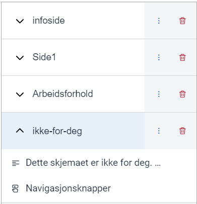
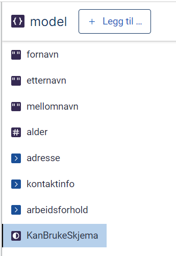
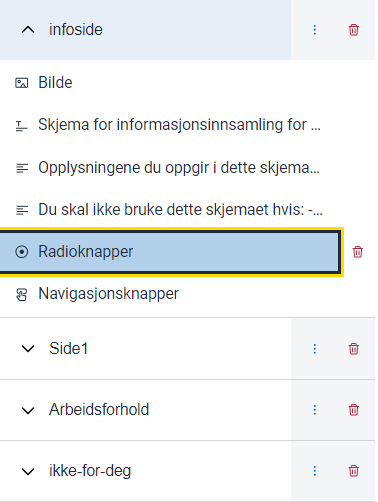
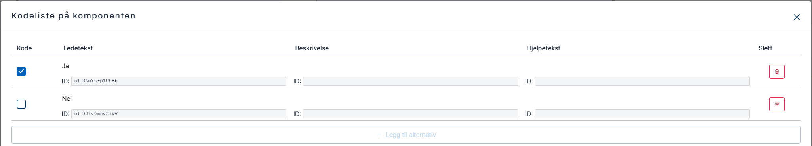
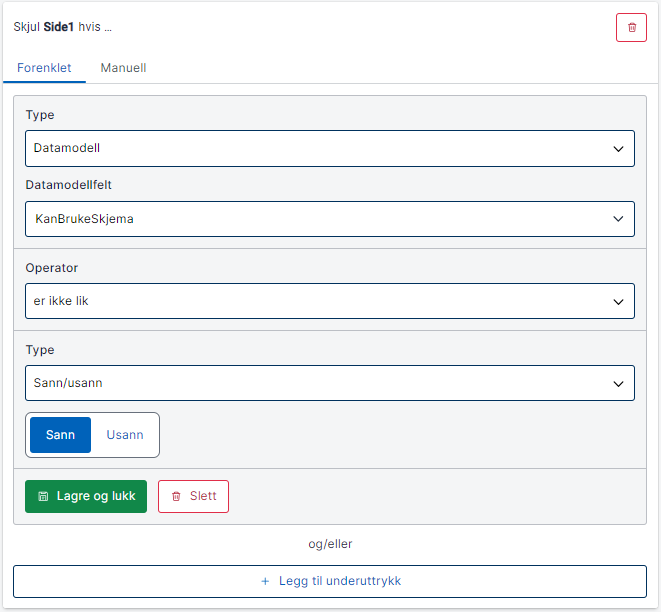
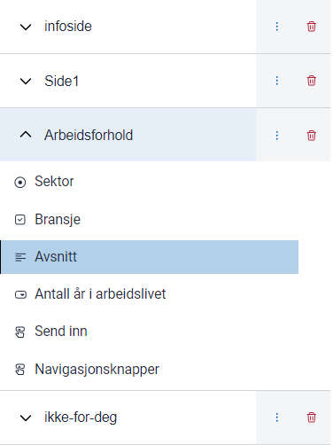
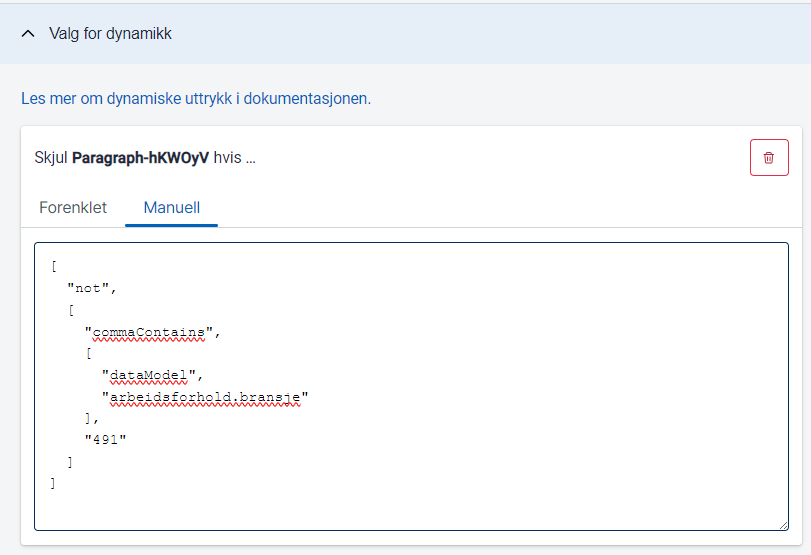

 
I denne modulen skal vi videreutvikle applikasjonen ved å legge til dynamisk skjuling av sider og komponenter. Dette gjør 
at du kan styre hvilke deler av appen som vises, basert på brukerens svar.

## Temaer som dekkes i denne modulen
- Vise og skjule sider ved hjelp av logiske uttrykk
- Vise og skjule komponenter ved hjelp av logiske uttrykk

## Krav fra Sogndal kommune
Sogndal kommune har to krav for dynamikk.

### Krav 1: Stopp brukere som ikke oppfyller kravene tidlig
En bruker som ikke oppfyller kravene for skjemaet skal stoppes så tidlig som mulig i arbeidsflyten. 
Hvis brukeren ikke bekrefter at skjemaet er relevant, skal de sendes til en ny forklaringsside. Hvis de bekrefter relevansen,
skal de sendes til datainnsamlingssidene.

### Krav 2: Vis stillingsutlysninger for IKT-bransjen
Om en bruker velger **IKT (data/it)** under bransje skal det vises en tekst med en lenke til en av deres stillingsutlysninger.

## Implementer dynamisk visning og skjuling av sider
For å oppfylle krav 1 fra Sogndal kommune, må vi opprette en ny side som skal vises hvis appen ikke er relevant for brukeren. 
Vi legger også til en funksjon der brukeren kan bekrefte relevansen, og basert på dette valget vil vi dynamisk skjule eller vise sider ved hjelp av logiske uttrykk.

### Legg til ny side
Vi legger til en ny side som skal vises hvis brukeren ikke bekrefter at de oppfyller kravene for appen.
1. Klikk på **Utforming**.
2. Klikk på **Legg til ny side** og gi den navnet ```ikke-for-deg``` 
3. Dra inn en komponent av typen **Avsnitt**.
4. Klikk på **Ledetekst** under **Tekst**-menyen til komponenten.
5. Kopier inn følgende tekst: 
    ```md
    Dette skjemaet er ikke for deg.
    Se en oversikt over andre tilbud i kommunen [her](https://www.sogndal.kommune.no/).
    ```
Appen skal nå bestå av fire sider.



### Oppdater datamodellen
For at appen skal kunne vurdere om skjemaet er relevant for brukeren, må vi oppdatere datamodellen.
1. Klikk på **Datamodell**.
2. Klikk på **Legg til**.
3. Klikk på **Ja/nei**.
4. Endre navnet på feltet til ```KanBrukeSkjema```.
5. Klikk **Generer modeller**.

Datamodellen skal nå se slik ut:



### Legg til avkrysningsbokser
Vi legger til avkrysningsbokser på infosiden så brukeren kan bekrefte at skjemaet er relevant for dem.
1. Klikk på **Utforming**.
2. Klikk på **infoside** og dra inn en komponent av typen **Radioknapper**.
    
3. Klikk på **Ledetekst** under **Tekst**-menyen til komponenten og kopier inn teksten:
    ```Jeg møter kriteriene for å bruke appen.```
4. Lag en ny kodeliste ved å klikke på **Sett opp egne alternativer** og **Legg til alternativ**.
5. Klikk på **Radioknapp 1** og sett verdien til ```true``` og ledeteksten til ```Ja```.
6. Klikk på **Legg til alternativ** igjen.
7. Klikk på **Radioknapp 2** og sett verdien til ```false``` og ledeteksten til ```Nei```.
   
8. Klikk på **Radioknapper** under **Datamodellknytninger**-menyen 
9. Velg **KanBrukeSkjema** som datamodellknytning. 


### Vis og skjul sider ved hjelp av logiske uttrykk
Sidene **Side1** og **Arbeidsforhold** skal vises når brukeren har bekreftet at de oppfyller kriteriene for appen. Dette oppnås 
ved å bruke logiske uttrykk, som styrer når en side skal vises basert på data fra brukeren. 
1. Klikk på **Side1**.
2. Klikk på **Valg for dynamikk**.
3. Klikk på **Gjør om til logisk uttrykk**.
4. Klikk på **Endre** for å åpne komponenten som brukes til å bygge logiske uttrykk.
5. For den første operanden velg **Datamodell** som type. Deretter velger du datamodellfeltet **KanBrukeSkjema**.
6. For operator velg **er ikke lik**.
7. For den andre operanden velg **Sann/Usann** som type og sett verdien til **Sann**.



Gjenta prosessen for "Arbeidsforhold" ved å klikke på **Arbeidsforhold** i steg 1.

For siden **ikke-for-deg** skal du bruke samme prosess, men med én viktig forskjell: I steg 7 skal du sette den andre operandens 
verdi til **Usann** i stedet for **Sann**.

## Vis stillingsutlysning for brukere med IKT-kompetanse
Sogndal kommune ønsker å vise stillingsannonse når brukeren har markert at de har IKT-kompetanse.
### Legg inn stillingsutlysningen
Første steg er å legge inn stillingsannonsen i skjemaet.
1. Klikk på **Utforming** og på siden for **Arbeidsforhold**.
2. Dra inn en **Avsnitt**-komponent og legg den mellom komponentene **Bransje** og **Antall år i arbeidslivet**.
   
3. Klikk på **Ledetekst** i **Tekst**-menyen for avsnittskomponenten, og kopier inn følgende tekst:
    ```md
    Vi ser at du besitter kompetanse vi trenger i kommunen.
    
    [Se en oversikt over våre ledige stillinger her](https://sogndal.easycruit.com/index.html).
    ```
### Skjul stillingsutlysningen om IKT ikke er valgt som bransje
Nå skal vi legge inn en logikkregel for å skjule stillingsutlysningen hvis brukeren ikke har valgt IKT som bransje.
1. Klikk på **Valg for dynamikk** i avsnittskomponenten som ble lagt inn i forrige steg.
2. Klikk på **Lag en ny logikkregel** og **Skjul felt dersom**.
3. For å sette opp en avansert dynamikkregel, må vi legge inn et manuelt uttrykk. Klikk **Manuell** og kopier inn uttrykket:
   ```
    [
        "not",
        [
            "commaContains",
            [
                "dataModel",
                "arbeidsforhold.bransje"
            ],
            "491"
        ]
    ]
    ```
    Dette uttrykket sjekker om bransjefeltet i datamodellen inneholder nummeret 491, som tilsvarer **IKT (data/IT)** i kodelisten for bransje.



## Nyttig dokumentasjon
- [Brukerveiledning - Dynamikk](../../../guides/development/dynamics/)
- [Dokumentasjon - Dynamiske uttrykk](../../../reference/logic/expressions/)

## Oppsummering
I denne modulen har du satt opp logiske utrykk for å dynamisk bestemme hvilke sider og komponenter som skal vises til brukeren.

