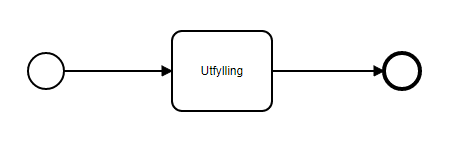
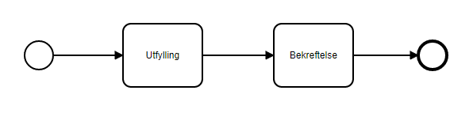

I denne modulen skal du legge til et prosessteg i applikasjonen.

**Temaer som dekkes i denne modulen:**
- Prosess
- Bekreftelsessteg
- Autorisasjonsregler

## Oppgaver

{}

En Altinn-applikasjon har en prosessflyt definert av BPMN (Business Process Model and Notation) som beskriver de ulike stegene i prosessen.
Standardflyten for en nyopprettet applikasjon består av én oppgave - et utfyllingssteg.

Din oppgave er å utvide standardprosessflyten med et bekreftelsessteg som illustrert nedenfor.
Bekreftelsessiden blir lagt til automatisk når man legger til dette i BPMN-filen `App/config/process/process.bpmn`.

### Krav fra kommunen

- Brukeren skal kunne se over utfylt data før skjemaet sendes inn.

### Oppgaver

1. Legg til et bekreftelses-steg i prosessen og lagre den oppdaterte prosessen.

### Nyttig dokumentasjon

- [Tilgjengelige prosessteg i en Altinn App](/nb/altinn-studio/reference/configuration/process/#støttede-prosess-task-typer)
- [BPMN standard](https://en.wikipedia.org/wiki/Business_Process_Model_and_Notation)

### Forståelsessjekk

{}
_SequenceFlow_ i bpmn-filen beskriver kun at flyten går én vei, fra utfylling og til bekreftelse. Flyten vil dermed ikke kunne gå begge veier.
{}

{}

{}

Autorisasjonsreglene til applikasjonen din er tilpasset standard prosessflyt og må oppdateres for å inkludere bekreftelsessteget.

### Krav fra kommunen

- Det skal være samme rollekrav for å fylle ut og bekrefte en instans.
- Brukeren skal kunne sende inn skjemaet.

### Oppgaver

1. Trykk på innstillinger-knappen i topp-menyen og velg "Tilgangsregler".
2. Ta en titt på tilgangsreglene som er satt opp. Identifiser de ulike reglene innholdet i de.
3. Finn regelen der bruker med rolle REGNA og DAGL har tilgang til Les, Skriv på `Task_1` (som er 
    utfyllingssteget som fulgte med malen)
4. Trykk på "Legg til sub-ressurs" på den aktuelle regelen, og kopier oppsettet fra `Task_1` i
  venstre kolonne. I høyre kolonne, nederste felt, legg inn ID til den nye oppgaven (bekreftelsessteg)
  du la til.

### Nyttig dokumentasjon
- [Regelbibliotek](/nb/altinn-studio/reference/configuration/authorization/rules/)
- [Alle roller i Altinn](https://www.altinn.no/hjelp/skjema/alle-altinn-roller/)

### Forståelsessjekk

{}
Applikasjonen vil vise "Ukjent feil" når brukeren trykker på "send inn"-knappen.
{}

{}
Da vil alle brukere, både med og uten roller, ha tillatelse til å utføre _confirm_-operasjonen for applikasjonen.
{}

{}

## Oppsummering

I denne modulen har du utvidet applikasjonen din med et bekreftelsessteg og lagt til autorisasjonsregler knyttet til prosessteget.

