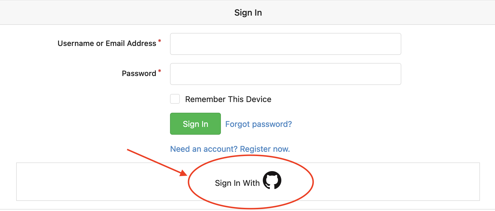

## Create a user in Altinn Studio

Your Altinn Studio user is personal to you and can be linked to one or more organizations to collaborate with others and access existing applications.

{}

1. Go to [altinn.studio](https://altinn.studio) and click "Logg inn".
   
2. Choose to log in with GitHub.
   
3. Provide your GitHub credentials if prompted.
   
4. Authorize Altinn Studio to use your GitHub account to log in.
   
5. Create an Altinn Studio user by filling in username, email, password, a captcha and click "Fullfør".
   The user in Altinn Studio will be connected to your GitHub user and you are ready to start working on your first application.
   

{}

{}

1. Go to [altinn.studio](https://altinn.studio) and click "Opprett ny bruker".
   
2. Create an Altinn Studio user by filling in username, email, password, and click "Fullfør". You are now ready to start working on your first application.
   

{}

After your account is activated, click on the logo at the top left of the page to navigate to your service dashboard.
You are now ready to create your first service.

## Join an organization

Organizations in Altinn Studio own the applications and enable collaboration between people within the organization.

To join an organization, an administrator must grant you access.
If you're uncertain about the administrator or if your organization is available in Altinn Studio,
you can seek assistance from the Altinn Servicedesk (mailto:tjenesteeier@altinn.no).

_Are you an administrator for your organization and want to add a user to a team? See our guide explaining how this is 
done [here](../../guides/access-management/studio/)._

## Create an organization

Digdir creates the organizations in Altinn Studio.

To get an organization in Altinn Studio, your organization must

- be a service owner and have an agreement with Altinn, or
- offer service development in Altinn Studio on behalf of organizations in public sector

Organizations that are not service owners will not get access to their own test or production environment.

To create an organization, email [Altinn Servicedesk](mailto:tjenesteeier@altinn.no) with the organization's name and who will be the administrator.
Creating the organization may require a few days, and we will notify you via email when it's ready.
