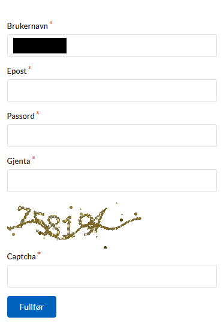

## Lag en bruker i Altinn Studio

Din Altinn Studio bruker er personlig for deg og kan knyttes til en eller flere organisasjoner for å samarbeide med andre og få tilgang til eksisterende apper.

{}

1. Gå til [altinn.studio](https://altinn.studio) og klikk på "Logg inn".
   

2. Velg å logge inn med GitHub.
   

3. Logg inn på GitHub hvis du ikke allerede er innlogget.
   

4. Godkjenn at Altinn Studio bruker din GitHub-konto for å logge inn.
   

5. Lage en Altinn Studio bruker ved å fylle ut brukernavn, epost, passord, en captcha og klikk på “Fullfør”.  
   Brukeren i Altinn Studio vil bli koblet til din GitHub-bruker og du er klar for å begynne arbeide med din første applikasjon.
   

{}

{}

1. Gå til [altinn.studio](https://altinn.studio) og klikk på "Opprett ny bruker".
   
2. Lage en Altinn Studio bruker ved å fylle ut brukernavn, epostadresse, passord, en captcha og klikk på “Fullfør”.
   

{}

Etter at konto er aktivert, trykk på logoen øverst til venstre på siden for å navigere til ditt tjeneste-dashboard.
Du er nå klar til å lage din første tjeneste.

## Bli del av en organisasjon

Organisasjoner i Altinn Studio eier applikasjonene og gjør det mulig for flere innen samme organisasjon å samarbeide.

For å bli del av en organisasjon må en administrator for din organisasjon gi deg tilgang.
Hvis du er usikker på hvem som er administrator eller du ikke vet om organisasjonen din er satt opp i Altinn Studio
kan du spørre [Altinn Servicedesk](mailto:tjenesteeier@altinn.no) om hjelp.

_Er du administrator for din organisasjon og skal legge inn brukere? Se veiledning for hvordan det gjøres [her](../../guides/administration/access-management/studio/)._

## Opprette en organisasjon

Det er Digdir som oppretter organisasjoner i Altinn Studio.

For å kunne få en organisasjon i Altinn Studio må din virksomhet

- være tjenesteeier og ha inngått en avtale med Altinn, eller
- tilby tjenesteutvikling i Altinn Studio på vegne av offentlige virksomheter

Organisasjoner som ikke er tjenesteeiere vil ikke få tilgang til eget test- eller produksjonsmiljø. 

For å opprette en ny organisasjon, send en epost til [Altinn Servicedesk](mailto:tjenesteeier@altinn.no) med navn på organisasjonen og hvem som skal være administrator.
Det vil kunne ta noen dager og du vil få svar på epost så snart det er gjort.
