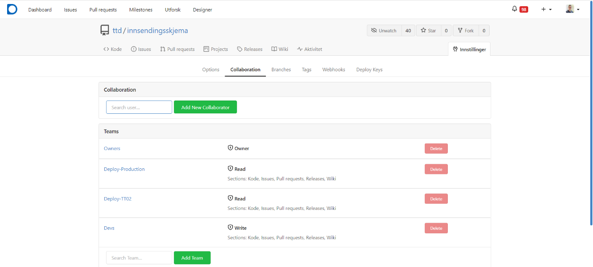

## Tilgangsstyring for organisasjonen

Som eier av en organisasjon i Altinn Studio har man mulighet til å konfigurere tilgangene til de øvrige brukerne knyttet
til organisasjonen. Dette gjøres via Gitea på følgende lenke:
https://altinn.studio/repos/org/{org}/teams/ Husk å bytte ut `{org}`.

Det er definert fire standard team som legger føringer for hva en bruker har tillatelse til å gjøre innad i en
organisasjon i Altinn Studio. Ved behov kan man som eier kan man legge til/fjerne brukere i team, opprette nye team og
endre konfigurasjon på eksisterende team.

[Se oversikt over standard team og tilgangene de gir her](../../../reference/access-management/studio/).

## Tilgangsstyring for enkelt repository

En administrator for organisasjonen kan også styre hvem som har tilgang til det enkelte repository. Tilgang
kan gis til både hele team, og til enkeltbrukere.
1. Naviger til det aktuelle repository: `https://altinn.studio/repos/{org}/{app}/` - her erstattes 
    `{org}` og `{app}` med den aktuelle org-koden og appnavn.
    - Alternativt, naviger til https://altinn.studio/repos/explore/repos og søk etter din app.
2. Klikk på `Innstillinger`-knappen på høyre side av toppmenyen for repoet.
3. Velg `Collaboration` i venstre-menyen.
4. Gi tilgang til en spesifikk bruker i "Collabortation"-seksjonen ved å skrive inn brukernavn og klikk på "Add Collaborator".
5. Gi tilgang til spesifikke grupper i "Teams"-seksjonen ved å skrive inn navnet på en gruppe, og klikk "Add Team".

Det gjøres ved at man går til repositoryet i Gitea, og går til fanen `Collaboration` under `Innstillinger`.
Tilgang kan gis både til team og enkeltbrukere. For å holde oversikt anbefaler vi primært å sette opp
team for tilgangsstyring. For å gi et team tilgang, søk det fram og klikk `Add Team`.

