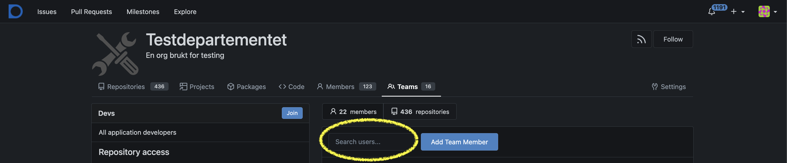

## Tilgangsstyring for organisasjonen

Som eier av en organisasjon i Altinn Studio har man mulighet til å konfigurere tilgangene til de øvrige brukerne knyttet
til organisasjonen. Dette gjøres via Gitea på følgende lenke:
https://altinn.studio/repos/org/{org}/teams/ Husk å bytte ut `{org}`.

Det er definert fire standard team som legger føringer for hva en bruker har tillatelse til å gjøre innad i en
organisasjon i Altinn Studio. Ved behov kan man som eier kan man legge til/fjerne brukere i team, opprette nye team og
endre konfigurasjon på eksisterende team.

[Se oversikt over standard team og tilgangene de gir her](../../../../reference/access-management/studio/).

### Hvordan legge til bruker i et team
Stegene under må gjøres av en bruker som er lagt inn som _eier_ av organisasjonen.
- Naviger til https://altinn.studio/repos/org/{org}/teams/ Husk å bytte ut `{org}` med din org-kode.
- Åpne ønsket team ved å klikke på navnet, eller på knappen "View".
- Skriv inn brukerens Altinn Studio _brukernavn_ i tekstfeltet over listen av eksisterende brukere i Teamet
  - Velg bruker fra listen som dukker opp når du skriver
- Klikk på knappen "Add Team Member". 
- Brukeren er nå lagt til i teamet.

## Tilgangsstyring for enkelt repository

En administrator for organisasjonen kan også styre hvem som har tilgang til det enkelte repository. Tilgang
kan gis til både hele team, og til enkeltbrukere.
1. Naviger til det aktuelle repository: `https://altinn.studio/repos/{org}/{app}/` - her erstattes 
    `{org}` og `{app}` med den aktuelle org-koden og appnavn.
    - Alternativt, naviger til https://altinn.studio/repos/explore/repos og søk etter din app.
2. Klikk på `Innstillinger`-knappen på høyre side av toppmenyen for repoet.
3. Velg `Collaboration` i venstre-menyen.
4. Gi tilgang til en spesifikk bruker i "Collabortation"-seksjonen ved å skrive inn brukernavn og klikk på "Add Collaborator".
5. Gi tilgang til spesifikke grupper i "Teams"-seksjonen ved å skrive inn navnet på en gruppe, og klikk "Add Team".

Det gjøres ved at man går til repositoryet i Gitea, og går til fanen `Collaboration` under `Innstillinger`.
Tilgang kan gis både til team og enkeltbrukere. For å holde oversikt anbefaler vi primært å sette opp
team for tilgangsstyring. For å gi et team tilgang, søk det fram og klikk `Add Team`.

## Hvordan fjerne en bruker fra et team
Du trenger brukernavnet til brukeren som skal fjernes.
1. Naviger til teamene for din organisasjon: `https://altinn.studio/repos/org/{org}/teams/` - her erstattes `{org}` med din org-kode.
2. Velg det teamet du skal fjerne brukeren fra ved å klikke på "View".
3. Velg brukeren fra listen over medlemmmer, og velg "Remove".

Merk at en bruker kan selv forlate et team ved å navigere til samme visning og trykke på "Leave" knappen øverst til venstre
ved siden av team-navnet.

## Hvordan fjerne en bruker fra organisasjonen
Du trenger brukernavnet til brukeren som skal fjernes. Se oppskrift over for hvordan fjerne bruker fra enkeltteam.
1. Naviger til teamene for din organisasjon: `https://altinn.studio/repos/org/{org}/teams/` - her erstattes `{org}` med din org-kode.
2. Fjern brukeren fra de teamene brukeren er medlem i for din organisasjon.
   - Typiske team er `devs` for skrivetilgang til tjenestene, `Deploy-<miljø>` for publiseringstilgang for tjenestene, og `Resources-Publish-<miljø>` for tilgang til å publisere ressurser.
   - Om din organiasjon har satt opp en annen team-struktur må du sjekke samtlige team brukeren kan være medlem av.
3. Verifiser at brukeren ikke lenger hører til din organisasjon ved å navigere til brukeren: ``https://altinn.studio/repos/{brukernavn}`
   og sjekk at din organisasjon (med logo) ikke lenger vises under brukerens profililde på venstre side.
