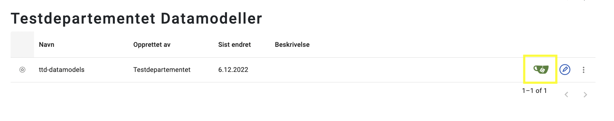
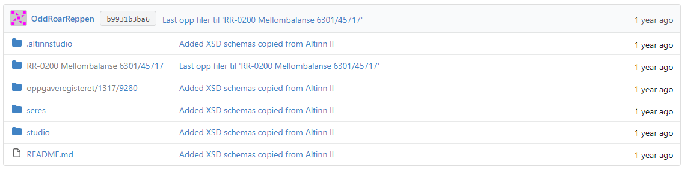
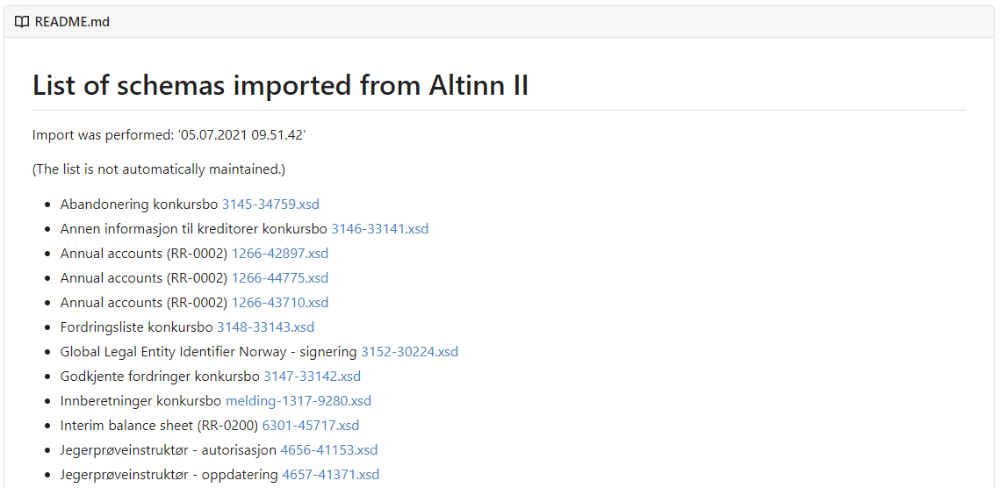

{}
Denne siden beskriver hva som må gjøres ifm. overgangen fra Seres til Altinn Studio som datamodelleringsverktøy. 
Siden vil oppdateres i takt med utviklings- og migreringsarbeidet som gjøres så det må forventes oppdateringer.
{}

{}
Alle XSD'er som lå i Altinn 2 pr. 06.12.2022 er importert til Altinn Studio.
{} 

## Altinn Studio Datamodellering
Seres er et verktøy for å lage XSD'er som igjen validerer korrektheten til en XML. Det nye datamodelleringsverktøyet jobber på Json Schema som igjen validerer Json. Prinsippet er det samme, men formatet er forskjellig.

Selv om datamodelleringsverktøyet jobber på Json Schema vil det fortsatt være mulig å hente ut en XSD hvis man trenger det, f. eks. i et mottakssystem. Json Schema vil da bli konvertert til XSD. En XSD produsert i Seres og som leses inn i ASD vil inneholde nok metadata til å kunne re-generere XSD'en slik den var. Dette muliggjør at man kan bruke verktøyet til å jobbe med datamodeller for Altinn 2 ev. lage en Altinn 3 applikasjon som leverer samme format som Altinn 2.

{}
Selv om både XSD og Json Schema handler om å beskrive og validere dataformater så har de begge forskjellige egenskaper og måter å beskrive datatyper og datastrukturer på. Json Schema startet som et noe mer lettvekts alternativ til XSD - noe av denne "lettheten" blir dog borte når man må kunne re-generere en XSD 100%. 

Det anbefales derfor at man starter fra bunnen av og modellerer på nytt for en Altinn 3 applikasjon hvis man har muligheten til dette, slik at man sikrer mest mulig enkle og oversiktlige datamodeller.
{}

## Overgangen fra Seres til Altinn Studio Datamodellering - Hva må du som tjenesteeier gjøre?
### Verifisere at alle XSD'er fra Altinn 2 er overført
XSD'er som er lastet opp til og tatt i bruk i Altinn 2 vil bli hentet ut og overført til et dedikert lagringsområde per tjenesteeier i Altinn Studio. Dette er et _repository_ som ligger under den enkelte tjenesteeier sin organisasjon i Altinn Studio/Gitea og har navnet {org}-datamodels.

Du finner det ved å enten søke det opp i dashboardet til Altinn Studio, eller se i listen **Datamodeller** på dashboardet,
 og klikke på den grønne _repository_ lenken.

Når du har åpnet _repository_ vil du se flere mapper, XSD'er fra Altinn 2 vil ligge under Seres mappen.

I tillegg vil du se en _readme.md_ fil som vises på forsiden av _repository_. Denne inneholder en tekstlig beskrivelse av alle XSD'ene som er hentet ut fra Altinn 2.

{}
Ifm. at dette arbeidet ble startet i 2021 ble det gjort et uttrekk av XSD'er da, disse ligger igjen. Vi har kjørt et nytt uttrekk i 23. november 2022, og igjen 6. desember 2022.

Vi har ikke slettet skjemaer som allerede er overført til ny løsning selv om de er fjernet i Altinn 2.
{}

Det gjøres ingen endringer i XSD'ene ifm. uttrekket og overføringen til _repository_ i Altinn Studio. XSD'ene skal være 
100% like. Det er først når man velger å jobbe videre på XSD'ene at nytt datamodelleringsverktøy vil tas i bruk. Videreutvikling kan være mindre endringer for Altinn 2 ev. bygge videre på skjema med tanke på å bruke det i en Altinn 3 applikasjon.

### XSD'er som er under arbeid i Seres
Hvis du har XSD'er som er under arbeid i Seres og som ikke er satt i produksjon i Altinn 2 må disse tas ut av Seres 
manuelt og [lastes opp i _repository_][1] hvis du ønsker å jobbe videre med de i Altinn Studio ev. ha alt samlet på et sted. 
Alternativt kan man starte på nytt med datamodellering i nytt verktøy.

### XSD'er som kun er lastet opp i TUL
Her gjelder det samme som for punktet over.

### Teste nytt verktøy
Har du planer om å gjøre endringer i en eller flere XSD'er som skal produksjonsettes i Altinn 2 bør endringsprosessen
testes og helst gjøres med mindre endringer slik at det blir lettere å verifisere den genererte XSD'en før den lastes
opp og tas i bruk i Altinn 2.

[1]: /altinn-studio/reference/data/data-modeling/#uploading-xsd-to-repository