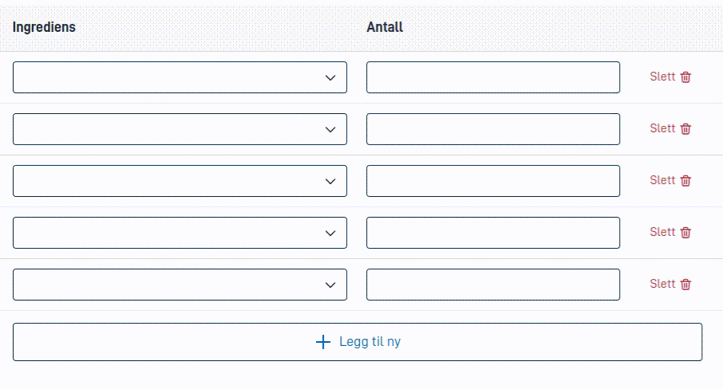

Filtering is a way to remove some of the options from the list. This can be useful if you want to limit which
options the user can choose from.

Keep in mind that there are different approaches to making options dynamic:

1. You can use [dynamics](../../../dynamics) to hide and show entirely different components based on a condition. These
   components could be bound to the same location in the data model, but have different options. Note that
   [automatic cleanup](../automatic-cleanup) may unexpectedly remove values from the data model when using this approach.
   Test thoroughly to ensure form data is not lost when using this method.
2. By using [dynamic options](../../sources/dynamic) and passing query parameters to the backend, you can write custom code
   to generate a different set of options based on those query parameters. This may be useful, but can cause lots of traffic
   to the backend if the options are frequently changing.
3. Using [options from the data model](../../sources/from-data-model) you can set up options based on a repeating structure in
   the data model. In combination with data processing on the backend, this can be a powerful way to create custom options
   even when dynamic options based on query parameters would be problematic.

Filtering options via the `optionFilter` property works with all of the above, and with
plain [static options](../../sources/static) as well. It makes it possible to use a [dynamic expression](../../../dynamics)
to filter out options based on the current state of the form.

### Configuration

In the example below, the `optionFilter` property is set to a dynamic expression that filters out the
option `should-be-removed`. Note that the `optionFilter` property accepts an expression for which options to keep,
so you should invert the logic to remove an option.

The expression is evaluated for each option, and if it returns `true`, the option is _kept_. All other options are _removed_.

```json {hl_lines=["10"]}
{
  "id": "dropdown-component-id",
  "type": "Dropdown",
  ...
  "options": [
    { "value": "should-be-removed", "label": "Should be removed" },
    { "value": "red", "label": "Red" },
    { "value": "blue", "label": "Blue" }
  ],
  "optionFilter": ["notEquals", ["value"], "should-be-removed"]
}
```

The result of the above configuration will be a dropdown with two options: "Red" and "Blue".

### The `value` function

In the example above, the `value` function is used to access the value of the current option. This function can be used
with arguments to access other values in the option as well.

- `["value"]` and `["value", "value"]` are equivalent, and will return the value of the current option.
- `["value", "label"]` will return the label of the current option. This label is the text given in the `label` property
  of the option, before any text resources are looked up.
- `["value", "description"]` will return the [description of the current option](../texts), if set.
- `["value", "helpText"]` will return the [help text of the current option](../texts), if set.

### Used alongside options from the data model

When using `optionFilter` with options from the data model, the expression will be evaluated for each _row_ in the
repeating structure. This means that if you look up the data model (via the `dataModel` function) in the expression,
you will have access to data from the row that the option was fetched from.

If there is a `RepeatingGroup` component associated with this repeating structure, the `optionFilter` property can also
look up values from the `component` function to access data from components inside the repeating group. The return value
from this function will always be `null` if the row is hidden using
[dynamics in the `hiddenRow` property](../../../../../reference/ux/fields/grouping/repeating/dynamics),
even if a lookup with the `dataModel` function would return data from the hidden row.

An example using this combination:

```json {hl_lines=["10-15"]}
{
   "id": "choose-pet",
   "type": "Dropdown",
   ...
   "source": {
      "group": "MyPets",
      "label": ["dataModel", "MyPets.Name"],
      "value": "MyPets[{0}].Id"
   },
   "optionFilter": [
      "and",
      ["notEquals", ["dataModel", "MyPets.Name"], null],
      ["notEquals", ["component", "pet-owned-by-someone-else"], true],
      ["notEquals", ["value"], "example-cat-id"]
   ]
}
```

In this example, the `optionFilter` property will filter out all pets that:
- Do not have a name (the path `MyPets.Name` is `null` or an empty string)
- Are owned by someone else (the value in the `pet-owned-by-someone-else` component is `true`). In this example, we assume
  that this component is set up inside a `RepeatingGroup` component that is associated with the `MyPets` structure.
- Have the ID `example-cat-id`. Since the `value` field is fetched from the path `MyPets[{0}].Id`, the result will be
  the same as if you wrote `["notEquals", ["dataModel", "MyPets.Id"], "example-cat-id"]`.

### Example: Filtering duplicate options in a repeating group

In the following animation, a `RepeatingGroup` component has been set up with a `Dropdown` component inside.
The `Dropdown` component has a `optionFilter` property that removes options that have already been used in
other rows in the repeating group.



The configuration for this example is as follows:

```json {hl_lines=["11-17"]}
{
   "id": "ingredientType",
   "type": "Dropdown",
   "textResourceBindings": {
      "title": "Ingrediens"
   },
   "dataModelBindings": {
      "simpleBinding": "Ingredients.Type"
   },
   "optionsId": "foods",
   "optionFilter": [
      "or",
      // Remove those that have been used elsewhere
      ["not", ["commaContains", ["dataModel", "UsedTypes"], ["value"]]],
      // But not if it's the currently chosen ingredient here
      ["equals", ["component", "ingredientType"], ["value"]]
   ]
}
```

A few things to note about the configuration:

1. The already used types are stored in a comma-separated list in the `UsedTypes` field in the data model. This field
   is updated using a [data processor](../../../../../reference/logic/dataprocessing) that finds all the unique types
   in the `Ingredients` array.
2. If we just checked the `UsedTypes` field against the `value` of the current `Dropdown` component, as soon as an
   ingredient was chosen, it would be removed from the list of options and
   would [be automatically cleaned up](../automatic-cleanup). For this reason, we also check that the `value` is not
   equal to the data set in the current `Dropdown` component.

{}
The example above relies on saving the form data to the backend and running data processing to update
the `UsedTypes` field. For this reason, it is still fully possible to select the same ingredient in multiple rows
in the repeating group if you're fast enough. When using a method like this you should
also [implement validation](../../../../../reference/logic/validation) to catch any duplicates that might slip through.
{}
