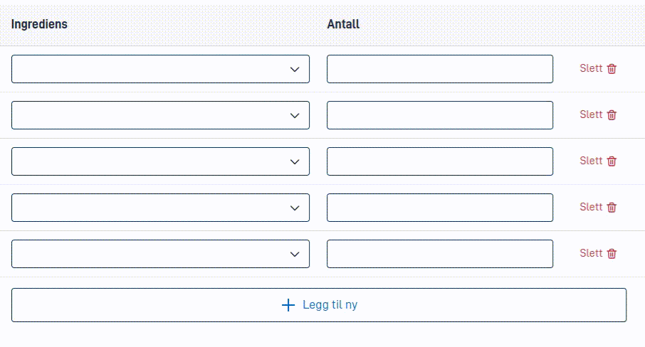

Filtrering gjør det mulig å fjerne noen av svaralternativene fra listen. Dette kan være nyttig hvis du vil begrense hvilke
alternativer brukeren kan velge mellom.

Legg merke til at det allerede finnes flere måter å gjøre svaralternativene dynamiske på:

1. Du kan bruke [dynamikk](../../../dynamics) for å skjule og vise helt forskjellige komponenter basert på en betingelse. Disse
   komponentene kan være bundet til samme sted i datamodellen, men ha forskjellige svaralternativer. Merk at
   [automatisk opprydding](../automatic-cleanup) kan fjerne verdier fra datamodellen når du bruker denne metoden.
2. Ved å bruke [dynamiske alternativer](../../sources/dynamic) og sende spørringsparametre til backenden, kan du skrive 
   kode for å generere et annet sett med alternativer basert på disse spørringsparametrene. Dette kan være nyttig,
   men kan føre til mye nettverkstrafikk hvis alternativene og spørringsparametrene endres ofte.
3. Ved å bruke [svaralternativer fra en repeterende struktur i datamodellen](../../sources/from-data-model). I kombinasjon
   med data prosessering på backenden, kan dette være en kraftig måte å lage egendefinerte svaralternativer på, selv når dynamiske
   alternativer basert på spørringsparametre ville være problematisk.

Filtrering av svaralternativer via `optionFilter`-egenskapen fungerer med alle de nevnte metodene, og med
vanlige [statiske svaralternativer](../../sources/static) også.
Dette gjør det mulig å bruke et [dynamisk uttrykk](../../../dynamics) for å filtrere ut svaralternativer basert
på den nåværende tilstanden i skjemaet.

### Konfigurasjon

I eksempelet under er `optionFilter`-egenskapen satt til et dynamisk uttrykk som filtrerer ut alternativet
`should-be-removed`. Merk at `optionFilter`-egenskapen settes opp med et uttrykk som bestemmer hvilke alternativer som
skal beholdes. Om du vil fjerne alternativer, må du snu om logikken. Dette kan for eksempel gjøres ved å pakke inn
hele uttrykket i en `not`-funksjon.

Uttrykket evalueres for hvert svaralternativ, og hvis det returnerer `true`, beholdes alternativet. Alle andre alternativer fjernes.

```json {hl_lines=["10"]}
{
  "id": "dropdown-component-id",
  "type": "Dropdown",
  ...
  "options": [
    { "value": "should-be-removed", "label": "Denne blir fjernet" },
    { "value": "red", "label": "Rød" },
    { "value": "blue", "label": "Blå" }
  ],
  "optionFilter": ["notEquals", ["value"], "should-be-removed"]
}
```

Resultatet av konfigurasjonen over vil være en nedtrekksliste med to alternativer: "Rød" og "Blå".

### `value`-funksjonen

I eksempelet over brukes `value`-funksjonen til å få tilgang til verdien av det nåværende alternativet.
Denne funksjonen kan brukes med argumenter for å få tilgang til andre verdier i svaralternativet også.

- `["value"]` og `["value", "value"]` er like, og vil returnere verdien av det nåværende alternativet.
- `["value", "label"]` vil returnere ledeteksten til det nåværende alternativet. Denne teksten er teksten som er gitt i
  `label`-egenskapen til alternativet, før noen teksteressurser slås opp.
- `["value", "description"]` vil returnere [beskrivelsen av det nåværende alternativet](../texts), hvis satt.
- `["value", "helpText"]` vil returnere [hjelpeteksten til det nåværende alternativet](../texts), hvis satt.

### Sammen med kodelister fra repeterende strukturer

Hvis du bruker [kodelister fra en repeterende struktur i datamodellen](../../sources/from-data-model), vil uttrykket
i `optionFilter`-egenskapen bli evaluert for hvert _rad_ i den repeterende strukturen. Det betyr at om du gjør oppslag
i datamodellen (via `dataModel`-funksjonen) i uttrykket, vil du få tilgang til data fra den nåværende raden som
kodeliste-elementet er hentet fra.

Dersom det finnes en `RepeatingGroup`-komponent knyttet til denne repeterende strukturen, vil `optionFilter`-egenskapen
også kunne slå opp verdier fra `component`-funksjonen for å få tilgang til data fra komponenter inne i den repeterende
gruppen. Returverdien fra denne funksjonen er alltid `null` om raden er skjult ved hjelp
av [dynamikk i `hiddenRow`-egenskapen](../../../../../reference/ux/fields/grouping/repeating/dynamics), selv om et
oppslag med `dataModel`-funksjonen ville returnert data fra den skjulte raden.

Et eksempel på denne kombinasjonen:

```json {hl_lines=["10-15"]}
{
   "id": "choose-pet",
   "type": "Dropdown",
   ...
   "source": {
      "group": "MyPets",
      "label": ["dataModel", "MyPets.Name"],
      "value": "MyPets[{0}].Id"
   },
   "optionFilter": [
      "and",
      ["notEquals", ["dataModel", "MyPets.Name"], null],
      ["notEquals", ["component", "pet-owned-by-someone-else"], true],
      ["notEquals", ["value"], "example-cat-id"]
   ]
}
```

I dette eksempelet vil `optionFilter`-egenskapen filtrere ut alle kjæledyr som:
- Ikke har et navn (stien `MyPets.Name` er `null` eller en tom streng)
- Eies av noen andre (verdien i `pet-owned-by-someone-else`-komponenten er `true`). I dette eksempelet antar vi at
  denne komponenten er satt opp inne i en `RepeatingGroup`-komponent som er knyttet til `MyPets`-strukturen.
- Har ID-en `example-cat-id`. Siden `value`-feltet hentes fra stien `MyPets[{0}].Id`, vil resultatet være det samme
  som om man skrev `["notEquals", ["dataModel", "MyPets.Id"], "example-cat-id"]`.

### Eksempel: Filtrere duplikate alternativer i en repeterende gruppe

I animasjonen under er en `RepeatingGroup`-komponent satt opp med en `Dropdown`-komponent inni. Denne
`Dropdown`-komponenten har en `optionFilter`-egenskap som fjerner svaralternativer som allerede er brukt i andre
rader i den repeterende gruppen.



Konfigurasjonen for dette eksempelet er som følger:

```json {hl_lines=["11-17"]}
{
   "id": "ingredientType",
   "type": "Dropdown",
   "textResourceBindings": {
      "title": "Ingrediens"
   },
   "dataModelBindings": {
      "simpleBinding": "Ingredients.Type"
   },
   "optionsId": "foods",
   "optionFilter": [
      "or",
      // Fjern de som har blitt brukt andre steder
      ["not", ["commaContains", ["dataModel", "UsedTypes"], ["value"]]],
      // Men ikke hvis det er den valgte ingrediensen her
      ["equals", ["component", "ingredientType"], ["value"]]
   ]
}
```

Noen ting å merke seg om konfigurasjonen:

1. De allerede brukte ingrediens-typene lagres i en komma-separert liste i feltet `UsedTypes` i datamodellen. Dette feltet
   oppdateres ved hjelp av [dataprosessering](../../../../../reference/logic/dataprocessing) som finner alle unike
   ingredienstyper i `Ingredients`-lista.
2. Hvis vi bare sjekket `UsedTypes`-feltet mot `value`-verdien til den nåværende `Dropdown`-komponenten, ville alternativet
   bli fjernet fra listen med en gang en ingrediens ble valgt, og verdien i datamodellen
   ville da [blitt automatisk ryddet opp](../automatic-cleanup). Av denne grunn sjekker vi også at `value` ikke er lik
   verdien til den nåværende `Dropdown`-komponenten.

{}
Eksempelet ovenfor er avhengig av å lagre skjemadata til backenden og kjøre dataprosessering for å oppdatere
`UsedTypes`-feltet. Av denne grunn er det fortsatt fullt mulig å velge den samme ingrediensen i flere rader
i den repeterende gruppen hvis du er rask nok. Når du bruker en metode som dette bør du
også [implementere validering](../../../../../reference/logic/validation) for å fange opp eventuelle duplikate verdier.
{}
