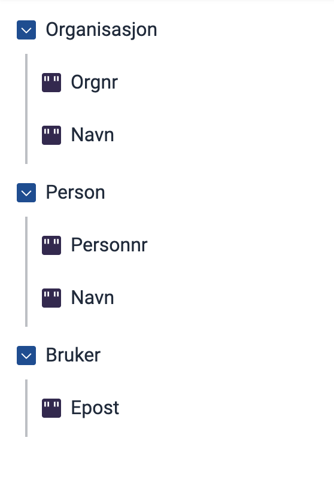

## What does this feature do?  
Your Altinn app can automatically fill in parts of the form before the user begins. The data can be retrieved from:  
- The Business Register (for company info)  
- The Population Register (for personal info)  
- The user's Altinn profile.  

When someone starts the form, the fields you select will be automatically populated with the correct data.

## When should I use this?
If you plan on using data from the sources listed above. There is a limited set of fields available. 
See [full list of available data fields for all sources](../../../../reference/data/prefill).

Do you need data from other sources? Go to [prefilling data using custom code](../custom/).

## How to set it up
{.floating-bullet-numbers-sibling-ol}

1. **Create a new file**

   Navigate to the folder `App/models` in your app and create a new file named `[dataModelName].prefill.json`.

   If your data model is called _appModel_, you should now have the following files:
   - `appModel.cs` 
   - `appModel.schema.json` 
   - `appModel.prefill.json`  &larr; *the new file*

2. **Add the base configuration**

   Copy this configuration code into the new file:

   ```json
   {
      "$schema": "https://altinncdn.no/schemas/json/prefill/prefill.schema.v1.json",
      "allowOverwrite": true,
      "ER": {},
      "DSF": {},
      "UserProfile": {}
   }
   ```

3. **Configure which data should be filled automatically**

   The three groups in the code mirror the three available sources:  
   - `ER` - The Business Register  
   - `DSF` - The Population Register  
   - `UserProfile` - The user's Altinn profile  

   Choose which sources you want to use. If any (or all) of the sources should not be used, leave them empty.

   Within the group for the relevant source, add lines indicating:  
   - Which data field (from the source) you want to retrieve data from  
   - Which form field should be filled out  

   The format is `"datafield": "formfield"`, where:  
   - `datafield` is the name of the field _from the source_  
   - `formfield` is the name of the field in the form's data model.

   See [full list of available data fields for all sources](../../../../reference/data/prefill).


## Examples

All examples are based on the data model shown below:



### Retrieve Organization Number from the Business Register (ER)

This will fill the `Organization.OrgNo` field with the organization number from the Business Register:

```json
"ER": {
  "OrgNumber": "Organization.OrgNo"
}
```

### Example: Retrieve Personal Number from the Population Register (DSF)

This will fill the `Person.PersonNr` field with the personal number from the Population Register.

```json
"DSF": {
  "SSN": "Person.PersonNr"
}
```

### Example: Retrieve email from the user's Altinn profile

This will fill the `User.Email` field with the email retrieved from the user's Altinn profile.

```json
"UserProfile": {
  "Email": "User.Email"
}
```