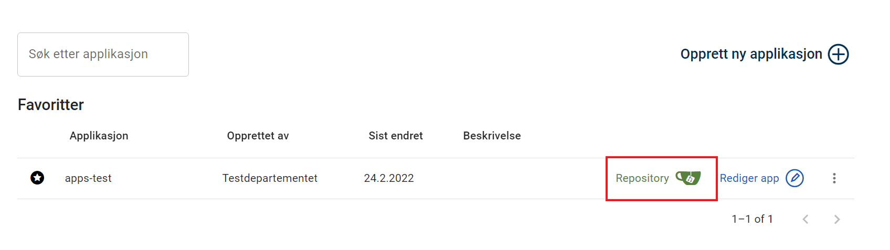
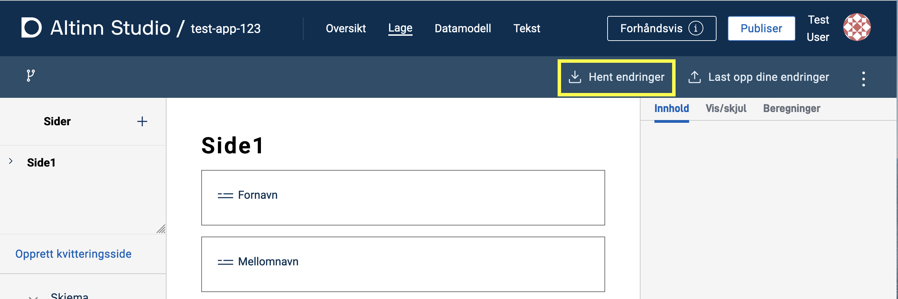
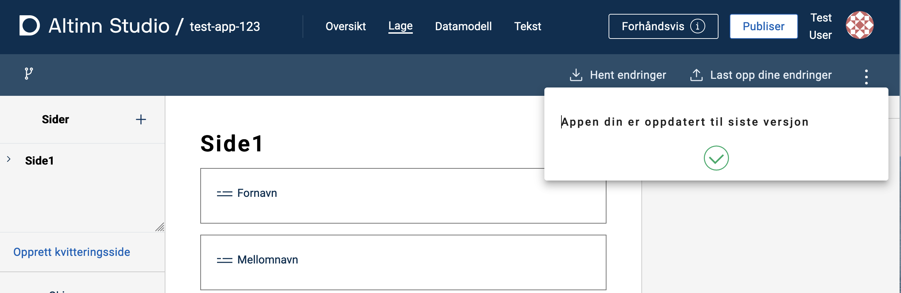
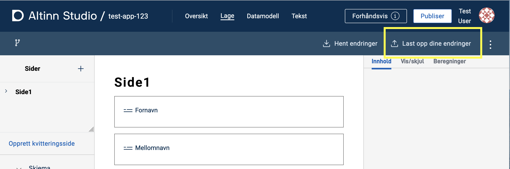
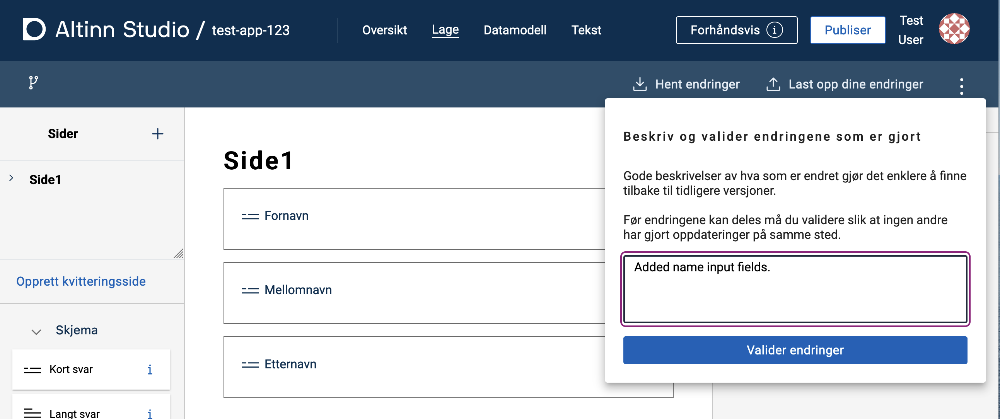

During application development, you will need to work both in Altinn Studio and in a local development environment.
 Here's an overview of how to get started with local development.

## How to clone the application to a local development environment

1. Find the application you want to work with locally in the [Dashboard](/altinn-studio/getting-started/navigation/dashboard) in Altinn Studio.
2. Navigate to the repository by clicking the _Repository_ button.
    
3. Copy the repository link (the blue square) either manually or by clicking the button marked with a red circle.
    
4. Open a terminal in your local development environment.
    - Navigate to the desired location for the application repository.
    - Enter the command `git clone` and paste the URL you copied in the previous step.
    ```cmd
    $ git clone https://altinn.studio/repos/<org>/<app-name>.git
    ```
    -  If you have logged into Altinn Studio without creating a password (e.g. using Github login),
    you can [create a personal access token in Gitea](https://altinn.studio/repos/user/settings/applications)
    that can be used as a password when cloning:
    ```cmd
    $ git clone https://<username>:<access-token>@altinn.studio/repos/<org>/<app-name>.git
    ```
    - You should see an output in the terminal similar to this:
    ```cmd
    Cloning into 'app-name'...
    remote: Enumerating objects: 982, done.
    remote: Counting objects: 100% (982/982), done.
    remote: Compressing objects: 100% (950/950), done.
    remote: Total 982 (delta 600), reused 0 (delta 0), pack-reused 0 
    Receiving objects: 100% (982/982), 166.38 KiB | 1.51 MiB/s, done.
    Resolving deltas: 100% (600/600), done.
    ```

A folder with the same name as the application has been created, and the contents of the application repository have been cloned into the folder.
 Now you can open your preferred development tool and start coding.

## How to synchronize changes in the local development environment

Changes made locally need to be uploaded (pushed) to the repository from which the code was cloned.
 If changes are made in Altinn Studio Designer (and uploaded to the repository), these must be downloaded (pulled) to update the local code.

Synchronizing changes made in the local development environment can be done in several ways.
 Many development tools have good integrations for this purpose, so check if your tool has that type of support.

Below is a description of how you can synchronize changes from the command line.

### Uploading changes

1. Navigate to your application repository in a terminal.
2. Add the files you want to upload changes for (push) with the command `git add <file path>`.
   The command can be executed for individual files, multiple files at once (space separated), or a directory.
3. Save (commit) the changes with a meaningful message using the command `git commit -m <commit message>`.
4. Upload (push) the changes to the master branch with the command `git push`.

### Downloading changes

Navigate to your application repository in a terminal and run the command `git pull`.

[Read more about `git pull` here](https://git-scm.com/docs/git-pull)

## How to synchronize changes in Altinn Studio

If you're using Altinn Studio for development, changes need to be synchronized with the Altinn Repository.

### Downloading changes
1. Click on _Hent endringer_ (_Fetch changes_) on the 'Lage' page of the application in Altinn Studio.
   
2. If everything went well, you will see this confirmation.
 

### Uploading changes

1. Click on _Last opp dine endringer_ (_Upload your changes_) on the 'Lage' page of the application in Altinn Studio.
   
2. Enter a descriptive message for the change(s) and click _Valider endringer_ (_Validate changes_).
    
3. Wait for the changes to be validated. If a conflict occurs, click _Løs konflikt_ (_Resolve conflict_) and follow the instructions.
4. Click _lagre_ (_Save_) to upload the changes to the repository (master).
    
5. If everything went well, you will see this confirmation.
    

## Local testing

When working locally, it can be useful to preview the changes you make. *LocalTest* is a program that spins up a local mock-up of the Altinn Platform. This allows you to test and verify local changes without having to synchronize with Altinn Studio.

{}
**NOTE**
To run the app in LocalTest, the application must have an associated [data model](/altinn-studio/reference/data/data-modeling/).
{}

1. **Download and start LocalTest** by following the steps [described on GitHub](https://github.com/Altinn/app-localtest/blob/master/README.md) (includes starting the app, which is also explained below).
2. **Run your application within LocalTest**: Open a new terminal window and navigate to the subfolder *App* in your application (`<app-name>/App`). Start the app with the command `dotnet run` and wait for confirmation in the terminal.
3. **Preview and test application**: Go to [http://local.altinn.cloud](http://local.altinn.cloud) and log in with a [test user](/altinn-studio/reference/testing/local/testusers/).

### Preview changes in real-time

- For changes related to JSON files, simply reload the page.
- For changes in prefilling, the application must be instantiated again (go to [http://local.altinn.cloud](http://local.altinn.cloud) and log back in).
- For changes in CS files, the application must be stopped (`ctrl+C`) and restarted (`dotnet run`).

To automatically update when there are changes in CS files, start the application with `dotnet watch`. This command will either start the application or reload it ([hot reload](https://learn.microsoft.com/en-us/dotnet/core/tools/dotnet-watch#hot-reload)) when changes are made to the source code.

### Stopping the application and LocalTest

To stop the application, press `ctrl+C` in the terminal window where you started it. To stop LocalTest, navigate to the `app-localtest` folder in the terminal and run the command `docker compose down`.