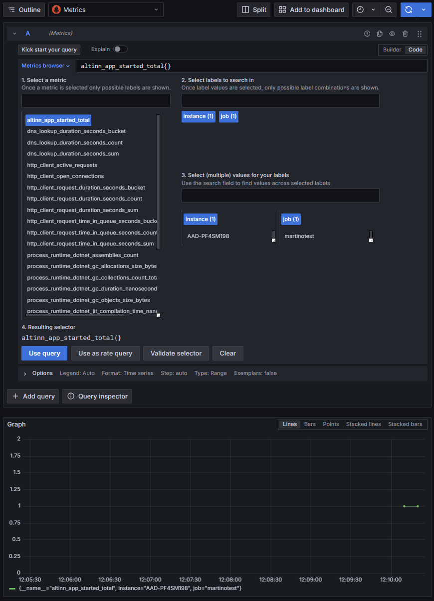
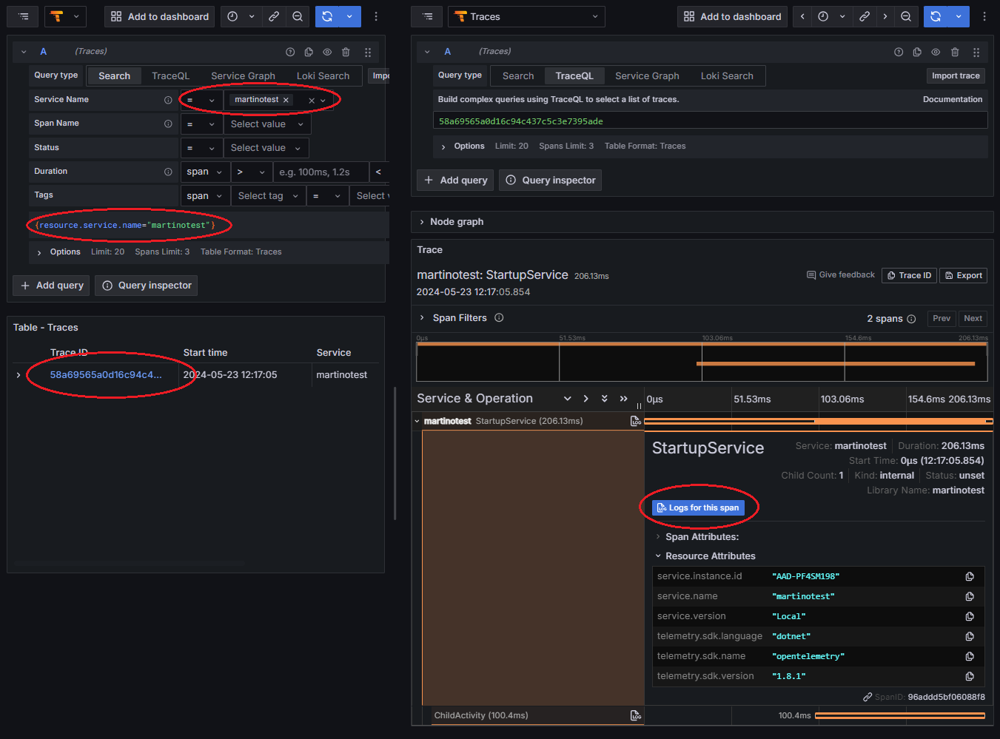

{}
This page refers to configuration when [OpenTelemetry (OTel)](https://opentelemetry.io/) is enabled in the app from v8 and newer.
The existing Application Insights SDK setup is obsolete and will be removed in the next major version of the Altinn.App libraries. 
{}

## Configuring your app

The new monitoring and instrumentation setup based on OpenTelemetry is enabled simply by setting 
`UseOpenTelemetry` to `true` in `appsettings.json` or equivalent.


{
  "AppSettings": {
    "UseOpenTelemetry": true
  }
}


You can now run the app, and the Altinn.App library will by default ship telemetry to localtest when running locally,
and to Azure monitor when running in an environment.

[Read more about configuration options on the configuration reference page](/altinn-studio/reference/monitoring/configuration/).

## Custom instrumentation

The most straightforward way of getting familiar with the Altinn.App instrumentation APIs is by creating
a simple `IHostedService` implemented in `Program.cs`. This way we can get some code running which we can experiment with.

In telemetry and instrumentation APIs of the Altinn.App library are exposed through the `Telemetry` class.
It is a thread-safe singleton object available in the dependency injection container.
Let's extend the the app by extending `Program.cs`.

If they're not there already, we need the following using statements at the top of the file:

```csharp
using System;
using System.Threading;
using System.Threading.Tasks;
using Microsoft.Extensions.Logging;
using Microsoft.Extensions.Hosting;
using Altinn.App.Core.Features;
```

Then we can implement the following class in the bottom of the file:

```csharp
sealed class StartupService(ILogger<StartupService> logger, Telemetry telemetry) : IHostedService
{
    public async Task StartAsync(CancellationToken cancellationToken)
    {
        // Create a custom metric - a counter in this case. Name will become `altinn_app_started`
        var counter = telemetry.Meter.CreateCounter<long>(Telemetry.Metrics.CreateName("started"));
        // Increments the counter
        counter.Add(1);

        // Start an activity, which get's emitted as an OTel span
        using var activity = telemetry.ActivitySource.StartActivity("StartupService");

        {
            // Wait a little, then spawn a child activity/span
            await Task.Delay(100, cancellationToken);
            using var childActivity = telemetry.ActivitySource.StartActivity("ChildActivity");
            await Task.Delay(100, cancellationToken);
        }

        // Logs come from the `ILogger<T>` interface
        var now = DateTimeOffset.UtcNow;
        logger.LogInformation("StartupService logging - Now={Now}", now);
    }

    public Task StopAsync(CancellationToken cancellationToken) => Task.CompletedTask;
}
```


[Read more about instrumentation on the instrumentation reference page](/altinn-studio/reference/monitoring/instrumentation).

## Visualising

Here is a brief overview of visualising the telemetry instrumented above.

[Read more about visualisation on the visualisation reference page](/altinn-studio/reference/monitoring/visualisation).

###  Running locally 

When running locally using [localtest](/altinn-studio/guides/local-dev/), a monitoring stack consisting of Grafana and OpenTelemetry Collector 
can be provisioned along side localtest and Platform APIs. [See the localtest README for more info](https://github.com/Altinn/app-localtest/blob/main/README.md).

Localtest monitoring setup currently contains a Grafana instance with ASP.NET Core dashboards and a preview Altinn app dashboard.
In addition you can freely explore the emitted telemetry while debugging or learning how the Altinn platform and libraries works.

[Read more about local Grafana on the visualisation reference page](/altinn-studio/reference/monitoring/visualisation/#grafana).

If you've implemented the code above, you should be able to find the `altinn_app_started` metric in the explore tab for the `Metrics` datasource.
You should also be able to find the log message and trace emitted above by using the other datasources.

To open Grafana, visit [local.altinn.cloud/grafana/](http://local.altinn.cloud/grafana/), then click explore in the side-menu.






### Deploying to an environment

When the app is deployed to an environment, the telemetry is currently shipped to Azure Monitor.

[Read more about Azure Monitor on the visualisation reference page](/altinn-studio/reference/monitoring/visualisation/#azure-monitor).

In Azure Monitor, logs and traces can be found by using the `Transaction search` menu blade,
while metrics are in the `Metrics` menu blade.

{}
In the future, the Altinn monitoring solution for deployed apps will also be based on Grafana.
{}
