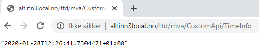

The applications that are developed in Altinn Studio are based on [ASP.NET Core](https://docs.microsoft.com/en-us/aspnet/core/introduction-to-aspnet-core) for back-end.
This provides a highly flexible environment to change and modify the applications.


## Adding an API controller

To expose a new API to an application, you have to add one or more API controllers.

Below is an example from an API controller which has been added to an app.
This is where the API path listener is set up along with the API logic.


```C# {linenos=false,hl_lines=[8,11]}
using System;
using System.Threading.Tasks;
using Microsoft.AspNetCore.Mvc;

namespace Altinn.App.Api.Controllers
{
    [ApiController]
    [Route("{org}/{app}/CustomApi")]
    public class CustomApiController : ControllerBase
    {
        [HttpGet("TimeInfo")]
        public async Task<ActionResult> Get()
        {
            return Ok(DateTime.Now);
        }
    }
}
```



The code can be viewed
in [this repository](https://altinn.studio/repos/ttd/mva/src/branch/master/App/controllers/CustomApiController.cs).

You can read more details about [the possibilities for exposing an API](https://docs.microsoft.com/en-us/aspnet/core/web-api/) in the documentation for ASP.NET.
