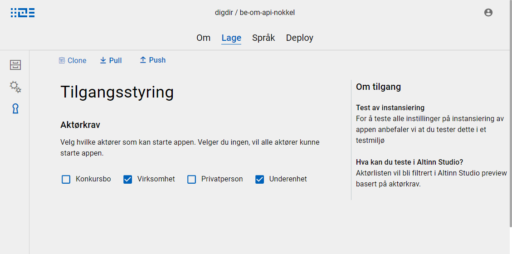

## Limit access using Altinn Studio designer

You can limit which actors have access to an app by using the Altinn Studio Designer. Role access options are placed in the "Lage" category in the top menu, on the page "Tilgangsstyring", represented by the keyhole on the leftmost side menu.
On this page you can mark the actor types the app should be accessible for. If none (or all) actor types are marked, everyone will have access. The option "Virksomhet" is used in cases where a report is filed on behalf of a company or other organization.

The screenshot below shows the settings for full access to the application for all organization numbers (both main entity and sub entities).



## Limit access by editing applicationmetadata.json

If you prefer working with code, you can find the option to adjust access between actor types in `applicationmetadata.json`, which is located in the folder `App/config` in the app repository.
The example below displays that same settings as the screenshot.

```json
  "partyTypesAllowed": {
    "bankruptcyEstate": false,
    "organisation": true,
    "person": false,
    "subUnit": true
  },
```
