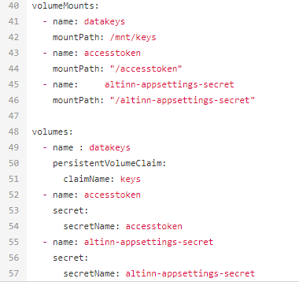

## Administration of secrets in Azure

As an application developer you administer the secrets which the application use in the Azure Key Vault.

[Routines for ordering access to your organizations resources are described here](/nb/altinn-studio/guides/access-management/apps/).

## Configure support for secrets in your app

To make secrets accessible within your application the affiliated helm chart has to be updated. 

In your application repository you can find the file `values.yaml` in the folder _deployment_.

Under the section _volumeMounts_ you add the following lines:

```yaml
- name: altinn-appsettings-secret
  mountPath: "/altinn-appsettings-secret"
```

Under the section _volumes_ you add the following lines:

```yaml
- name: altinn-appsettings-secret
    secret:
      secretName: altinn-appsettings-secret
```

{}
Be wary of indentations while working in _values.yaml_.
In yaml indents should be spaces and not tabs, tab will cause the file to not be interpreted as a yaml file.
{}

The last part of the file should look something like this after your changes are complete.



## How to make use of secrets in your application

You can either add Azure Key Vault as a config provider and use the IOptions pattern to read secrets, or you can use the `ISecretsClient` service, which is exposed in the application and can be dependency injected into the class where you need to retrieve a secret.

### 1. Azure Key Vault as config provider (recommended)
If this approach is chosen, you can use Azure Key Vault in the standard way via [IOptions-pattern](https://learn.microsoft.com/en-us/dotnet/core/extensions/options).

There is a helper method to add Azure Key Vault in this way, which can be used in Program.cs.

```cs
if (!builder.Environment.IsDevelopment())
{
    builder.AddAzureKeyVaultAsConfigProvider();
}
```

Example:
```cs
WebApplicationBuilder builder = WebApplication.CreateBuilder(args);
ConfigureServices(builder.Services, builder.Configuration);
ConfigureWebHostBuilder(builder.WebHost);

if (!builder.Environment.IsDevelopment())
{
    builder.AddAzureKeyVaultAsConfigProvider();
}

WebApplication app = builder.Build();
Configure();
app.Run();
```

Local mocking can be done with the use of [user secrets]('https://learn.microsoft.com/en-us/aspnet/core/security/app-secrets?view=aspnetcore-8.0&tabs=windows).

```
dotnet user-secrets init
dotnet user-secrets set "NetsPaymentSettings:SecretApiKey" "test-secret-key-used-for-documentation"
```

### 2. Using ISecretsClient

If you do not wish to add Azure Key Vault as a config provider, you can alternatively use the `ISecretsClient` service, which is a wrapper around the retrieval of secrets from Azure Key Vault. This service offers methods for fetching individual secrets as needed.

#### Code example

In this section, you will find an example of how to use a secret to populate a form field during instantiation.

The logic is implemented in `InstantiationHandler.cs`.

```cs
using Altinn.App.Models;
using Altinn.App.Services.Interface;
using Altinn.App.Services.Models.Validation;
using Altinn.Platform.Storage.Interface.Models;
using Altinn.App.Core.Internal.Secrets;
using System.Threading.Tasks;

namespace Altinn.App.AppLogic
{
    public class InstantiationHandler
    {
        private IProfile _profileService;
        private IRegister _registerService;
        private ISecretsClient _secretsClient;

        /// <summary>
        /// Set up access to profile and register services
        /// </summary>
        public InstantiationHandler(IProfile profileService, IRegister registerService, ISecretsClient secretsClient)
        {
            _profileService = profileService;
            _registerService = registerService;
            _secretsClient = secretsClient;
        }

        /// <summary>
        /// Run events related to instantiation
        /// </summary>
        /// <remarks>
        /// For example custom prefill.
        /// </remarks>
        /// <param name="instance">Instance information</param>
        /// <param name="data">The data object created</param>
        public async Task DataCreation(Instance instance, object data)
        {

            if (data.GetType() == typeof(Skjema))
            {
                Skjema model = (Skjema)data;
                model.etatid = await _secretsClient.GetSecretAsync("secretId");
            }
            await Task.CompletedTask;
        }
    }
}
```

1. The private variable for the service is included in the class.

    ```cs
    private ISecretsClient _secretsClient;
    ```

2. The ISecretsClient service is injected in the constructor and is assigned to the private variable.

    ```cs
    public InstantiationHandler(IProfile profileService, IRegister registerService, ISecretsClient secretsClient)
            {
                _profileService = profileService;
                _registerService = registerService;
                _secretsClient = secretsClient;
            }

    ```

3. How to get a specific secret using the name from Azure Key Vault and/or local mock.

    ```cs
    await _secretsClient_.GetSecretAsync("secretId");
    ```

#### Local mock

To run your service locally without connecting to Azure Key Vault, you need to create a file named `secrets.json` under the _App_ folder. In the JSON structure, you can include dummy data for the secrets you need. If you have uploaded a secret in Key Vault with the name "secretId," the content of the JSON file will look like this:

```json
{
  "secretId": "dummy secret value"
}
```