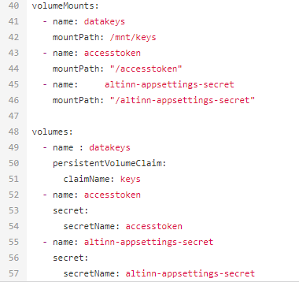

## Administrasjon av hemmeligheter i Azure

Som applikasjonsutvikler administrerer man selv hemmelighetene som applikasjonen benytter i Azure Key Vault.

[Rutiner for bestilling av tilgang til din organisasjons ressurser er beskrevet her](/altinn-studio/guides/administration/access-management/apps/).

## Konfigurer støtte for hemmeligheter i din app

For å tilgjengeliggjøre hemmeligheter i applikasjonen må det gjøres oppdateringer i helm charten tilknyttet applikasjonen.

I applikasjonsrepoet ditt finner du filen `values.yaml` i mappen _deployment_.

Under seksjonen _volumeMounts_ legger du til følgende linjer:

```yaml
- name: altinn-appsettings-secret
  mountPath: "/altinn-appsettings-secret"
```

Under seksjonen _volumes_ legger du til følgende linjer:

```yaml
- name: altinn-appsettings-secret
    secret:
      secretName: altinn-appsettings-secret
```

{}
Vær påpasselig med innrykk når du jobber i _values.yaml_.
I yaml skal indents være mellomrom og ikke tab, benytter du tab vil ikke din yaml være gyldig.
{}

Siste del av filen skal se omtrent slik ut når du har gjort ferdig alle endringer.




## Hvordan benytte hemmeligheter i applikasjonen

Man kan enten legge til Azure Key Vault som en config provider og benytte IOptions-pattern for å lese ut hemmeligheter, eller så kan man benytte servicen `ISecretsClient` er eksponert i applikasjonen og kan dependency injectes
i den klassen der du har behov for å hente ut en hemmelighet.

### 1. Azure Key Vault som config provider (anbefalt)
Om denne fremgangsmåten velges kan man bruke Azure Key Vault på standard måte via [IOptions-pattern](https://learn.microsoft.com/en-us/dotnet/core/extensions/options).

Det finnes en hjelpemetode for å legge til Azure Key Vault på denne måten, som kan benyttes i program.cs.

```cs
if (!builder.Environment.IsDevelopment())
{
    builder.AddAzureKeyVaultAsConfigProvider();
}
```

Eksempel:
```cs
WebApplicationBuilder builder = WebApplication.CreateBuilder(args);
ConfigureServices(builder.Services, builder.Configuration);
ConfigureWebHostBuilder(builder.WebHost);

if (!builder.Environment.IsDevelopment())
{
    builder.AddAzureKeyVaultAsConfigProvider();
}

WebApplication app = builder.Build();
Configure();
app.Run();
```

Lokal mocking kan gjøres ved hjelp av [user secrets](https://learn.microsoft.com/en-us/aspnet/core/security/app-secrets?view=aspnetcore-8.0&tabs=windows).

```
dotnet user-secrets init
dotnet user-secrets set "NetsPaymentSettings:SecretApiKey" "test-secret-key-used-for-documentation"
```

{}
Kall til `AddAzureKeyVaultAsConfigProvider()` må skje __etter__ metoden `ConfigureWebHostBuilder(builder.WebHost)` har kjørt, hvis ikke vil oppstart feile.
{}

### 2. Bruk av ISecretsClient

Dersom man ikke ønsker å legge til Azure Key Vault som config provider så kan man alternativt benytte tjenesten ISecretsClient, som er en wrapper rundt uthenging av hemmeligheter fra Azure Key Vault. Her tilbys metoder for å hente ut en og en hemmelighet der de trengs.

#### Kodeeksempel

I denne seksjonen finner du et eksempel på hvordan man benytter en hemmelighet
til å populere et skjemafelt under instansiering.

Logikken er implementert i `InstantiationHandler.cs`

```cs
using Altinn.App.Models;
using Altinn.App.Services.Interface;
using Altinn.App.Services.Models.Validation;
using Altinn.Platform.Storage.Interface.Models;
using Altinn.App.Core.Internal.Secrets;
using System.Threading.Tasks;

namespace Altinn.App.AppLogic
{
    public class InstantiationHandler
    {
        private IProfile _profileService;
        private IRegister _registerService;
        private ISecretsClient _secretsClient;

        /// <summary>
        /// Set up access to profile and register services
        /// </summary>
        public InstantiationHandler(IProfile profileService, IRegister registerService, ISecretsClient secretsClient)
        {
            _profileService = profileService;
            _registerService = registerService;
            _secretsClient = secretsClient;
        }

        /// <summary>
        /// Run events related to instantiation
        /// </summary>
        /// <remarks>
        /// For example custom prefill.
        /// </remarks>
        /// <param name="instance">Instance information</param>
        /// <param name="data">The data object created</param>
        public async Task DataCreation(Instance instance, object data)
        {

            if (data.GetType() == typeof(Skjema))
            {
                Skjema model = (Skjema)data;
                model.etatid = await _secretsClient.GetSecretAsync("secretId");
            }
            await Task.CompletedTask;
        }
    }
}
```

1. Den private variabelen for servicen inkluderes i klassen

    ```cs
    private ISecretsClient _secretsClient;
    ```

2. ISecretsClient servicen dependency injectes inn i klassen. Og den private variabelen blir assignet en verdi.

    ```cs
    public InstantiationHandler(IProfile profileService, IRegister registerService, ISecretsClient secretsClient)
            {
                _profileService = profileService;
                _registerService = registerService;
                _secretsClient = secretsClient;
            }

    ```

3. I metoden der man har behov for hemmeligheten kaller man på servicen.
    `secretId` vil være navnet på hemmeligheten i KeyVault evt. i lokal mock.

    ```cs
    await _secretsClient_.GetSecretAsync("secretId");
    ```

#### Lokal mock

For å kunne kjøre tjenesten din lokalt uten å koble seg til Azure Key vault
må man opprette filen `secrets.json` under mappen _App_.
I Json strukturen kan man legge inn dummydata for hemmelighetene man har behov for.
Har man lastet opp en hemmelighet i Key Vault med navnet "secretId" vil innholdet i json-filen se slik ut

```json
{
  "secretId": "local secret dummy data"
}
```