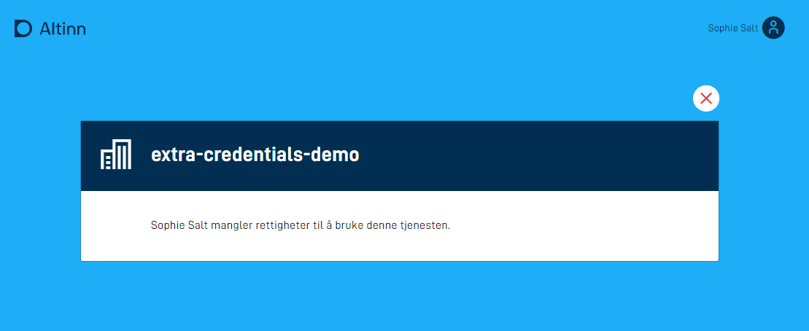

## Introduksjon til stateless applikasjoner

En stateless, eller tilstandsløs, applikasjon skiller ser fra standard applikasjoner ved at den ikke lagrer noe data,
hverken skjemadata eller metadata om instanser av applikasjonen. Applikasjonen vil heller ikke havne i meldingsboksen til sluttbruker.
 En tilstandsløs applikasjon tilsvarer en innsynstjeneste i Altinn 2.

 Stateless-applikasjoner passer godt som innsynstjenester der en sluttbruker eller et system gjør et oppslag mot en ressurs eller presenterer data fra en tredjepart basert på identiteten til brukeren.
  Det er også mulig å konfigurere en stateless-applikasjon for å tillate anonyme brukere, det vil si brukere som ikke er pålogget.

## Konfigurasjon

{}

Dette er helt ny funksjonalitet. Oppsett må gjøres manuelt inntil videre.

**MERK:** for å benytte denne funksjonaliteten må man versjon >= 4.5.2 av [nuget-pakkene](../../../maintainance/dependencies#nuget) `Altinn.App.PlatformServices`, `Altinn.App.Common` og `Altinn.App.Api`.

{}

Du kan styre applikasjonens oppførsel under oppstart og konfigurere den som en tilstandsløs applikasjon etter behov ved å konfigurere applikasjonsmetadataen, som er lagret i applicationmetadata.json.

Eksempel på konfigurasjon:


App/config/applicationmetadata.json


```json{hl_lines=[31]}
{
  "id": "ttd/stateless-app-demo",
  "org": "ttd",
  "title": {
    "nb": "Stateless App Demo"
  },
  "dataTypes": [
    {
      "id": "ref-data-as-pdf",
      "allowedContentTypes": [
        "application/pdf"
      ],
      "maxCount": 0,
      "minCount": 0
    },
    {
      "id": "Stateless-model",
      "allowedContentTypes": [
        "application/xml"
      ],
      "appLogic": {
        "autoCreate": true,
        "classRef": "Altinn.App.Models.StatelessV1"
      },
      "taskId": "Task_1",
      "maxCount": 1,
      "minCount": 1
    }
  ],
  ...
  "onEntry": { "show": "stateless" } // legg til denne linjen
}
```

I feltet `onEntry.show` har du muligheten til å spesifisere et layout-sett som du ønsker å vise under oppstart av applikasjonen.

Selve layout-settet er definert i konfigurasjonsfilen `App/ui/layout-sets.json`.
 Hvis filen ikke eksisterer, kan du opprette den.
  Du kan finne mer informasjon om layout-sett [her](/nb/altinn-studio/reference/ux/pages/layout-sets/).

Eksempel på layout-sett:


App/ui/layout-sets.json


```json
{
  "$schema": "https://altinncdn.no/toolkits/altinn-app-frontend/4/schemas/json/layout/layout-sets.schema.v1.json",
  "sets": [
    {
      "id": "stateless",
      "dataType": "Stateless-model"
    }
  ]
}
```

I eksempelet over referer layout-settet `stateless` til datamodellen `Stateless-model`.

Eksempel app-struktur for en applikasjon som er satt opp på denne måten:

```text
├───App
    ├───config
    ├───logic
    ├───models
    │       Stateless-model.cs
    │       Stateless-model.metadata.json
    │       Stateless-model.schema.json
    │       Stateless-model.xsd
    ├───ui
        │   layout-sets.json
        │
        └───stateless
            |   RuleConfiguration.json
            │   RuleHandler.js
            │   Settings.json
            │
            └───layouts
                  {page}.json
```

`{page}.json` vil kunne settes opp på samme måte som en vanlig applikasjonsside og vil støtte samtlige komponenter med unntak av:
- Filopplaster
- Knapp

Appens frontend vil lese konfigurasjonen fra `applicationmetadata.json` og forstå at den ikke skal opprette en instans.
 I stedet vil den hente layout-filene og tilhørende datamodeller og presentere dem for sluttbrukeren.

### Konfigurere tilgang uten innlogging

{}
OBS! Skjemakomponenter som påvirker prosess (knapp for innsending eller instansiering) er ikke støttet for anonyme brukere!

**MERK:** for å benytte denne funksjonaliteten må man bruke versjon >= 5.1.0 av [nuget-pakkene](../../../maintainance/dependencies#nuget) `Altinn.App.PlatformServices`, `Altinn.App.Common` og `Altinn.App.Api`.

{}

For å tillate bruk av appen for bruker som ikke er innlogget, må man følge stegene som beskrevet over. _I tillegg_ må man definere at den datatypen som er satt opp
til å brukes for stateless visningen tillater anonym (ikke innlogget) bruk. Dette gjøres ved å modifisere det aktuelle `dataType`-elementet i `applicationMetadata.json`.
Datatypen sitt `appLogic`-objekt må få en ny innstilling, `"allowAnonymousOnStateless": true`. Se eksempel under:



App/config/applicationmetadata.json


```json{hl_lines=[24]}
{
  "id": "ttd/stateless-app-demo",
  "org": "ttd",
  "title": {
    "nb": "Stateless App Demo"
  },
  "dataTypes": [
    {
      "id": "ref-data-as-pdf",
      "allowedContentTypes": [
        "application/pdf"
      ],
      "maxCount": 0,
      "minCount": 0
    },
    {
      "id": "Stateless-model",
      "allowedContentTypes": [
        "application/xml"
      ],
      "appLogic": {
        "autoCreate": true,
        "classRef": "Altinn.App.Models.StatelessV1",
        "allowAnonymousOnStateless": true,
      },
      "taskId": "Task_1",
      "maxCount": 1,
      "minCount": 1
    }
  ],
  ...
  "onEntry": { "show": "stateless" } 
}
```

## Datapopulering

Når man benytter en stateless datatype så vil man kunne populere datamodellen i det app-frontend spør om skjemadataen.

Datapopuleringen skjer i to steg på det initielle kallet fra frontend (GET):
1. [Prefill](../../data/prefill/)
2. [Dataprossesering](../../logic/dataprocessing/)

På påfølgende oppdateringer på samme skjemadata (POST) så vil man ikke kjøre prefill en gang til, men kalkuleringen trigges. Dette muliggjør manipulering av dataen basert på brukerens input selv i en stateless tilstand.

Eksempel på en kalkulering som populerer datamodellen nevnt i eksempelet over:

```c#
public async Task<bool> ProcessDataRead(Instance instance, Guid? dataId, object data)
{  
    if (data.GetType() == typeof(StatelessV1))
    {
        StatelessV1 form = (StatelessV1) data;
        // Her kan du gjøre det du ønsker, f.eks et API-kall 
        // om tjenesten skal oppføre seg som en innsynstjeneste.
        form.Fornavn = "Test";
        form.Etternavn = "Testesten";
        return true
    }
    return false;
}
```

## Autorisasjon med tredjepartsløsninger

Tilgangsstyring for stateless applikasjoner kan løses med [standard app-autorisasjon](../authorization) 
der man hved hjelp av Altinn-roller definerer hvem som har tilgang til å benytte tjenesten.
Dersom man har behov for ytteligere sikring av tjenesten kan man implementere logikk for autorisasjon av brukere med tredjepartløsninger.
Dette kan være API-er som er eksponert innenfor egen virksomhet eller åpne API fra andre tilbydere.

I eksempelet nedenfor benyttes Finanstilsynets API til å fastslå om virksomheten som repesenteres av en bruker i Altinn 
har tilstrekkelige lisenser til å benytte tjenesten.





Kildekoden til applikasjonen som eksempelet er basert på finnes [her](https://altinn.studio/repos/ttd/extra-credentials-demo) (krever bruker i Altinn Studio).

Videre i eksempelet vil betegnelsen *bruker* være synonymt med en virksomhet representert av en person i Altinn.

1. **Utvid datamodellen med felter for autorisasjon**

    I tillegg til et felt for å ta input fra bruker og et felt for å vise fram resultatet,
    har vi i dette eksempelet et felt for å holde på infomasjon om hvorvidt brukeren er autentisert 
    og et felt for å holde på en dynamisk feilmelding.

    ```xml
    <xs:sequence>
        <xs:element name="searchString" type="xs:string" />
        <xs:element name="result" type="xs:string" />
        <xs:element name="userAuthorized" type="xs:boolean" />
        <xs:element name="errorMessage" type="xs:string" />
    </xs:sequence>
    ```

    *Hopp til steg 4 dersom applikasjonen kun skal benyttes via API.*
  
2. **Legg til felt for å vise feilmelding i brukergrensesnittet**
    
    I brukergrensesnittet til applikasjonen er det tre komponenter. 
    Et søkefelt for brukerinput, et tekstfelt dedikert til å vise fram søkeresultatet og en paragraf som er reservert for feilmeldinger.

    

    Komponentene er koblet til datamodell og tekstressurs på følgende måte i `{page}.json`:


    
    App/ui/layouts/{page}.json
    

    ```json
    "layout": [
      {
        "id": "sokeBoks",
        "type": "Input",
        "textResourceBindings": {
          "title": "SearchString"
        },
        "dataModelBindings": {
          "simpleBinding": "searchString"
        },
        "required": false,
        "readOnly": false
      },
      {
        "id": "resultatBoks",
        "type": "TextArea",
        "textResourceBindings": {
          "title": "Result"
        },
        "dataModelBindings": {
          "simpleBinding": "result"
        },
        "required": false,
        "readOnly": true
      },
      {
        "id": "errorBoks",
        "type": "Paragraph",
        "textResourceBindings": {
          "title": "ErrorMessage"
        },
        "required": false,
        "readOnly": true
      }
    ]
    ```

3. **Legg inn dynamikkregler for å vise/skjule felter**
    
    Vi bruker dynamikkregler til å vise/skjule felter avhengig av om en bruker en autorisert eller ikke. 
    
    Det er lagt inn en dynamikkregel i `RuleHandler.js` som sjekker om et felt i datamodellen har verdien `false`. 
    Konfigurasjon av regler er beskrevet nærmere [her](../../logic/dynamic/#legg-tilrediger-funksjoner-for-beregninger-eller-visskjul).

    I `RuleConfiguration.json` ser man hvordan regelen benyttes.
    Dersom inputverdien fra datamodellen `userAuthorized` er false, så vises errorBoks-komponenten,
    mens det motsatte skjer med søke- og resultatfeltene, disse skjules. 

    Default oppførsel vil være det motsatte, altså at søk og resultat er synlig, mens error feltet er skjult.

    ```json
    {
      "data": {
        "ruleConnection": {},
        "conditionalRendering": {
          "e2dd8ff0-f8f1-11eb-b2bc-5b40a942c260": {
            "selectedFunction": "isFalse",
            "inputParams": {
              "value": "userAuthorized"
            },
            "selectedAction": "Show",
            "selectedFields": {
              "e2dd68e0-f8f1-11eb-b2bc-5b40a942c260": "errorBoks"
            }
          },
          "e2dd8ff0-f8f1-11eb-b2bc-5b40a942c261": {
            "selectedFunction": "isFalse",
            "inputParams": {
              "value": "userAuthorized"
            },
            "selectedAction": "Hide",
            "selectedFields": {
              "e2dd68e0-f8f1-11eb-b2bc-5b40a942c261": "sokeBoks",
              "e2dd68e0-f8f1-11eb-b2bc-5b40a942c262": "resultatBoks"
            }
          }
        }
      }
    }
    ```

4. **Legg til tekstressurser**

   I tillegg til navnet på tjenesten er det lagt inn tre tekstressurser. 
  
   Tekstressursen for feilmelding inneholder en placeholder for navnet på brukeren. 
   Variabelen `errorMessage` vil populeres i datamodellen når det registreres at en bruker ikke er autorisert til å bruke tjenesten.

    ```json
     {
      "id": "ErrorMessage",
      "value": "{0} mangler rettigheter til å bruke denne tjenesten.",
      "variables": [
        {
          "key": "errorMessage",
          "dataSource": "dataModel.lookup"
        }
      ]
    },
    {
      "id": "Result",
      "value": "Resultat"
    },
    {
      "id": "SearchString",
      "value": "Legg inn søkeord her:"
    },
    ```
5. **Implementér autorisasjonslogikk**

    Alt av dataprosessering for stateless applikasjoner ligger i filen `App\logic\DataProcessing\DataProcessingHandler.cs`, 
    og det er her autorisasjonslogikken skal plasseres. 
    
    Logikk for å slå opp data og autorisere brukeren ligger i metoden `ProcessDataRead`.
    Denne kalles hver gang en bruker åpner applikasjonen eller sendes inn noe input data.

    ```cs
     public async Task<bool> ProcessDataRead(Instance instance, Guid? dataId, object data)
     {
         lookup lookup = (lookup)data;
         
         // Check if user is authorized to use service
         Party party = await _register.GetParty(int.Parse(instance.InstanceOwner.PartyId)); 

         if (string.IsNullOrEmpty(party.OrgNumber) || !await _finanstilsynet.HasReqiuiredLicence(_settings.LicenseCode, party.OrgNumber))
         {
             lookup.userAuthorized = false;
             lookup.errorMessage = $"{party.Name}";
             return true;
         }         
          
         // logic for looking up data
         if (!string.IsNullOrEmpty(lookup.searchString))
         {
             lookup.result = $"You typed \"{lookup.searchString}\". This is the result.";
             return true;
         }

         return false;
     }
    ```

    Metoden starter med logikk for å hente ut skjemadataen slik at denne kan benyttes 
    videre i metoden.

    ```cs
    lookup lookup = (lookup)data 
    ```

    Videre kommer logikken for å sjekke om brukeren er autorisert.

    ```cs
    // Check if user is authorized to use service
    Party party = await _register.GetParty(int.Parse(instance.InstanceOwner.PartyId)) 

    if (string.IsNullOrEmpty(party.OrgNumber) || !await _finanstilsynet.HasReqiuiredLicence(_settings.LicenseCode, party.OrgNumber))
    {
        lookup.userAuthorized = false;
        lookup.errorMessage = $"{party.Name}";
        return true;
    }   
    ```

    For å vite hvem brukeren er, benyttes identifikatoren `instance.InstanceOwner.PartyId`, denne får vi som input til metoden.
    Vi slår opp i Altinn sitt register for å hente ut party-objektet som representerer brukeren. Dette kan inneholde en organisasjon eller en person.

    ```cs
    Party party = await _register.GetParty(int.Parse(instance.InstanceOwner.PartyId)) 
    ```

    Det gjøres to sjekker for å avgjøre om en bruker er autorisert eller ikke. 
    Først verifiseres det at party-objektet har definert et organisasjonsnummer,
    dersom dette ikke er tilfellet er brukeren en person, og dermed ikke autorisert.

    Den andre sjekken kaller `_finanstilsynet.HasReqiuiredLicence()`, en metode som slår opp i finanstilsynets API for å avgjøre om en organisasjonen har en gitt lisens.
    Implementasjonen av servicen er tilgjengelig [her](https://altinn.studio/repos/ttd/extra-credentials-demo/src/branch/master/App/services/FinanstilsynetService.cs).
    
    Dersom ingen av sjekkene er vellykkede populeres to felter i datamodellen; 
    - en indikator på at brukeren ikke er autorisert
    - en feilmelding, her kun navnet til brukeren
  
     og `true` returneres for å indikere at dataverdier har blitt oppdatert.
    

    ```cs
    lookup.userAuthorized = false;
    lookup.errorMessage = $"{party.Name}";
    return true;
    ```

    Helt til slutt kommer logikken for å vise fram et resultat basert på søkestrengen.
    
    ```cs
    // logic for looking up data
    if (!string.IsNullOrEmpty(lookup.searchString))
    {
        lookup.result = $"You typed \"{lookup.searchString}\". This is the result.";
        return true;
    }

    return false;
    ```

    `lookup.result` populeres med verdien av oppslaget, i dette tilfellet skriver vi bare søkestrenger tilbake til bruker.
    Igjen returneres `true` for å indikere at en dataverdi er blitt endret, og `false` dersom dette ikke er tilfellet.

## Starte instans fra et stateless skjema

{}

Dette er helt ny funksjonalitet. Oppsett må gjøres manuelt inntil videre og vil ikke være støttet i Altinn Studio.

**MERK:** for å benytte denne funksjonaliteten må man versjon >= 4.17.2 av [nuget-pakkene](../../../maintainance/dependencies#nuget) `Altinn.App.PlatformServices`, `Altinn.App.Common` og `Altinn.App.Api`.

{}

Fra en tilstandsløs applikasjon har man mulighet til å benytte `InstantiationButton`-komponenten til å starte en instans.
Enn så lenge støtter vi kun å starte en instans innad i samme applikasjonen som stateless skjema vises i. Det å starte en instans i en annen applikasjon er funksjonalitet som kommer.

Det er laget en eksempel-applikasjon som er satt opp som en innsynstjeneste hvor sluttbruker kan velge å starte en instans på den aktuelle applikasjonen.
 Denne kan brukes til inspirasjon for videre utvikling.
  Applikasjonen med kildekode finnes [her](https://altinn.studio/repos/ttd/start-from-stateless).

### Instansiere med prefill

Et bruksområde for det å starte en instans fra et stateless view kan være at man først ønsker at appen skal oppføre seg som en innsynstjeneste hvor brukeren blir presentert for gitte data som er aktuell. Fra denne informasjonen kan brukeren velge å agere videre på dataen som listes opp, og da er man over på en vanlig innsendingstjeneste.

For å få til en slik flyt er man først avhengig av å sette opp applikasjonen som en stateless appliksjon som står beskrevet under [konfigurasjon.](#konfigurasjon)
Når dette er gjort kan man utvide stateless viewet til å inkludere `InstantiationButton` som kan vil starte en ny instans i det brukeren klikker på knappen.
Standard oppførsel for denne knappen er å sende inn hele datamodellen som brukeren har benyttet inn som en del av instansieringn under feltet `prefill`. 
Om man ønsker å velge ut deler av datamodellen som er benyttet i det tilstandsløse steget vil det også være mulig ved å legge til `mapping` på `InstantiationButton`-komponenten. F.eks

```json
 {
    "id": "instantiation-button",
    "type": "InstantiationButton",
    "textResourceBindings": {
      "title": "Start instans"
    },
    "mapping": {
      "some.source.field": "name",
      "some.other.field": "id"
    }
  }
```

Når brukeren da velger å starte en instans så vil app-frontend hente ut feltene `some.source.field` og `some.other.field` fra datamodellen i det tilstandsløse steget og mappe disse mot feltene `name` og `id` som sendes med i instansieringskallet for applikasjonen.
Eksempel request som vil gå mot backend som man kan mappe over datamodellen man benytter i datamodellen man benytter i innsendingsdelen av applikasjonen:

```json
{
    "prefill": {
        "name": "Ola Nordmann",
        "id": "12345"
    },
    ...
}

```

Denne prefill verdien kan man så benytte seg av i metoden `DataCreation` i `InstantiationHandler.cs` for å mappe mot de feltene man trenger som en del av innsendsingsdelen av applikasjonen under instansieringen. Eksempel:

```c#
public async Task DataCreation(Instance instance, object data, Dictionary<string, string> prefill)
  {
      if (data.GetType() == typeof(MessageV1))
      {
          string name = "";
          string id = "";
          if (prefill.ContainsKey("name")) {
              name = prefill["name"];
          }
          if (prefill.ContainsKey("id")) {
              id = prefill["id"];
          }
          MessageV1 skjema = (MessageV1)data;
          skjema.Sender = name;
          skjema.Reference = id;
      }            
      await Task.CompletedTask;
  }
```

#### Instansiere fra en repeterende gruppe

Om man i det tilstandsløse steget ønsker at brukeren f.eks velger et element fra en repeterende gruppe å jobber videre på et gitt element kan man sette opp `InstantiationButton`-komponenten som en del av den repeterende gruppen.
Her kan man så konfigurere instansierings-knappen til å mappe felter fra den gitte indeksen brukeren velger å starte en instans fra. Dette krever at man setter opp mapping-feltene med en indeks på den aktuelle gruppen.
Eksempel:

```json
 {
    "id": "instantiation-button",
    "type": "InstantiationButton",
    "textResourceBindings": {
      "title": "Start ny instans"
    },
    "mapping": {
      "people[{0}].name": "name",
      "people[{0}].age": "age"
    }
  }
```

I den repeterende gruppen vil så `{0}` bli erstattet med den aktuelle indeksen på gruppen brukeren ønsker å starte fra.
