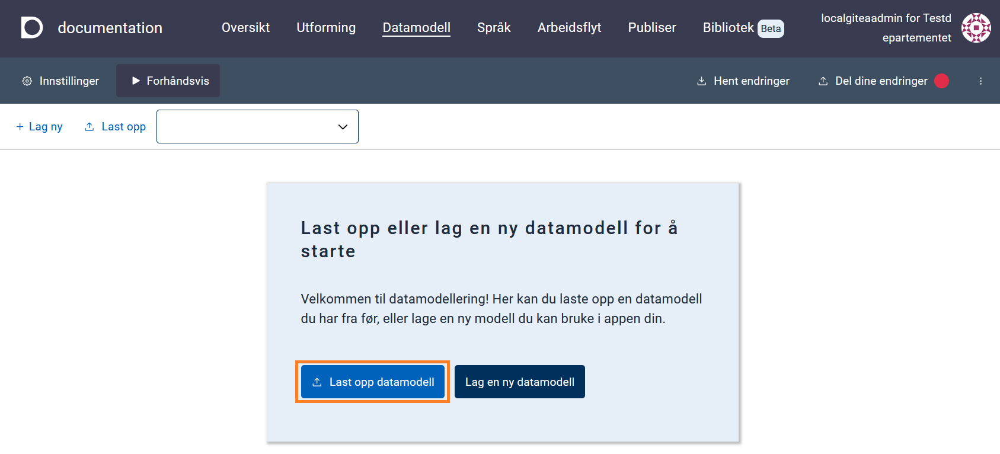
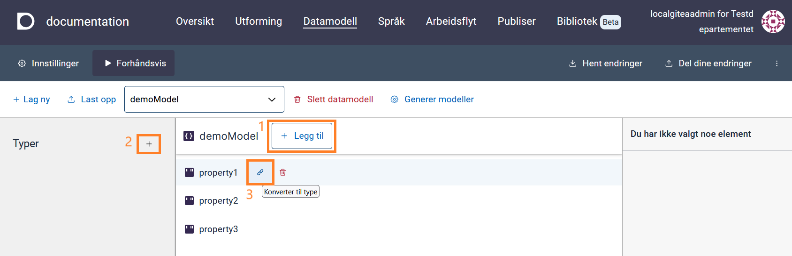
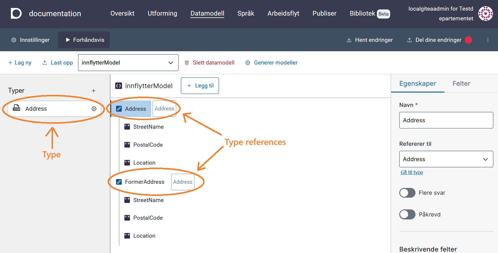

## Datamodeller

### Datamodeller for applikasjoner

Datamodeller for applikasjoner ligger i samme mappestruktur som resten av applikasjonsfilene. Disse ligger lagret i
[Altinn Studio repository](https://altinn.studio/repos) under `App/models` i filstrukturen til appen.
En applikasjon har 4 modellfiler:

- **C# datamodell** (`<model>.cs`) : Datamodell som benyttes av applikasjonens backend/API'er for å behandle og validere data.
- **JSON schema** (`<model>.schema.json`) : Datamodell i JSONschema-format som brukes av applikasjonen på klientsiden (frontend) for å validere data fortløpende.
  Det er også denne filen man jobber med i datamodelleringsverktøyet.
- **XSD datamodell** (`<model>.XSD`) : Datamodell i _XML_-format som definerer hvilke elementer som kan brukes i et dokument.
  Denne brukes ikke direkte av applikasjonen, men kan lastes opp for å generere de andre modellfilene i Altinn Studioe eller lastes ned ved behov til f.eks. mottakssystemer.
- **JSON metadata** (`<model>.metadata.json`) : Brukes av Altinn Studio for å genererere `<model>.cs`-filen.
  Denne filen blir ikke lagret i applikasjonen og vil kun bli generert ved behov.

### Datamodeller for organisasjoner

Datamodeller for organisasjoner ligger i Altinn Studio sin [repos][1]-løsning.
For å få tilgang til disse må man logge inn med Altinn Studio bruker. Om det er første gang du bruker Altinn Studio
må du [lage en bruker][2].

Datamodellene ligger i `<org>-datamodels`-repo, hvor `<org>` er den organisasjonen du tilhører.
F.eks. ligger datamodellene til organisasjonen `Testdepartementet (ttd)` under
https://altinn.studio/repos/ttd/ttd-datamodels.

Lenke til dette repoet finner man i [Altinn Studio Dashboard](/nb/altinn-studio/getting-started/navigation/dashboard) (https://altinn.studio/dashboard). Velg _Rediger_ (blått blyant-ikon) for å komme til
Altinn Studio [Datamodellering](#altinn-studio-datamodellering) verktøet. Velg _Gitea_ (grønt kopp-ikon) for å se filene direkte i repo.

#### Tilgang til datamodellene

Alle kan se på datamodellene til en organisasjon som standard. For å få tilgang til å redigere datamodellene må brukeren
være del av _Datamodels_-teamet i organisasjonen. Se [tilgangsstyring][3] for mer informasjon.

#### Laste opp XSD til repo

XSD kan lastes opp direkte i verktøyet [Altinn Studio Datamodellering](#altinn-studio-datamodellering) og er beskrevet under [Laste Opp og Vise Datamodell](#laste-opp-og-vise-datamodell).

Om man kun har behov for å laste opp XSD for lagring, og ikke skal bruke verktøyet for å redigere modellen, kan man også
laste opp XSD-filer direkte til `<org>-datamodels` repo. Naviger da til ønsket mappe og velg
"Add file" -> "Upload file". I tekstfeltet som dukker opp øverst kan man skrive inn mappenavn man ønsker å benytte (valgfritt).
Last opp ønsket fil, scroll ned, skriv evt. en melding om hva slags fil det er, og trykk på "commit changes"
for å bekrefte.

[1]: https://altinn.studio/repos
[2]: /nb/altinn-studio/getting-started/create-user/
[3]: /nb/altinn-studio/guides/administration/access-management/studio/

## Altinn Studio Datamodellering

{}
Verktøyet Datamodellering i Altinn Studio er under utvikling og vil ha noe begrenset funksjonalitet før det er ferdigstilt.
{}

Altinn Studio Datamodellering er et verktøy for å utvikle [datamodeller](#datamodeller). Den baserer seg på en datamodell i JSONSchema
format og kan ut fra dette generere XSD- og C#-modeller (se [Datamodeller for Applikasjoner](#datamodeller-for-applikasjoner)).

{}

- [Registrerte feil og mangler for Altinn Studio Datamodellering](https://github.com/orgs/Altinn/projects/1/views/10)
- [Planlagt ny funksjonalitet for Altinn Studio Datamodellering](https://github.com/orgs/Altinn/projects/1/views/6)
- [Utvikling av datamodell for Altinn 2](/nb/altinn-studio/guides/altinn-2/altinn-2-datamodel/)
- [Overgang fra Seres til Altinn Studio Datamodellering](/nb/altinn-studio/guides/altinn-2/seres-migration/)
  {}

### Navigere til Altinn Studio Datamodellering

1. Logg inn i Altinn Studio. Hvis du ikke befinner deg i [Altinn Studio Dashboard](/nb/altinn-studio/getting-started/navigation/dashboard/), naviger dit ved å klikke på logoen øverst i venstre hjørne eller [her](https://altinn.studio/dashboard).
2. Velg _rediger_ (blått blyant-ikon) ved enten:  
   a. En app under "Mine applikasjoner", eller  
   b. Datamodellerings repo for din organisasjon.
3. Velg fanen **Datamodell** i topp-menyen.

## Laste opp og vise datamodell

Datamodellen definerer hvilke data som kan sendes inn via en app, og hvilket format det skal sendes på.
Vi støtter pr. nå kun opplasting av XSD datamodell.
Ved opplasting av XSD-modell `<model>.xsd` vil verktøyet generere følgende filer: `<model>.cs` og `<model>.schema.json` (se [datamodell-filer](#datamodeller-for-applikasjoner)).

1. Klikk på _Last opp datamodell_ fra Datamodell-siden om det ikke er noen eksisterende datamodeller eller _Last opp_ fra
   verktøylinjen øverst i verktøyet.
2. Velg en XSD datamodell-fil i filvelgeren og klikk _Last opp_.

Etter at datamodellen er prosessert kan du finne de genererte filene under `App/models/` i app-repositoryet.

Typer som er definert i datamodellen vises i panelet på venstre side.
Tre-visning av datamodellen kan åpnes for å se en visuell representasjon av datamodellen og feltene som er tilgjengelige.

## Velge modell fra nedtrekkslisten

Nedtrekkslisten har to kategorier:

- _XSD_ - Disse filene vises når det finnes XSD-modeller uten en tilhørende JSON Schema-modellfil. Når du velger en modell fra XSD-listen, blir den automatisk importert inn i verktøyet, og en JSON Schema-fil vil bli generert.
  Deretter kan denne jobbes videre med i verktøyet.
- _JSON Schema_ - modeller genert etter prosessering av opplastede XSD-filer.

{}
Kun datamodeller som er plassert i `App/models` i repositoriet vil bli vist i nedtrekkslisten.
{}

## Lage ny datamodell

For å opprette en ny datamodell fra bunnen av:

1. Klikk på _Lag ny_ til venstre på verktøylinjen.
2. Skriv inn navnet på datamodellen i feltet.
3. Klikk på _Opprett modell_.

Datamodellen opprettes med noen eksempel-felter som man kan jobbe videre med eller slette:

- `property1` (tekst, påkrevd)
- `property2` (tekst, påkrevd)
- `property3` (tekst)

## Redigere datamodell

Velg modellen du ønsker å redigere fra nedtrekkslisten på verktøylinjen.

{}
JSON Schema-modellen lagres automatisk mens man jobber med den. For å generere andre modell-filer i XSD- og C#-format må man
trykke på knappen _Generer modeller_ på verktøylinjen (se [Generere Modellfiler](#generere-og-laste-ned-modellfiler-xsd-og-c)).
{}

### Legge til nytt felt

For å legge til felt på øverste nivå (rot-node), klikk "Legg til" (**1** i bildet under).

Du kan legge til underfelt på felter av type Objekt ved å trykke på **+**-knappen til høyre for feltnavnet, eller ved å klike på feltet og velge fanen _Felter_ i panelet til høyre.

### Legge til en ny type

Klikk på **+**-tegnet i "Typer"-panelet på venstre side (**2** i bildet under).

### Konvertere felt til type

Et felt kan konverteres til en type ved å trykke på referanse-ikonet til høyre for feltet (**3** i bildet under).

### Redigere en type

1. Klikk på typen du ønsker å redigere. En tre-visning for typen vises i midten.
2. Egenskaper for typen kan redigeres i panelet til høyre.
3. Klikk "Legg til" øverst for å legge til felter på typen.
4. Ved å velge felter fra typen kan man redigere egenskaper for disse i høyre-panelet.
5. Lukk redigering av typer ved å trykke på **Tilbake til datamodell** øverst i modell-panelet.

### Slette en type

1. Velg ønsket type fra panelet på venstre side.
2. Klikk på Slett-knappen ved det øverste feltet (rot-noden) på typen.

Merk at det ikke er mulig å slette typer som er i bruk.

### Typereferanser

En typereferanse er et felt som følger strukturen til en egendefinert type.
For eksempel, hvis du har typen `Adresse` med feltene `Gateadresse`, `Postnummer` og `Sted`, vil en referanse til denne typen automatisk legge til disse feltene.
Typen vises ved siden av feltnavnet i trevisningen.

### Legge til en typereferanse

Dra og slipp en type fra panelet på venstresiden inn i trevisningen (midtseksjonen). Dette vil opprette et nytt felt med den valgte typen.

Du kan også legge en typereferanse til et underordnet felt ved å dra typen inn i det overordnede feltet.

{}
**MERK**  
For å legge til elementer under et felt (node) må feltet være av typen _Objekt_.
{}

### Slette et felt

Klikk på Slett-knappen til høyre for feltnavnet.

### Redigere egenskaper til et felt

1. Klikk på noden/feltet du ønsker å redigere for å få opp egenskaper i høyre-panelet
2. Rediger egenskapene for noden/feltet som ønsket. Tilgjengelige egenskaper for feltet vil variere basert på base-typen
   for feltet.

### Redigere/legge til XSD-attributter, namespaces, osv, inkl `dataFormatId og `dataFormatVersion`.

Dette er foreløpig ikke noe som støttes direkte i verktøyet og må gjøres manuelt. Beskrivelser
for hvordan dette gjores finnes i lenkene under:

- [dataFormatId og dataFormatVersion][1]
- [XSD attributter generelt][2]
- [XSD namespaces][3]

## Generere og laste ned modellfiler (XSD og C#)

Når modellen er klar kan man generere modell-filer ved å klikke på knappen **Generer modeller** over det høyre panelet.
Både XSD- og C#-modellfiler vil bli generert.
Husk å trykke på **Del dine endringer** til høyre i hovedmenyen til Altinn Studio for å lagre endringene dine.

En generert XSD fil kan lastes ned ved å gå til repoet: klikk på person-ikonet øverst til høyre på siden og velg
"Åpne repository". Naviger til ønsket fil i `App/models/` og klikk på nedlastingsikonet.

[1]: /nb/altinn-studio/guides/altinn-2/altinn-2-datamodel/#dataformatid-og-dataformatversion
[2]: /nb/altinn-studio/guides/altinn-2/altinn-2-datamodel/altinn-2-datamodel/#xsd-attributter
[3]: /nb/altinn-studio/guides/altinn-2/altinn-2-datamodel/#xsd-namespaces
