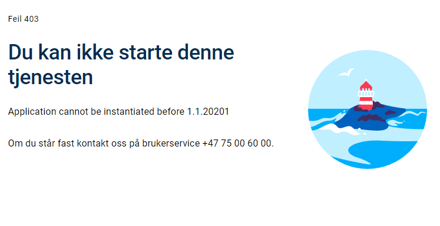

## Introduction

Application logic connected to instantiation can be defined by implementing an interface and registrering them in `Program.cs`

 - `IInstantiationValidator` - create your own tests for determining whether a user/submitter is allowed to instantiate.
 - `IInstantiationProcessor` - create customized prefill data, this is described in the [prefill chapter](/altinn-studio/guides/prefill/custom/).

## Custom validation rules for instantiation
Validation rules for instantiation can include validating a time to specific user instructions and complex tests that
require external API calls.


### Example 1 - Instantiation only allowed before 3 pm on any given day

```C# {hl_lines=[12]}
namespace Altinn.App.Logic;

using Altinn.App.Core.Features;
using Altinn.App.Core.Models.Validation;
using Altinn.Platform.Storage.Interface.Models;

public class InstantiationValidatorExample1 : IInstantiationValidator
{
    public Task<InstantiationValidationResult?> Validate(Instance instance)
    {
        DateTime now = DateTime.Now;
        if (now.Hour < 15)
        {
            return new InstantiationValidationResult()
            {
                Valid = false,
                Message = "ERROR: Instantiation not possible before 3PM."
            };
        }

        return null;
    }
}
```
In `Program.cs` the service must be registrered by
```C#
services.AddTransient<IInstantiationValidator, InstantiationValidatorExample1>()
```

### Example 2 - Instantiation only allowed for application owner
To limit instantiation to a given entity, in this case the application owner, you need to inject extra services for usage in the validation implementation. 

To validate the instantiation, you can check one of two claims in the context.
Either the organization's three-letter abbreviation or the organization number.
The example below uses the organization abbreviation.

To validate based on organization number you can follow the example below,
and replace *AltinnCoreClaimTypes&#46;Org* with *AltinnCoreClaimTypes.OrgNumber*.

```C#
namespace Altinn.App.Logic;

using System.Security.Claims;
using Altinn.App.Core.Features;
using Altinn.App.Core.Models.Validation;
using Altinn.Platform.Storage.Interface.Models;
using AltinnCore.Authentication.Constants;
using Microsoft.AspNetCore.Http;

public class InstantiationValidatorExample2 : IInstantiationValidator
{
    private readonly ClaimsPrincipal _user;

    public InstantiationValidatorExample2(IHttpContextAccessor contextAccessor)
    {
        _user = contextAccessor.HttpContext!.User;
    }

    public async Task<InstantiationValidationResult?> Validate(Instance instance)
    {
        var result = new InstantiationValidationResult();
        string org = string.Empty;

        if (_user.HasClaim(c => c.Type == AltinnCoreClaimTypes.Org))
        {
            Claim? orgClaim =
            _user.FindFirst(c => c.Type == AltinnCoreClaimTypes.Org);

            if (orgClaim != null)
            {
                org = orgClaim.Value;
            }
        }

        if (!string.IsNullOrWhiteSpace(org) && org.Equals("ttd"))
        {
            result.Valid = true;
        }
        else
        {
            result.Valid = false;
            result.Message =
            "Only ttd is allowed to instantiate this application.";
        }

        return result;
    }
}
```

I `Program.cs` må tjenesten registreres med
```C#
services.AddTransient<IInstantiationValidator, InstantiationValidatorExample2>()
```


### Example 3 - Instantiation only allowed between certain dates

To limit instantiation to a certain time frame, in this example January 2021, you can take some inspration from the following example.

```cs
namespace Altinn.App.Logic;

using Altinn.App.Core.Features;
using Altinn.App.Core.Models.Validation;
using Altinn.Platform.Storage.Interface.Models;

public class InstantiationValidatorExample3 : IInstantiationValidator
{
    public async Task<InstantiationValidationResult?> Validate(Instance instance)
    {
        DateTime now = TimeZoneInfo.ConvertTime(DateTime.UtcNow, TimeZoneInfo.FindSystemTimeZoneById("Central European Standard Time"));
        if (now < new DateTime(2021, 01, 01))
        {
            return new InstantiationValidationResult
            {
                Valid = false,
                Message = "Application cannot be instantiated before 1.1.2021"
            };
        }
        else if (now > new DateTime(2021, 01, 31))
        {
            return new InstantiationValidationResult
            {
                Valid = false,
                Message = "Application cannot be instantiated after 25.1.2021"
            };
        }

        return null;
    }
}
```

Logic connected to date handling has been added to ensure the Norwegian time zone
is being used in the validation. 

```cs
DateTime now = TimeZoneInfo.ConvertTime(DateTime.UtcNow, TimeZoneInfo.FindSystemTimeZoneById("Central European Standard Time"));
```

Furthermore, a simple test is run to see if the current time is within the given time frame

```cs
(now < new DateTime(2021, 01, 01)
```

If the requirements are not met, the return object is populated with an _InstantiationValidationResult_ object that contains two fields:
_Valid_: a boolean that says if the instantiation is valid or not.
_Message_: a string that can contain an error message if it is not valid.


```cs
 result = new InstantiationValidationResult
        {
            Valid = false,
            Message = "Application cannot be instantiated before 1.1.2021"
        };
```

In addition you have the opportunity to use property
_ValidParties_: a list of the parties that are allowed to instantiate the application.

The result of a failed validation is shown below:




