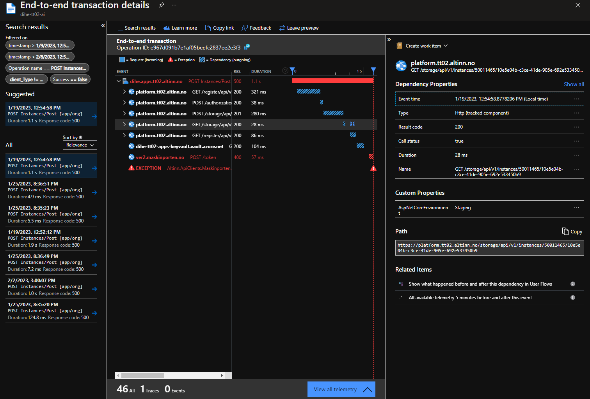
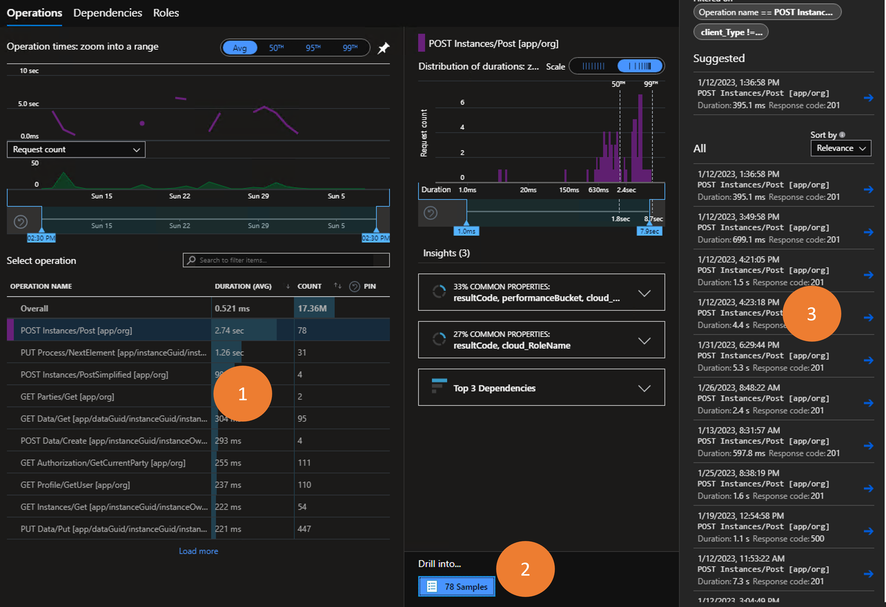

{}
Har du noen gode tips eller spørsmål som du trenger svar på?

Vennligst bidra til denne siden ved å bruke __Edit page on GitHub__-funksjonen nederst på denne siden!
{}

[//]: <> (Section: Hvordan kan jeg sette opp varsler basert på hva som logges til AI?)

{}
Dessverre er det ingen resursgruppe der varsler kan persisteres for applikasjonseiere.
Vi vet at dette er funksjonalitet som mange tjenesteeiere ønsker
og Altinnteamet jobber med å tilgjengeliggjøre dette.
{}

[//]: <> (Section: Hva monitorerer Altinn på våre vegne?)
{}

Altinn har også innsyn i telemetrien som logges av applikasjonene og tilgjengliggjøres for tjenesteeierene i AI.
I tillegg monitorerer vi infrastrukturen til hver tjenesteeier som Kubernetes cluster, storagekontoer og key vault. 

Hovedregelen er at Altinn-teamet agerer på alarmer knytte til infrastrukturen som kreves for å kjøre en app
for eksempel for lite CPU tilgjengelig i app clusteret eller at en pod står i en feilstate i clustert 

__Altinn overvåker ikke aktivt ytelsen eller feilraten til den individuelle applikasjonen.__
{}

[//]: <> (Section: Hva er de tre nyttigste funksjonene i AI?.)
{}


- **Failures**: få en oversikt over alle feilede requests i et tidsrom og drill ned i stack tracen
   for å undersøke hvilken request i kjeden som produserer uønsket respons.
- **Performance**: få oversikt over alle requests i et tidsrom.
  Identifiser de tregeste requestene og undersøk stack tracen for å avgjøre hvilken del
  av kjeden som påvirker ytelsen negativt.
- **Logs**: kjør spørringer på logger og trace-data for å finne exceptions
  eller identifisere egendefinerte datapunkter relatert til en spesifikk request.
{}


[//]: <> (Section: Hvordan kan jeg se hvem som utførte requesten?)
{}
Applikasjonsmalen logger identitetstelemetri når denne informasjonen er tilgjengelig for appen.
Datapunkter inkluderer autentiseringsnivå (authLevel), partyId, userId og organisasjonsnummer (orgNumber).


For å presentere den egendefinerte telemetridataen når du gjør spørringer mot loggene
brukes propertyen `customDimensions`.
Her er et eksempel på hvordan du kan liste opp url og userId på den som sendte requesten.

```
requests
| project url, customDimensions["userId"]
```
{}

[//]: <> (Section: Vi har mange apper i organisasjonen min, men jeg er bare interessert i én av dem)
{}
Alle logger og dashbord i AI kan inkludere filtre. Bruk et _rollefilter_ for å filtrere ut data relatert til applikasjonen din.
Rollen (_role_ eller _cloud role name_) for applikasjonen din er applikasjonsnavnet ditt (dvs. reponavnet i Altinn Studio).


Når du arbeider med brukergrensesnittet, se etter filter-ikonet (1) og legg til eller juster rollefilteret (2).

Hvis du arbeider med logger, brukes følgende _where_-klausul for å filtrere ut dataene for appen din.

```
where cloud_RoleName == <sett inn appnavn>
```

For å hente alle forespørsler for applikasjonen _bli-tjenesteeier_ vil spørringen se slik ut

```
requests
| where cloud_RoleName == "bli-tjenesteeier"
```
{}


[//]: <> (Section: En sluttbruker rapporterer at de opplever en feil)
{}
Når sluttbrukere rapporterer feil kan dette være en feil som påvirker alle brukere og det kommer ofte
tydelig fram hvilken request som feiler i _failure_-fanen,
men hvis feilen påvirker en enkelt eller svært få brukere, kan instanceId være et nyttig hjelpemiddel.

Sluttbrukere bør alltid inkludere instanceGuid eller arkivreferanse (de siste 12 tegnene i en instanceId).
Denne GUIDen kan inkluderes i et filter på _Performance_-siden for å få en oversikt over alle
innkommende requests relatert til instansen. Kanskje kan dette  gi et klart bilde av hva som har skjedd.

Alternativt kan du kjøre en spørring i loggverktøyet for requests knyttet til instansen.

```
requests
| where url contains "165dc739-0f55-4a4c-9b0b-781340a68cd8"
| order by timestamp desc
```

{}

[//]: <> (Section: Appen min viser ukjent feil...)
{}
... men jeg vet ikke hva som forårsaker det.

_Ukjent feil_ i applikasjonen er forårsaket av at applikasjonen returnerer en uventet responskode på requests fra
klienten (app-frontend). For å undersøke slike feilsituasjoner er det ofte lurt å starte in _Failures_-fanen


1. Basert på scenariet når ting feiler, kan du kanskje identifisere riktig
   request i _operation overview_. Markér denne requesten.
2. I sammendragsseksjonen vil du se topp tre responskoder og exceptions relatert til den feilende requesten.
3. Hvis det er nødvendig med ytterligere undersøkelser, kan du se nærmere på _request samples_.
4. Tilfeller av requesten er listet opp og du kan sortere basert på relevans eller dato.
   Trykk på ett av innslagene for å sendes videre til ende-til-ende-transaksjonsloggen.



Når du ser gjennom transaksjonene, vil alle forespørsler med en ikke-vellykket responskode være merket med rødt.
For å se tilleggsdetaljer for en spesifikk forespørsel, merk den og se gjennom bladet på høyre side av skjermen.
{}

[//]: <> (Section: Hvordan kan jeg identifisere hva som gjør at en forespørsel går tregt? )
{}
Bruk _Performance_-siden for å undersøke trege forespørsler


1. Identifiser requesten du er interessert i
2. Trykk på knappen _Drill into x samples_
3. Velg en av requestene i listen for å se transaksjonsdetaljene fra ende til ende.


Fra dette punktet kan man undersøke hver avhengighet og tiden det tar å få et svar.
{}
