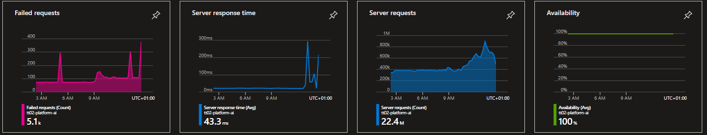
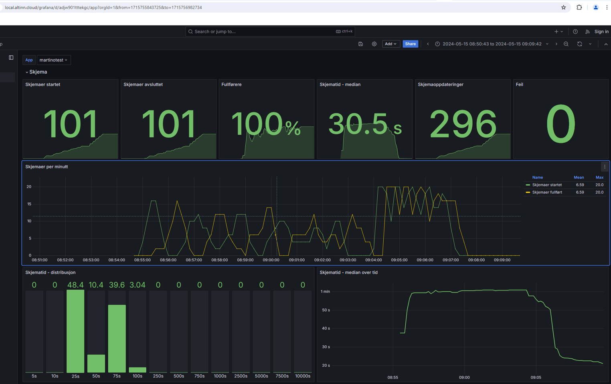
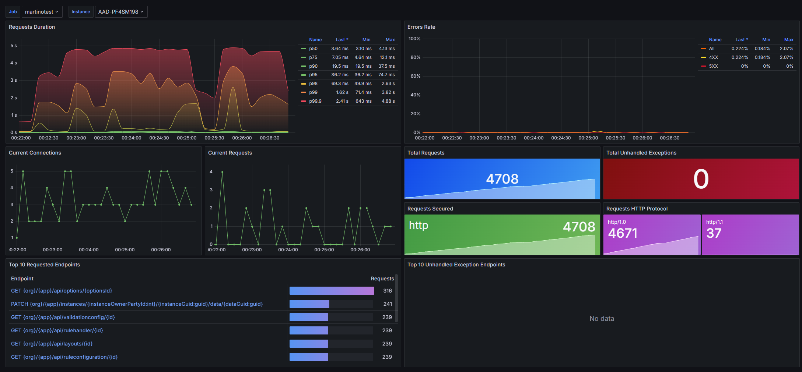
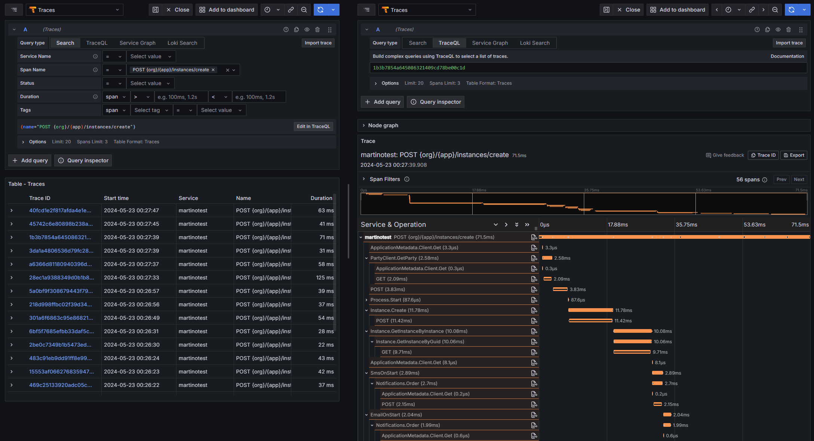
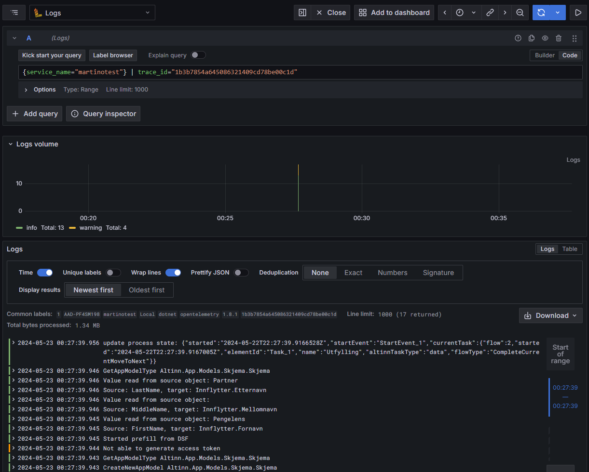

{}
This page refers to configuration when [OpenTelemetry (OTel)](https://opentelemetry.io/) is enabled in the app from v8 and newer.
The existing Application Insights SDK setup is obsolete and will be removed in the next major version of the Altinn.App libraries. 
{}

## Azure Monitor

Azure Application Insights (AI) is an extension of 
[Azure Monitor](https://learn.microsoft.com/en-us/azure/azure-monitor/overview) and is currently the monitoring solution
we provide for Altinn apps. 

{}
In the future, the Altinn monitoring solution for deployed apps will be based on Grafana.
{}

AI can provide you as an app developer with valuable insights into the health, performance and usage of your app.
With real-time monitoring and performance analytics, developers can identify and resolve issues before they impact the 
user experience. 

### Prerequisites

- **Test Developer or Production Developer role in Azure.**
    Test Developer role grants access to AI for apps in TT02 and Production Developer role grants access to apps in production.

    [Instructions on how to request access is available here](/altinn-studio/guides/access-management/apps/)

- **General overview of AI features**
    AI has a number of features available.

    [Check Microsoft's official documentation](https://learn.microsoft.com/en-us/azure/azure-monitor/app/app-insights-overview?tabs=net)
    for a quick overview.

- **Basic knowledge of Kusto Query Language (KQL)**
    Queries in AI are written using KQL. The possibilities within data visualization and exploration are many with KQL,
    learning the basics will get you a long way in identify data points of interest.

    [Find an overview of KQL and sample queries on the Microsoft website.](https://learn.microsoft.com/en-us/azure/data-explorer/kusto/query/)

## Grafana

Grafana is as visualisation tool where one can explore telemetry and design dashboards to suite teams monitoring needs.
Each app cluster has a Grafana instance which service owners can use.
These are still early days for the Grafana installation - in the future, service owners will get the following out of the box:

* Telemetry exploration
* ASP.NET Core dashboards
* .NET runtime dashboard
* Altinn app dashboards (single-app, aggregated)
* Alerting

A preview of the Altinn app dashboard and ASP.NET Core dashboards are available in localtest

