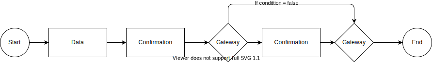
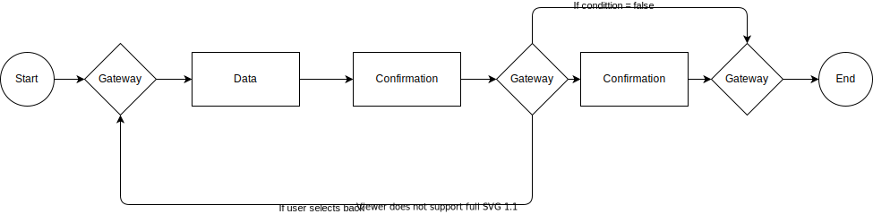

The template follows the [BPMN 2.0 standard.](https://www.bpmn.org/)

## Supported process elements

* [__Process tasks__](tasks) _tasks that require users or systems to perform actions before the process continues_

* [__Flow control__](flowcontrol) _controls navigation through a process with gateways_

## Process Examples

## Process configuration

In Altinn Studio, the App developer can configure the process.

[Read our development handbook for details.](../../../../altinn-studio/reference/configuration/process/)