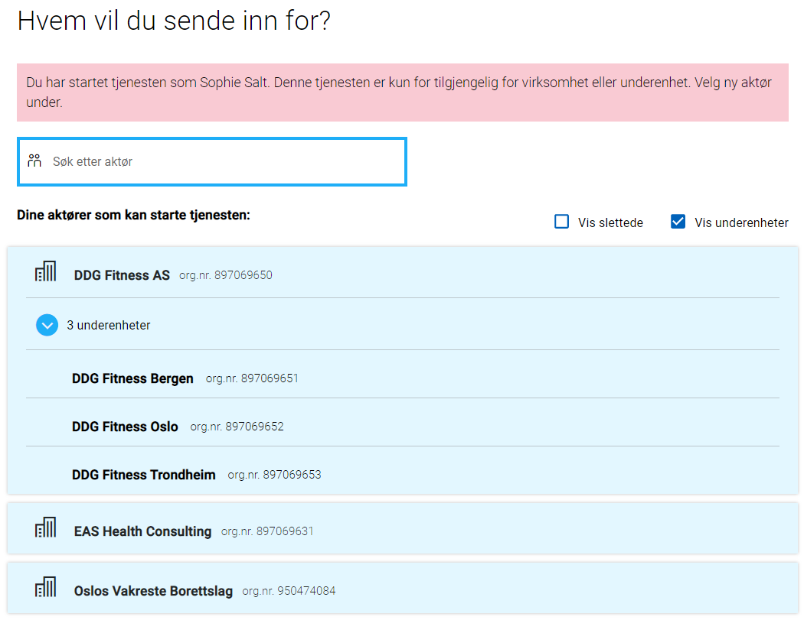

## Standard users

These are the standard users in the user selections in localtest.


### Sophie Salt

Sophie is a highly resourceful woman living in Oslo. She has established a fitness center chain called DDG Fitness, which currently has three branches in Oslo, Bergen, and Trondheim.
Sophie holds the role of CEO (DAGL) and its sub-roles for DDG Fitness AS and its subsidiaries.

Additionally, she is a health expert and has started her own consulting firm for health services. Sophie holds the role of LEDE (Leader) along with associated roles for EAS Health Consulting.

She is also a board member of the housing cooperative where she resides, named "Oslos Vakreste Borettslag" ("Oslo's Most Beautiful Housing Cooperative"). Sophie holds the role of MEDL (Member) along with associated roles for "Oslos Vakreste Borettslag".

#### Submitters (avgivere)

| Submitter                                                                                                                     | Roles                                                                                                                                               |
| ----------------------------------------------------------------------------------------------------------------------------- | --------------------------------------------------------------------------------------------------------------------------------------------------- |
| [01039012345 Sophie Salt](https://github.com/Altinn/app-localtest/blob/main/testdata/Register/Person/01039012345.json)        | [Private](https://github.com/Altinn/app-localtest/blob/main/testdata/authorization/roles/User_1337/party_501337/roles.json)                         |
| [897069650 DDG Fitness AS](https://github.com/Altinn/app-localtest/blob/main/testdata/Register/Org/897069650.json)            | [CEO + associated roles](https://github.com/Altinn/app-localtest/blob/main/testdata/authorization/roles/User_1337/party_500000/roles.json)          |
| [897069651 DDG Fitness Bergen](https://github.com/Altinn/app-localtest/blob/main/testdata/Register/Org/897069651.json)        | [CEO + associated roles](https://github.com/Altinn/app-localtest/blob/main/testdata/authorization/roles/User_1337/party_500001/roles.json)          |
| [897069652 DDG Fitness Oslo](https://github.com/Altinn/app-localtest/blob/main/testdata/Register/Org/897069652.json)          | [CEO + associated roles](https://github.com/Altinn/app-localtest/blob/main/testdata/authorization/roles/User_1337/party_500002/roles.json)          |
| [897069653 DDG Fitness Trondheim](https://github.com/Altinn/app-localtest/blob/main/testdata/Register/Org/897069653.json)     | [CEO + associated roles](https://github.com/Altinn/app-localtest/blob/main/testdata/authorization/roles/User_1337/party_500003/roles.json)          |
| [897069631 EAS Health Consulting](https://github.com/Altinn/app-localtest/blob/main/testdata/Register/Org/897069631.json)     | [Chairperson + associated roles](https://github.com/Altinn/app-localtest/blob/main/testdata/authorization/roles/User_1337/party_500600/roles.json)  |
| [950474084 Oslos Vakreste Borettslag](https://github.com/Altinn/app-localtest/blob/main/testdata/Register/Org/950474084.json) | [Board Member + associated roles](https://github.com/Altinn/app-localtest/blob/main/testdata/authorization/roles/User_1337/party_500700/roles.json) |



### Pengelens Partner

Pengelens Partner is the accountant for the company DDG Fitness AS.

#### Submitters (avgivere)

| Submitter                                                                                                                    | Roles                                                                                                                          |
| ---------------------------------------------------------------------------------------------------------------------------- | ------------------------------------------------------------------------------------------------------------------------------ |
| [01899699552 Pengelens Partner](https://github.com/Altinn/app-localtest/blob/main/testdata/Register/Person/01899699552.json) | [Private](https://github.com/Altinn/app-localtest/blob/main/testdata/authorization/roles/User_1001/party_510001/roles.json)    |
| [897069650 DDG Fitness AS](https://github.com/Altinn/app-localtest/blob/main/testdata/Register/Org/897069650.json)           | [Accountant](https://github.com/Altinn/app-localtest/blob/main/testdata/authorization/roles/User_1001/party_500000/roles.json) |

### Gjentagende Forelder

Gjentagende Forelder is the auditor for selskapet DDG Fitness AS.

#### Submitters (avgivere)

| Submitter                                                                                                                       | Roles                                                                                                                       |
| ------------------------------------------------------------------------------------------------------------------------------- | --------------------------------------------------------------------------------------------------------------------------- |
| [17858296439 Gjentagende Forelder](https://github.com/Altinn/app-localtest/blob/main/testdata/Register/Person/17858296439.json) | [Private](https://github.com/Altinn/app-localtest/blob/main/testdata/authorization/roles/User_1002/party_510002/roles.json) |
| [897069650 DDG Fitness AS](https://github.com/Altinn/app-localtest/blob/main/testdata/Register/Org/897069650.json)              | [Auditor](https://github.com/Altinn/app-localtest/blob/main/testdata/authorization/roles/User_1002/party_500000/roles.json) |

### Ola Nordmann

Ola Nordmann is a private individual who can only represent himself.
He resides in Stokmarknes.

#### Submitters (avgivere)

- [01017512345 Ola Nordmann](https://github.com/Altinn/app-localtest/blob/main/testdata/Register/Person/01017512345.json)

### Other users

To test forms related to children and upbringing (kindergarten and school), some specific users have been added.
Submitter | Children | Income
| -------------------------------- | ---- | ------- |
01899699552 Pengelens Partner | 0 | Low
17858296439 Gjentagende Forelder | 3 | Medium
29917097109 Rik forelder | 2 | High

Note: These originate from Tenor's test dataset but are listed there under different names.

### Systems and System Users

With the newer version of localtest, you can test apps locally using system users.
A built-in system and system user associated with 950474084 Oslos Vakreste Borettslag has been provided.
You can obtain the token using `/Home/GetTestSystemUserToken` in localtest or visit the webpage `/Home/Tokens`.

### Instance Delegation

Instance delegation is supported in the latest version of localtest,
but the users/submitters you delegate instances from and to must have an associated `partyUuid`. See the example file below.

## App-specific users

If the default set of users doesn't fit your needs when testing your app locally, you can configure your app to respond
with a JSON document at the URL `/[org]/[appId]/testData.json`.
The simplest way is to place the file at `App/wwwroot/testData.json`

Typical customizations you might be interested in include using alternative organization numbers or personal identification
numbers, ensuring lookups in APIs your app depends on function correctly, or testing authorization rules with roles
different from those assigned to the default users.

### Json Structure

The [JsonSchema](https://altinncdn.no/schemas/json/test-users/test-users.schema.v1.json) helps you write a `testData.json`
file in an IDE such as VSCode. A full version of users from the `TestData`-folder is available in
[testData.json](testData.json)

```json
{
  "$schema": "https://altinncdn.no/schemas/json/test-users/test-users.schema.v1.json",
  "persons": [
    {
      "partyId": 512345,
      "partyUuid": "48153af4-265f-4b35-8ed9-232fafbc716e",
      "ssn": "01017512345",
      "firstName": "Ola",
      "middleName": "",
      "lastName": "Nordmann",
      "customClaims": [
        {
          "type": "some:extra:claim",
          "value": "claimValue",
          "valueType": "http://www.w3.org/2001/XMLSchema#string"
        }
      ],
      "partyRoles": {
        "512345": [
          {
            "type": "altinn",
            "value": "regna"
          },
          {
            "type": "altinn",
            "value": "dagl"
          },
          {
            "type": "altinn",
            "value": "priv"
          }
        ]
      },
      "addressCity": "Stokarknes",
      "addressHouseLetter": null,
      "addressHouseNumber": "7",
      "addressMunicipalName": "Hadsel",
      "addressMunicipalNumber": "1866",
      "addressPostalCode": "8450",
      "addressStreetName": "Bl\u00E5b\u00E6rveien",
      "mailingAddress": "Bl\u00E5b\u00E6reveien 7",
      "mailingPostalCity": "Stokmarknes",
      "mailingPostalCode": "8450",
      "mobileNumber": "87654321",
      "telephoneNumber": "12345678",
      "email": "test@test.com",
      "userId": 12345,
      "language": "nb",
      "userName": "OlaNordmann"
    },
    {
      "partyId": 501337,
      "partyUuid": "e9dd7d91-32d8-4933-a108-07562762d572",
      "ssn": "01039012345",
      "firstName": "Sophie",
      "middleName": "",
      "lastName": "Salt",
      "customClaims": [
        {
          "type": "some:extra:claim",
          "value": "claimValue",
          "valueType": "http://www.w3.org/2001/XMLSchema#string"
        }
      ],
      "partyRoles": {
        "500000": [
          {
            "type": "altinn",
            "value": "DAGL"
          },
          {
            "type": "altinn",
            "value": "UTINN"
          }
        ],
        "501337": [
          {
            "type": "altinn",
            "value": "PRIV"
          },
          {
            "type": "altinn",
            "value": "UTINN"
          }
        ],
        "500700": [
          {
            "type": "altinn",
            "value": "DAGL"
          },
          {
            "type": "altinn",
            "value": "UTINN"
          }
        ]
      },
      "addressCity": "Oslo",
      "addressHouseLetter": null,
      "addressHouseNumber": "9",
      "addressMunicipalName": "Oslo",
      "addressMunicipalNumber": "0301",
      "addressPostalCode": "0151",
      "addressStreetName": "Grev Wedels Plass",
      "mailingAddress": "Grev Wedels Plass 9",
      "mailingPostalCity": "Oslo",
      "mailingPostalCode": "0157",
      "mobileNumber": "87654321",
      "telephoneNumber": "12345678",
      "email": "1337@altinnstudiotestusers.com",
      "userId": 1337,
      "language": "nn",
      "userName": "SophieDDG"
    }
  ],
  "orgs": [
    {
      "partyId": 500000,
      "partyUuid": "77cab4d6-84bb-4eb2-91bd-710415a72d8a",
      "orgNumber": "897069650",
      "parentPartyId": null,
      "name": "DDG Fitness",
      "businessAddress": "Sofies Gate 1",
      "businessPostalCity": "By",
      "businessPostalCode": "0170",
      "eMailAddress": "central@ddgfitness.no",
      "faxNumber": "92110000",
      "internetAddress": "http://ddgfitness.no",
      "mailingAddress": "Sofies Gate 1",
      "mailingPostalCity": "Oslo",
      "mailingPostalCode": "0170",
      "mobileNumber": "92010000",
      "telephoneNumber": "12345678",
      "unitStatus": null,
      "unitType": "AS"
    },
    {
      "partyId": 500700,
      "partyUuid": "117e86a4-117f-41b0-8f2d-c383e2a69f9e",
      "orgNumber": "950474084",
      "parentPartyId": null,
      "name": "Oslos Vakreste Borettslag",
      "businessAddress": "Sofies Gate 2",
      "businessPostalCity": "By",
      "businessPostalCode": "0170",
      "eMailAddress": "epost@setra.no",
      "faxNumber": "92110000",
      "internetAddress": "http://setrabrl.no",
      "mailingAddress": "Sofies Gate 2",
      "mailingPostalCity": "Oslo",
      "mailingPostalCode": "0170",
      "mobileNumber": "92010000",
      "telephoneNumber": "12345678",
      "unitStatus": null,
      "unitType": "BRL"
    }
  ],
  "systems": [
    {
      "id": "913312465_sbs",
      "name": "Sluttbrukersystem",
      "systemUsers": [
        {
          "id": "d111dbab-d619-4f15-bf29-58fe570a9ae6",
          "orgNumber": "950474084",
          "actions": [
            "read",
            "write",
            "instantiate",
            "sign",
            "confirm",
            "reject",
            "delete"
          ]
        }
      ]
    }
  ]
}
```
