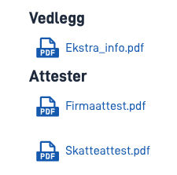
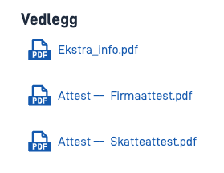

## Usage

The `AttachmentList` component can be used to show all attachments uploaded in the form, as well as link to them so that
the user can download them. You can also limit the component to only show a selection of attachment types/data types.

### Anatomy


## Properties

The following is a list of the properties available for {}.

| **Property**                 | **Type** | **Description**                                                                                                                                                                                                                                                                                       |
| ---------------------------- | -------- | ----------------------------------------------------------------------------------------------------------------------------------------------------------------------------------------------------------------------------------------------------------------------------------------------------- |
| `id`                         | string   | The component ID. Must be unique within all layouts/pages in a layout set. Cannot end with <hyphen><number>.                                                                                                                                                                                          |
| `type`                       | string   | Must be `AttachmentList`.                                                                                                                                                                                                                                                                             |
| `textResourceBindings.title` | string   | Title to be displayed over the list of attachments.                                                                                                                                                                                                                                                   |
| `dataTypeIds`                | string[] | List of data types to be displayed in the list. If no data types are specified, all attachments will be shown.                                                                                                                                                                                        |
| `links`                      | boolean  | Shows links to the attachments in the list. This is enabled by default. If it is disabled (set to `false`), only the names of the attachments will be shown along with icons.                                                                                                                         |
| `groupByDataTypeGrouping`    | boolean  | Groups the attachments by the `grouping` property on the data type that corresponds to each attachment. Attachments for data types without grouping are grouped in a default group. The default value for this property is `false`. There is currently no support for this property in Altinn Studio. |
| `showDataTypeDescriptions`   | boolean  | Shows the description set for the `description` property on the data type that corresponds to each attachment. The default value for this property is `false`. There is currently no support for this property in Altinn Studio.                                                                      |

## Configuration

### Add component




You can add a component in [Altinn Studio Designer](/altinn-studio/getting-started/) by dragging it from the list of components to the page area.
Selecting the component brings up its configuration panel.




Basic component:


App/ui/layouts/{page}.json


```json{hl_lines="6-12"}
{
  "$schema": "https://altinncdn.no/toolkits/altinn-app-frontend/4/schemas/json/layout/layout.schema.v1.json",
  {
    "data": {
      "layout": [
        {
          "id": "myAttachmentList",
          "type": "AttachmentList",
          "textResourceBindings": {
            "title": "All attachments"
          }
        }
      ]
    }
  }
}
```




### Limit attachment types

You can limit the component to show a selection of attachment types/data types. Valid values are:

- All data types defined in `applicationmetadata.json` under `dataTypes`, except for data models (these are never considered attachments)
- The data type `ref-data-as-pdf` (represents automatically generated PDF files for a filled-out form).

Example:

```json{hl_lines="7-10"}
{
  "id": "myAttachmentList",
  "type": "AttachmentList",
  "textResourceBindings": {
    "title": "Some attachments"
  },
  "dataTypeIds": [
    "ref-data-as-pdf",
    "my-custom-data-type"
  ]
}
```

### Grouping by data type grouping

You can group the attachments by the `grouping` property on the data type that corresponds to each attachment.

Example:

```json{hl_lines="7"}
{
  "id": "myAttachmentList",
  "type": "AttachmentList",
  "textResourceBindings": {
    "title": "Attachments"
  },
  "groupByDataTypeGrouping": true
}
```

Result: 

Here, the data type that corresponds to "Firmaattest.pdf" and "Skatteattest.pdf" has the following configuration:

```json{hl_lines=9}
{
  "id": "certificates",
  "taskId": "Task_1",
  "maxSize": 250,
  "maxCount": 100,
  "minCount": 0,
  "enablePdfCreation": true,
  "enableFileScan": false,
  "grouping": "Certificates",
  "validationErrorOnPendingFileScan": false,
  "enabledFileAnalysers": [],
  "enabledFileValidators": []
}
```

### Description by data type description

You can show a description for attachments using the `description` property on the data type that corresponds to each attachment.
Note that all attachments of the same type will get the same description.

Example:

```json{hl_lines="8"}
{
  "id": "myAttachmentList",
  "type": "AttachmentList",
  "textResourceBindings": {
    "title": "Attachments"
  },
  "groupByDataTypeGrouping": false,
  "showDataTypeDescriptions": true
}
```

Result: 

Here, the data type that corresponds to "Firmaattest.pdf" and "Skatteattest.pdf" has the following configuration:

```json{hl_lines=10}
{
  "id": "certificates",
  "taskId": "Task_1",
  "maxSize": 250,
  "maxCount": 100,
  "minCount": 0,
  "enablePdfCreation": true,
  "enableFileScan": false,
  "grouping": "Certificates",
  "description": "Certificate",
  "validationErrorOnPendingFileScan": false,
  "enabledFileAnalysers": [],
  "enabledFileValidators": []
}
```
