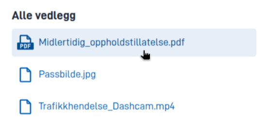
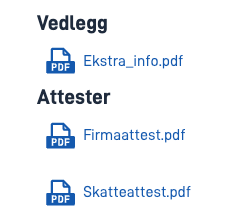
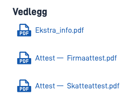

## Bruk

Komponenten `AttachmentList` kan brukes til å vise alle vedlegg som er lastet opp i skjemaet, samt lenke til dem slik at
brukeren kan laste dem ned. Man kan også begrense komponenten til å bare vise et utvalg vedleggstyper/datatyper.

### Anatomi



## Egenskaper

Følgende er en liste over tilgjengelige egenskaper for {}.

| **Egenskap**                 | **Type** | **Beskrivelse**                                                                                                                                                                                                                                                                               |
| ---------------------------- | -------- | --------------------------------------------------------------------------------------------------------------------------------------------------------------------------------------------------------------------------------------------------------------------------------------------- |
| `id`                         | streng   | Komponent-ID-en. Må være unik innenfor alle oppsett/sider i et oppsett-sett. Kan ikke slutte med <bindestrek><tall>.                                                                                                                                                                          |
| `type`                       | streng   | Må være `AttachmentList`.                                                                                                                                                                                                                                                                     |
| `textResourceBindings.title` | streng   | Ledetekst                                                                                                                                                                                                                                                                                     |
| `dataTypeIds`                | streng[] | Liste over datatyper som skal vises i listen. Hvis ingen datatyper er spesifisert, vises alle vedlegg.                                                                                                                                                                                        |
| `links`                      | boolsk   | Viser lenker til vedleggene i listen. Denne er aktivert som standard. Hvis den blir deaktivert (satt til `false`), vil bare navnene på vedleggene vises sammen med ikoner.                                                                                                                    |
| `groupByDataTypeGrouping`    | boolsk   | Grupperer vedleggene etter `grouping`-egenskapen på datatypen som samsvarer med hvert vedlegg. Vedleggene til datatyper uten gruppering blir gruppert i en standardgruppe. Standard valg for denne egenskapen er `false`. Det er foreløpig ingen støtte for denne egenskapen i Altinn Studio. |
| `showDataTypeDescriptions`   | boolsk   | Viser beskrivelsen satt for `description`-egenskapen på datatypen som samsvarer med hvert vedlegg. Standard valg for denne egenskapen er `false`. Det er foreløpig ingen støtte for denne egenskapen i Altinn Studio.                                                                         |

## Konfigurering

### Legg til komponent




Du kan legge til en komponent i [Altinn Studio Designer](/nb/altinn-studio/getting-started/) ved å dra den fra komponent-listen til sideområdet.
Når du velger komponenten, vises innstillingspanelet for den.




Grunnleggende komponent:


App/ui/layouts/{page}.json


```json{hl_lines="6-12"}
{
  "$schema": "https://altinncdn.no/toolkits/altinn-app-frontend/4/schemas/json/layout/layout.schema.v1.json",
  {
    "data": {
      "layout": [
        {
          "id": "myAttachmentList",
          "type": "AttachmentList",
          "textResourceBindings": {
            "title": "Alle vedlegg"
          }
        }
      ]
    }
  }
}
```




### Begrensning av vedleggstyper

Man kan begrense komponenten til vise frem et utvalg vedleggstyper/datatyper. Gyldige verdier er:

- Alle datatyper som definert i `applicationmetadata.json` under `dataTypes`, med unntak av datamodeller (disse regnes aldri som vedlegg)
- Datatypen `ref-data-as-pdf` (representerer automatisk genererte PDF-filer for et utfylt skjema).

Eksempel:

```json{hl_lines="7-10"}
{
  "id": "myAttachmentList",
  "type": "AttachmentList",
  "textResourceBindings": {
    "title": "Noen vedlegg"
  },
  "dataTypeIds": [
    "ref-data-as-pdf",
    "my-custom-data-type"
  ]
}
```

### Gruppering etter data type grouping

Man kan gruppere vedleggene etter `grouping`-egenskapen på datatypen som samsvarer med hvert vedlegg.

Eksempel:

```json{hl_lines="7"}
{
  "id": "myAttachmentList",
  "type": "AttachmentList",
  "textResourceBindings": {
    "title": "Vedlegg"
  },
  "groupByDataTypeGrouping": true
}
```

Resultat: 

Her har datatypen som samsvarer med "Firmaattest.pdf" og "Skatteattest.pdf" følgende konfigurasjon:

```json{hl_lines=9}
{
  "id": "certificates",
  "taskId": "Task_1",
  "maxSize": 250,
  "maxCount": 100,
  "minCount": 0,
  "enablePdfCreation": true,
  "enableFileScan": false,
  "grouping": "Attester",
  "validationErrorOnPendingFileScan": false,
  "enabledFileAnalysers": [],
  "enabledFileValidators": []
}
```

### Beskrivelse etter data type description

Man kan vise en beskrvielse for vedlegg ved hjelp av `description`-egenskapen på datatypen som samsvarer med hvert vedlegg.
Merk at alle vedlegg av samme type vil få den samme beskrivelsen.

Eksempel:

```json{hl_lines="8"}
{
  "id": "myAttachmentList",
  "type": "AttachmentList",
  "textResourceBindings": {
    "title": "Vedlegg"
  },
  "groupByDataTypeGrouping": false,
  "showDataTypeDescriptions": true
}
```

Resultat: 

Her har datatypen som samsvarer med "Firmaattest.pdf" og "Skatteattest.pdf" følgende konfigurasjon:

```json{hl_lines=10}
{
  "id": "certificates",
  "taskId": "Task_1",
  "maxSize": 250,
  "maxCount": 100,
  "minCount": 0,
  "enablePdfCreation": true,
  "enableFileScan": false,
  "grouping": "Attester",
  "description": "Attest",
  "validationErrorOnPendingFileScan": false,
  "enabledFileAnalysers": [],
  "enabledFileValidators": []
}
```
