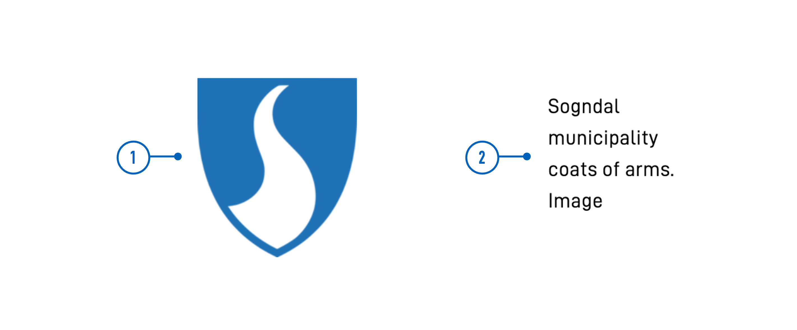

<!-- HVORDAN BRUKE DENNE MALEN
- Les kommentarer under hver seksjon for veiledning.
- Slett kommentarer og deler av innholdet som ikke er relevant.
- Gi norsk navn til title og linktitle i frontmatter
- Når dokumentasjonen er klar til å publiseres, fjern "hidden: true" fra frontmatter
- Hvis dokumentasjonen er fullstendig, fjern advarsel om at den er under oppdatering.

FELLES EGENSKAPER
Dokumentasjon for egenskaper som er felles for flere komponenter oppdateres i egne filer og legges til via shortcode.
Legg til dokumentasjon: Bruk shortcode `property-docs` med hakeparenteser (`< >`) og argument `prop="{propName}"`. `propName` må samsvare med filnavn (som bør samsvare med JSON-skjema-navn).
Oppdatere/opprette dokumentasjon:
- Filer, maler og instruksjoner ligger under components/_common-props-content
- Bilder legges i /assets/images/component-settings og legges til via egen shortcode (`image.html`)

EKSEMPLER
- Se Image, Checkboxes, RadioButtons og Dropdown. for eksempler.

-->

{}
🚧 Denne dokumentasjonen er under oppdatering.
{}

---

## Bruk

<!-- Kort beskrivelse av komponenten og hvordan den brukes. -->

### Anatomi

<!-- 

Nummerert skjermbilde av komponenten
1. Ta et skjermbilde av basis-versjonen av komponenten.
2. Bruk PowerPoint-filen (components/numbered-callouts-anatomy.pptx) for å legge til nummerering på skjermbildet 
3. Grupper skjermbilde og nummerering, lagre som bilde og legg det til i dokumentasjonen.
4. Legg til nummerert liste med beskrivelser, bruk anatomy-list shortcode (se eksempel for format).

Eksempel:



{}
1. **Bilde**: Foto, skjermbilde, illustrasjon, eller grafikk.
2. **Alternativ tekst**: Brukes av skjermlesere og vises dersom bildet ikke er tilgjengelig.
{} 

-->

<!-- 
Legg til seksjoner dersom de er relevante:

### Oppførsel

(Hvordan komponenten oppfører seg i ulike sammenhenger, f.eks. på mobil vs. desktop)

### Stil

(Visuell styling, e.g. plassering, padding, "dos and don'ts")

### Beste praksis

(Bransjestandarder, "dos and don'ts")

### Veiledning for innhold

(E.g. regler for tegnsetting, standard etiketter, etc.)

### Tilgjengelighet

(Komponent-spesifikk beste praksis for tilgjengelighet.)

### Mobil

(Hvordan implementere komponent i mobile miljøer.)

### Relatert

(Liste over relaterte komponenter, inkluder lenker.)

-->

## Egenskaper

Følgende er en liste over tilgjengelige egenskaper for {}. Listen er automatisk generert basert på komponentens JSON schema (se link).

{}
Vi oppdaterer for øyeblikket hvordan vi implementerer komponenter. Listen over egenskaper kan derfor være noe unøyaktig.
{}

<!-- Shortkoden `component-props` genererer automatisk en liste over komponentegenskaper fra komponentens JSON schema.
Komponentnavnet kan gis eksplisitt som argument (f.eks. `component-props "Grid"`).
Hvis ingen argument gis, henter shortkoden komponentnavnet fra 'schemaname' i frontmatter.
Hvis komponenten ikke har JSON schema, kommenter ut tekst og shortcode i denne delen og lag evt. tabell manuelt med de viktigste egenskapene (kolonner: Egenskap, Type, Beskrivelse).
 -->

{}

## Konfigurering

{}
Vi oppdaterer for øyeblikket Altinn Studio med flere muligheter for innstillinger!
 Dokumentasjonen oppdateres fortløpende, men det kan være flere innstillinger tilgjengelig enn det som beskrives her og noen innstillinger kan være i betaversjon.
{}

### Legg til komponent




Du kan legge til en komponent i [Altinn Studio Designer](/nb/altinn-studio/getting-started/) ved å dra den fra komponent-listen til sideområdet.
Når du velger komponenten, vises innstillingspanelet for den.




Grunnleggende komponent:


App/ui/layouts/{page}.json


```json{hl_lines="6-"}
{
  "$schema": "https://altinncdn.no/toolkits/altinn-app-frontend/4/schemas/json/layout/layout.schema.v1.json",
  {
    "data": {
      "layout": [
        {
          // Basic component (required properties)
        }
      ]
    }
  }
}
```




<!-- 
Legg til seksjoner som beskriver konfigurasjonen av egenskaper som er spesifikke for komponenten.
- Bruk nedenstående shortcode for Designer/Kode-faner for å vise innstillingene.
- Inkluder skjermbilder og eksempler der det er hensiktsmessig.
- Hvis innstillingene ikke er tilgjengelige i Altinn Studio, bruk kun fanen for kode og legg til følgende shortcode rett under overskriften til avsnittet:
    {}
    Innstillingene for denne egenskapen er foreløpig ikke tilgjengelig i Altinn Studio og må konfigureres manuelt.
    {}
- Legg til filsti eller annen informasjon inni code-title (vises øverst i kodeblokken).
- Marker gjerne relevante deler av koden vha hl_lines.
- Legg til dokumentasjon for felles egenskaper ved å bruke shortcode `property-docs` med hakeparenteser (`< >`) og argument `prop="{propName}"`. `propName` må samsvare med filnavn (som bør samsvare med JSON-skjema-navn).

Shortcode for faner:









App/ui/layouts/{page}.json


```json{hl_lines=""}
{
  // component properties
}
```




-->

## Eksempler

<!-- Ett eller flere eksempler på konfigurasjon (hvis relevant) -->