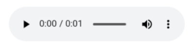

## Bruk

`Audio` brukes til å vise en lydspiller i applikasjonen din. Den kan brukes frittstående eller som en
mediekomponent i [Cards-komponenten](../cards).

### Anatomi



En standard lydspiller inkluderer vanligvis:

1. Spill/pause-knapp
2. Visning av nåværende tid og varighet
3. Fremdriftsindikator
4. Volumkontroll
5. Alternativer-knapp (for nedlasting, kontroll av hastighet, osv.)

Lydkomponenten er en enkel innpakning rundt [Lydelementet i HTML](https://developer.mozilla.org/en-US/docs/Web/HTML/Element/audio),
og det visuelle utseendet vil variere avhengig av nettleser, operativsystem og andre faktorer.
Skjermbildet ovenfor ble tatt fra Chrome-nettleseren.

### Relatert

- [Cards](../cards) - Kan bruke Lydkomponenter som medieinnhold
- [Image](../image) - Bildekomponent
- [Video](../video) - Videospillerkomponent

## Egenskaper

Følgende er en liste over tilgjengelige egenskaper for {}.

{}
Vi oppdaterer for øyeblikket hvordan vi implementerer komponenter. Listen over egenskaper kan derfor være noe unøyaktig.
{}

| **Egenskap**                   | **Type** | **Beskrivelse**                                                                                                         |
|--------------------------------|----------|-------------------------------------------------------------------------------------------------------------------------|
| `textResourceBindings.altText` | string   | Alternativ tekst som vises for skjermlesere                                                                             |
| `audio.src`                    | object   | Et objekt som inneholder lydfilene som skal spilles. Nøkkelen er språkkoden, og verdien er URL-en til lydfilen.         |

## Konfigurering

{}
Vi oppdaterer for øyeblikket Altinn Studio med flere muligheter for innstillinger!
 Dokumentasjonen oppdateres fortløpende, men det kan være flere innstillinger tilgjengelig enn det som beskrives her og noen innstillinger kan være i betaversjon.
{}

### Legg til komponent




Du kan legge til en komponent i [Altinn Studio Designer](/nb/altinn-studio/getting-started/) ved å dra den fra komponent-listen til sideområdet.
Når du velger komponenten, vises innstillingspanelet for den.




Grunnleggende komponent:


App/ui/layouts/{page}.json


```json{hl_lines="6-"}
{
  "$schema": "https://altinncdn.no/toolkits/altinn-app-frontend/4/schemas/json/layout/layout.schema.v1.json",
  "data": {
    "layout": [
      {
        "id": "myAudio",
        "type": "Audio",
        "textResourceBindings": {
          "altText": "Alternativ tekst for lyden (for skjermlesere)"
        },
        "audio": {
          "src": {
            "en": "https://example.com/audio.mp3",
            "nb": "/org/app/assets/audio.wav"
          }
        }
      }
    ]
  }
}
```



