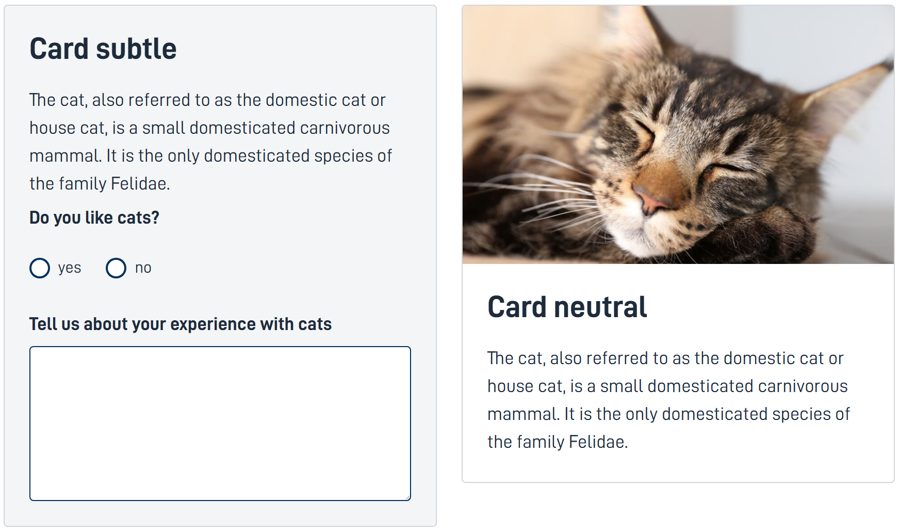

---

{}
🚧 Denne dokumentasjonen er under arbeid.
{}

---

## Bruk

Med Cards kan vi fremheve informasjon eller oppgaver som hører sammen. Kortene finnes i et par varianter og kan inneholde tekst, bilde, tekstfelt, radioknapper med flere.









```json
{
        "id": "subtle",
        "type": "Cards",
        "mediaPosition": "bottom",
        "minMediaHeight": "250px",
        "color": "subtle",
        "cards": [
          {
            "title": "Card subtle",
            "description": "bodyText",
            "children": [
              "RadiobuttondId",
              "TextAreaId"
            ]
          }
        ],
        "grid": {
          "md": 6
        }
      },
      {
        "id": "netural",
        "type": "Cards",
        "mediaPosition": "top",
        "minMediaHeight": "250px",
        "color": "neutral",
        "cards": [
          {
            "media": "imageId",
            "title": "Card neutral",
            "description": "bodyText"
          }
        ],
        "grid": {
          "md": 6
        }
      },
```




## Konfigurasjon

**Required properties:** `id`, `type`, `color`

| **Property**        | **Type** | **Description**                                                                                                                                 |
| ------------------- | -------- | ----------------------------------------------------------------------------------------------------------------------------------------------- |
| `mediaPosition`     | string   | Medieposisjon innenfor kortene.<br/> **Enum:** [bottom, top] <br/> **Default:**[top]                                                            |
| `minMediaHeight`    | string   | Sikrer høyden på media, eks. "250px".                                                                                                           |
| `color`             | string   | Bakgrunnsfarge på kortene.<br/> **Enum:** [neutral, subtle]                                                                                     |
| `cards`             | array    | Array av kort objekter.                                                                                                                         |
| `cards.media`       | string   | Id til media komponenten.                                                                                                                       |
| `cards.title`       | string   | Tittel                                                                                                                                          |
| `cards.description` | string   | Brødtekst                                                                                                                                       |
| `cards.footer`      | string   | Bunntekst                                                                                                                                       |
| `cards.children`    | array    | En array med komponent-ID-er på alle komponenter som hører til det spesifikke kortet.<br>Disse vil plasseres mellom brødteksten og bunnteksten. |

## Eksempel på flere kart i en Cards komponent

Når du bruker flere kort innenfor en enkelt kortkomponent, justeres de automatisk innenfor containern.

```json
{
    "id": "cardComponentId",
    "type": "Cards",
    "mediaPosition": "top",
    "minMediaHeight": "250px",
    "color": "subtle/neutral",
    "cards": [
        {
           "media": "componentIdToImage",
           "title": "TitleToImage",
           "description": "bodyText",
           "footer": "footerText",
        },
        {
           "title": "exampleTitle",
           "description": "exampleBody",
           "footer": "exampleFooter",
           "children": [
             "componentId1",
             "componentId2"
           ]
        }
    ]
},
```

## Aksepterte komponenter i Cards

Aksepterte komponenter i kort inkluderer:

- ActionButton
- Address
- Alert
- Audio
- Button
- ButtonGroup
- Checkboxes
- CustomButton
- Date
- Datepicker
- Dropdown
- Group
- Header
- IFrame
- Image
- Input
- InstantiationButton
- Link
- MultipleSelect
- Number
- Option
- Paragraph
- PaymentDetails
- PDFPreviewButton
- PrintButton
- Radiobuttons
- Summary
- Text
- TextArea
- Video
