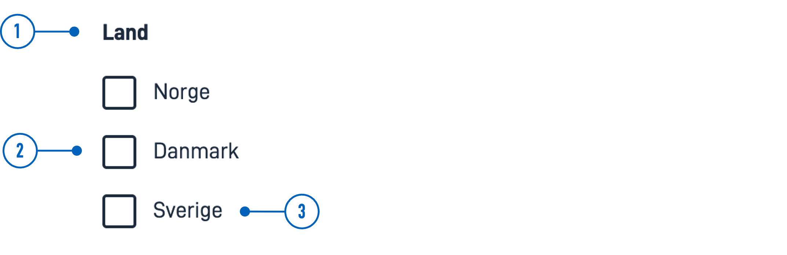

{}
🚧 Denne dokumentasjonen er under oppdatering.
{}

---

## Bruk

Avkrysningsbokser brukes ofte i skjemaer for å samle input fra brukeren,
 slik at de kan velge ett eller flere alternativer fra en liste.
 
 #### Bruk avkrysningsbokser når:
 * Brukere kan velge flere alternativer fra en liste.
 * Det må gjøres et eksplisitt valg for å bruke innstillingene (f.eks. bekrefte at brukeren har lest et dokument).

### Anatomi



{}
1. **Overskrift** - Spørsmål eller instruksjon.
2. **Avkrysningsboks** - Valgkontrollen.
3. **Etikett** - Tekstetikett knyttet til avkrysningsboksen.
{} 

### Stil

* Avkrysningsbokser bør alltid ha en tilknyttet etikett på høyre side.

### Beste praksis

* Avkrysningsbokser med deaktivert valg bør unngås.
    Hvis et alternativ er utilgjengelig bør det fjernes og en forklaring gitt for hvorfor alternativet mangler.

 ### Veiledning for innhold

* Hold etikettene korte og beskrivende.
* Begynn alle etiketter med stor bokstav.
* Ikke inkluder tegnsetting etter etikettene.

### Relatert

* For en mer kompakt måte å vise flere alternativer med flervalg, bruk [MultipleSelect](../multipleselect/).
* Hvis brukeren bare kan velge ett alternativ fra en liste, bruk [RadioButtons](../radiobuttons).
* For en mer kompakt måte å vise flere alternativer med enkeltvalg, bruk en [rullegardinmeny](../dropdown).

## Egenskaper

Følgende er en liste over tilgjengelige egenskaper for {}. Listen er automatisk generert basert på komponentens JSON schema (se link).

{}
Vi oppdaterer for øyeblikket hvordan vi implementerer komponenter. Listen over egenskaper kan derfor være noe unøyaktig.
{}

<!-- Shortkoden `component-props` genererer automatisk en liste over komponentegenskaper fra komponentens JSON schema.
Komponentnavnet kan gis eksplisitt som argument (f.eks. `component-props "Grid"`).
Hvis ingen argument gis, henter shortkoden komponentnavnet fra 'schemaname' i frontmatter. -->

{}

## Konfigurering

{}
Vi oppdaterer for øyeblikket Altinn Studio med flere muligheter for innstillinger!
 Dokumentasjonen oppdateres fortløpende, men det kan være flere innstillinger tilgjengelig enn det som beskrives her og noen innstillinger kan være i betaversjon.
{}

### Legg til komponent




Du kan legge til en komponent i [Altinn Studio Designer](/nb/app/getting-started/) ved å dra den fra komponent-listen til sideområdet.
Når du velger komponenten, vises innstillingspanelet for den.




Grunnleggende komponent:


App/ui/layouts/{page}.json


```json{hl_lines="6-14"}
{
  "$schema": "https://altinncdn.no/toolkits/altinn-app-frontend/4/schemas/json/layout/layout.schema.v1.json",
  {
    "data": {
      "layout": [
        {
          "id": "Image-id",
          "type": "Image",
          "image": {
            "src": {},
            "width": "100%",
            "align": "center"
          }
        }
      ]
    }
  }
}
```



























<!-- ## Eksempler -->
