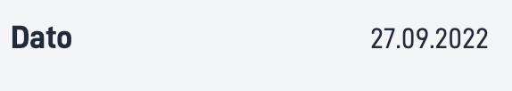
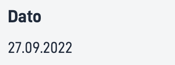
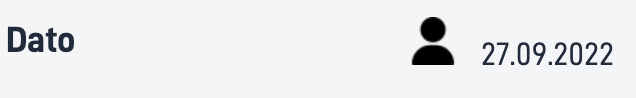

## Usage

The `Date` component allows users to add structured formatted date, with or without label.

### Anatomy

1. **Horizontal**: A date with a label structured horizontally
    
2. **Vertical**: A date with a label structured vertically 
    


<!-- 
Add the following sections if relevant:

### Behavior

(How the component behaves in different contexts)

### Style

(Visual styling (e.g. alignment, padding, dos and don'ts))

### Best Practices

(Industry standards, dos and don'ts)

### Content guidelines

(E.g. punctuation rules, standard labels, etc.)

### Accessibility

(Component-specific best practices for accessibility.)

### Mobile

(How to apply component in mobile environments.)

-->
### Related

- [`Number`](../number/)
- [`Text`](../text/)

## Properties

{}
We are currently updating how we implement components, and the list of properties may not be entirely accurate.
{}

| **Property**                 | **Type** | **Description**                                                                          |
|------------------------------|----------|------------------------------------------------------------------------------------------|
| `id`                         | string   | The component ID. Must be unique within all layouts/pages in a layout-set. Cannot end with <dash><number>. |
| `value`                      | string   |  A hardcoded string or expression for resolving the date you want to display. Must resolve to a ISO6801 string. |
| `textResourceBindings.title` | string   | A label for the date you want to display.                                                   |
| `format`                     | string   | A formatting string based on [Unicode Technical standard](https://www.unicode.org/reports/tr35/tr35-dates.html#Date_Field_Symbol_Table).                             |
| `direction`                  | string   | Sets the structured direction of label and value. <br/><br/>**Enum:** [horizontal, vertical] . <br/><br/>**Default:** horizontal. |
| `icon`                       | string   | A URL path to the image/icon.                                                            |

## Configuration

### Add component

```json{hl_lines="6-"}
{
  "id": "date",
  "type": "Date",
  "textResourceBindings": {
    "title": "Date"
  },
  "value": "2022-09-27 18:00:00.000",
  "format": "dd.MM.yyyy",
  "direction": "horizontal",
  "icon": "https://www.example.com/icon.png"
},
```

### Add title and elements

<br>

#### `textResourceBindings.title`

Label for the date. This can be added as a hardcoded string or as a reference to a [text resource](/nb/altinn-studio/reference/ux/texts/#legge-til-og-endre-tekster-i-en-app).

#### `value`

The value of the date to be displayed. Can be added as a string or an expression.

#### `format`

Sets the formatting of the date provided in the value field. This is based on [Unicode Technical standard](https://www.unicode.org/reports/tr35/tr35-dates.html#Date_Field_Symbol_Table).

#### `direction`

Decides if the date should be shown under or next to the label. `horizontal` for showing it next to the label and `vertical` for under. 

<!-- 
#### `icon`

If you want to show an icon before the label, you can add a URL path to the icon/image you want to be displayed.
-->

<br>

#### Example

Date with label and icon.

```json{hl_lines=["9-12"]}
...
{
  "id": "date",
  "type": "Date",
  "textResourceBindings": {
    "title": "Date"
  },
  "value": "2022-09-27 18:00:00.000",
  "format": "dd.MM.yyyy",
  "direction": "horizontal",
  "icon": "https://www.example.com/icon.png"
},
```
<!-- 

-->