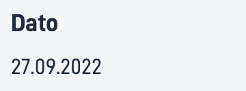

## Bruk

Dato komponenten lar brukeren legge til strukturert formatert dato med eller uten label.

### Anatomi

1. **Horisontal**: Dato med label strukturert horisontalt

2. **Vertikal**: Dato med label strukturert horisontalt. 



<!-- 
Add the following sections if relevant:

### Behavior

(How the component behaves in different contexts)

### Style

(Visual styling (e.g. alignment, padding, dos and don'ts))

### Best Practices

(Industry standards, dos and don'ts)

### Content guidelines

(E.g. punctuation rules, standard labels, etc.)

### Accessibility

(Component-specific best practices for accessibility.)

### Mobile

(How to apply component in mobile environments.)

-->
### Relatert

- [`Number`](../number/)
- [`Text`](../text/)

## Egenskaper

{}
We are currently updating how we implement components, and the list of properties may not be entirely accurate.
{}

| **Property**                 | **Type** | **Description**                                                                                                                          |
|------------------------------|----------|------------------------------------------------------------------------------------------------------------------------------------------|
| `id`                         | string   | Unik Id streng for komponenten                                                                                                           |
| `value`                      | string   | Datoen du vil vise frem. Må være en ISO6801 string.                                                                                      |
| `textResourceBindings.title` | string   | Labelen til datoen du vil vise                                                                                                           |
| `format`                     | string   | En formateringsstreng basert på [Unicode Teknisk standard](https://www.unicode.org/reports/tr35/tr35-dates.html#Date_Field_Symbol_Table) |
| `direction`                  | string   | Setter den strukturerte retningen på labelen og verdien. **Enum:** `"horizontal" \| "vertical"`                                          |
| `icon`                       | string   | En URL streng til bildet/ikonet                                                                                                          |

## Konfigurering

### Legg til komponent

```json{hl_lines="6-"}
{
  "id": "date",
  "type": "Date",
  "textResourceBindings": {
    "title": "Date"
  },
  "value": "2022-09-27 18:00:00.000",
  "format": "dd.MM.yyyy",
  "direction": "horizontal",
  "icon": "https://www.example.com/icon.png"
},
```

### Legg til tittel og elementer

<br>

#### `textResourceBindings.title`

Tittelen for datoen som er vist, blir vist som en label og kan brukes som en tekst direkte eller som en referanse via [tekst ressurs](/nb/altinn-studio/reference/ux/texts/#legge-til-og-endre-tekster-i-en-app).

#### `value`

Viser verdien til labelen og kan legges til som et ISO-dato streng eller et uttrykk.

#### `format`

Setter formateringen for datoen gitt i `value` feltet. Dette er basert på [Unicode Teknisk standard](https://www.unicode.org/reports/tr35/tr35-dates.html#Date_Field_Symbol_Table).

#### `direction`

Bestemmer om datoen vises under eller ved siden av labelen. Horisontal for "ved siden av" og vertikal for "under". 

#### `icon`

Hvis du vil vise et ikon foran label kan du legge til en url her.

<br>

#### Eksempel

Dato med label og ikon.

```json{hl_lines=["9-12"]}
...
{
  "id": "date",
  "type": "Date",
  "textResourceBindings": {
    "title": "Date"
  },
  "value": "2022-09-27 18:00:00.000",
  "format": "dd.MM.yyyy",
  "direction": "horizontal",
  "icon": "https://www.example.com/icon.png"
},
```

