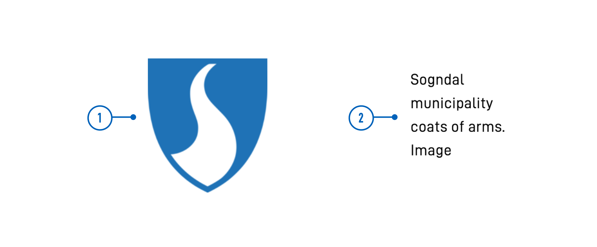

<!-- HOW TO USE THIS TEMPLATE
- Read the comments within each section for guidance.
- Delete comments and content that are not relevant.
- When the documentation is ready for publishing, remove "hidden: true" from the frontmatter.
- If the documentation is complete, remove the warning that it's a work in progress.

COMMON PROPERTIES
Documentation for properties that are common to multiple components is updated in separate files and added via shortcode.
Add documentation: Use the shortcode `property-docs` with pointy brackets and the argument `prop="{propName}"`. `propName` must match the filename (which should correspond to the JSON schema name).
Update/create documentation:
- Files, templates, and instructions are located under components/_common-props-content.
- Images are located under /assets/images/component-settings and are added via a separate shortcode (`image.html`).

EXAMPLES
- See Image, Checkboxes, RadioButtons, and Dropdown for examples.

-->

{}
🚧 This documentation is a work in progress.
{}

---

## Usage

<!-- Brief description of the component and how it is used. -->

### Anatomy

<!-- 

Image/diagram with numbered callouts.
1. Take a screenshot of the basic version of the component with good copy (text).
2. Use the [PowerPoint file](../numbered-callouts-anatomy.pptx) to add numbers to the screenshot
3. Group screenshot and numbering, save as image, and add to documentation
4. Include key with description of callouts below using anatomy-list shortcode (see example for formatting).

Example:



{}
1. **Image**: Photo, screenshot, illustration, or graphic.
2. **Alternative text**: Used by screen readers and displayed if the image can not be rendered.
{} 

-->

<!-- 
Add the following sections if relevant:

### Behavior

(How the component behaves in different contexts)

### Style

(Visual styling (e.g. alignment, padding, dos and don'ts))

### Best Practices

(Industry standards, dos and don'ts)

### Content guidelines

(E.g. punctuation rules, standard labels, etc.)

### Accessibility

(Component-specific best practices for accessibility.)

### Mobile

(How to apply component in mobile environments.)

### Related

(List of related components or patterns, include links)

-->

## Properties

The following is an autogenerated list of the properties available for {} based on the component's JSON schema file (linked below).

{}
We are currently updating how we implement components, and the list of properties may not be entirely accurate.
{}

<!-- The `component-props` shortcode automatically generates a list of component properties from the component's json schema.
The component name can be explicitly given as argument (e.g. `component-props "Grid"`).
If no argument is given, the shortcode pulls the component name from 'schemaname' in the frontmatter. 
If the component does not have a JSON schema, comment out the text and shortcode in this section and, if necessary, create a table manually with the most important properties (columns: Property, Type, Description).
-->

{}

## Configuration

{}
We are currently updating Altinn Studio Designer with more configuration options!
 The documentation is continuously updated, and there may be more settings available than what is described here, and some settings may be in beta version.
{}

### Add component




You can add a component in [Altinn Studio Designer](/altinn-studio/getting-started/) by dragging it from the list of components to the page area.
Selecting the component brings up its configuration panel.




Basic component:


App/ui/layouts/{page}.json


```json{hl_lines="6-"}
{
  "$schema": "https://altinncdn.no/toolkits/altinn-app-frontend/4/schemas/json/layout/layout.schema.v1.json",
  {
    "data": {
      "layout": [
        {
          // Basic component (required properties)
        }
      ]
    }
  }
}
```




<!-- 
Add sections describing the configuration of properties specific for the component.
- Use the below Designer/Code tabs shortcode to display the settings.
- Include screenshots and examples where appropriate.
- If the settings are not available in Altinn Studio, use only the Code tab and add the following shortcode directly under the section heading:
    {}
    The settings for this property is currently not available in Altinn Studio and must be configured manually.
    {}
- Add file path or other info within the code-title shortcode (shown at the top of the code block)
- Consider highlighting relevant parts of the code using hl_lines
- Add documentation for common properties using the shortcode `property-docs` with pointy brackets and the argument `prop="{propName}"`. `propName` must match the filename (which should correspond to the JSON schema name).

Shortcode for tabs:









App/ui/layouts/{page}.json


```json{hl_lines=""}
{
  // component properties
}
```




-->

## Examples

<!-- One or more examples of configuration (if relevant) -->
